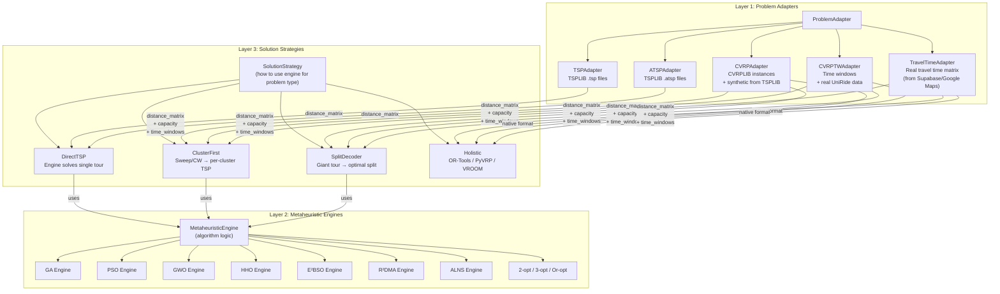
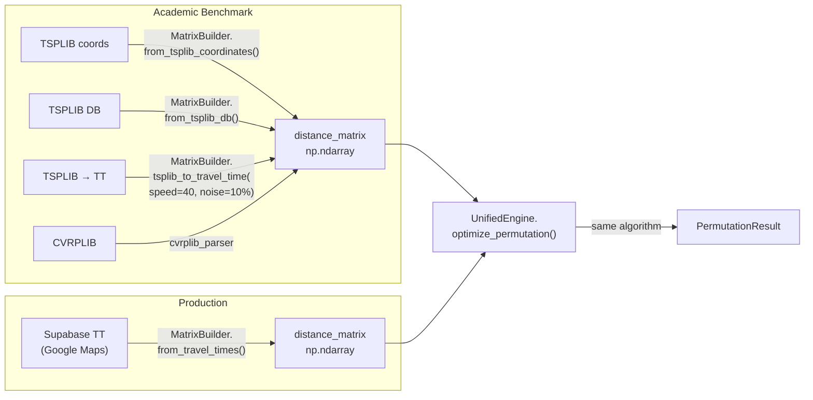

# UniRide Ecosystem — Master Architecture Plan (Final)

**Date:** May 26, 2026, 00:10 (UTC+3)  
**Architect:** Antigravity (Google DeepMind — Advanced Agentic Coding)

---

## The Core Challenge

**Write an algorithm ONCE, use it EVERYWHERE:**

```
Same Algorithm Implementation
         │
         ├── Benchmark on TSPLIB (TSP/ATSP)    → Academic Paper #1
         ├── Benchmark on CVRPLIB (CVRP)        → Academic Paper #2
         ├── Benchmark on Real Data (CVRPTW)     → Academic Paper #3
         └── Deploy in UniRide Web (Production)  → Student transportation
```

Currently this is **impossible** because:
- `sota_tsp/` solvers accept `List[int]` + distance matrix → TSP only
- `optimizer_api/strategies/` accept `OptimizationRequest` → CVRP/CVRPTW only
- An algorithm must be reimplemented to cross from research to production

---

## Solution: Three-Layer Solver Architecture



### How It Works

**The key insight:** Every metaheuristic operates on the same primitive — **permuting a sequence of nodes and evaluating cost via a distance/time matrix**. The difference between TSP and CVRP is not in the algorithm, but in:
1. **How the solution is decoded** (single tour vs. split into routes)
2. **What constraints are checked** (capacity, time windows)
3. **What the cost function computes** (total distance vs. total time + penalties)

So the architecture is:

| Layer | Responsibility | Lives In |
|:------|:--------------|:---------|
| **Problem Adapter** | Converts any problem format into a `distance_matrix` + `constraints` | `uniride_core/adapters/` |
| **Metaheuristic Engine** | Pure algorithm: takes `distance_matrix`, returns `permutation` + `cost` | `uniride_core/algorithms/` |
| **Solution Strategy** | Wraps engine for a problem type: TSP→direct, CVRP→cluster+TSP or TSP+split | `optimizer_api/strategies/` + `academic_benchmark/strategies/` |

---

## Algorithm Inventory: What Exists Today

### Currently in `uniride_core/algorithms/sota_tsp/` (Numba/Pure Python)

| Algorithm | Interface | TSP | ATSP | CVRP | CVRPTW | Notes |
|:----------|:---------|:---:|:----:|:----:|:------:|:------|
| E²BSO | `BaseTSPSolver.solve(coords)` or `.solve_with_matrix(dm)` | ✅ | ✅ | ❌ | ❌ | Needs CVRP wrapper |
| R²DMA | Same | ✅ | ✅ | ❌ | ❌ | Needs CVRP wrapper |
| P-AOEA | Same | ✅ | ✅ | ❌ | ❌ | Needs CVRP wrapper |
| CGO | Same | ✅ | ✅ | ❌ | ❌ | Needs CVRP wrapper |
| RUN | Same | ✅ | ✅ | ❌ | ❌ | Needs CVRP wrapper |
| ALNS | Same | ✅ | ✅ | ❌ | ❌ | Needs CVRP wrapper |

### Currently in `optimizer_api/strategies/` (Production Wrappers)

| Algorithm | Interface | TSP | ATSP | CVRP | CVRPTW | Notes |
|:----------|:---------|:---:|:----:|:----:|:------:|:------|
| GA (Sweep) | `BaseRoutingStrategy.optimize(request)` | ❌ | ❌ | ✅ | ✅ | Cluster-first |
| PSO (Sweep) | Same | ❌ | ❌ | ✅ | ✅ | Cluster-first |
| GWO (Sweep) | Same | ❌ | ❌ | ✅ | ✅ | Cluster-first |
| HHO (Sweep) | Same | ❌ | ❌ | ✅ | ✅ | Cluster-first |
| GA-Split | Same | ❌ | ❌ | ✅ | ✅ | Route-first + Split |
| PSO-Split | Same | ❌ | ❌ | ✅ | ✅ | Route-first + Split |
| GWO-Split | Same | ❌ | ❌ | ✅ | ✅ | Route-first + Split |
| HHO-Split | Same | ❌ | ❌ | ✅ | ✅ | Route-first + Split |
| E²BSO | Same | ❌ | ❌ | ✅ | ❌ | SOTA wrapper |
| R²DMA | Same | ❌ | ❌ | ✅ | ❌ | SOTA wrapper |
| OR-Tools | Same | ❌ | ❌ | ✅ | ✅ | Holistic |
| PyVRP | Same | ❌ | ❌ | ✅ | ✅ | Holistic |
| VROOM | Same | ❌ | ❌ | ✅ | ✅ | Holistic |
| 2-opt | Same | ❌ | ❌ | ✅ | ❌ | Heuristic |
| Greedy | Same | ❌ | ❌ | ✅ | ❌ | Heuristic |

### Currently in `academic_benchmark/` (Via registry_setup.py)

| Algorithm | Registered As | TSP | ATSP | CVRP | Notes |
|:----------|:-------------|:---:|:----:|:----:|:------|
| 2-opt (Numba) | `Numba-2-opt` | ✅ | ✅ | ❌ | Via `STRATEGIES` list |
| 3-opt (Numba) | `Numba-3-opt` | ✅ | ✅ | ❌ | Via `STRATEGIES` list |
| Or-opt (Numba) | `Numba-Or-opt` | ✅ | ✅ | ❌ | Via `STRATEGIES` list |
| Swap (Numba) | `Numba-Swap` | ✅ | ✅ | ❌ | Via `STRATEGIES` list |
| Hybrid (Numba) | `Numba-Hybrid` | ✅ | ✅ | ❌ | Via `STRATEGIES` list |
| GA (Numba) | `Numba-GA` | ✅ | ✅ | ❌ | Via metaheuristic path |
| PSO (Numba) | `Numba-PSO` | ✅ | ✅ | ❌ | Via metaheuristic path |
| GWO (Numba) | `Numba-GWO` | ✅ | ✅ | ❌ | Via metaheuristic path |
| HHO (Numba) | `Numba-HHO` | ✅ | ✅ | ❌ | Via metaheuristic path |
| E²BSO | `SOTA-E2BSO-TSP` | ✅ | ✅ | ❌ | Via SOTA executor |
| R²DMA | `SOTA-R2DMA-TSP` | ✅ | ✅ | ❌ | Via SOTA executor |
| P-AOEA | `SOTA-P-AOEA-TSP` | ✅ | ✅ | ❌ | Via SOTA executor |
| CGO | `SOTA-CGO-TSP` | ✅ | ✅ | ❌ | Via SOTA executor |
| RUN | `SOTA-RUN-TSP` | ✅ | ✅ | ❌ | Via SOTA executor |
| ALNS | `SOTA-ALNS-TSP` | ✅ | ✅ | ❌ | Via SOTA executor |

### The Gap

**No algorithm can currently be benchmarked on CVRP/CVRPTW in `academic_benchmark`.**
The production wrappers in `optimizer_api/strategies/` handle CVRP, but they can't be called from the academic CLI engine without the full FastAPI stack.

---

## The Unified Approach

### Option A: Unified Solver (Preferred — Your Choice)

Each algorithm in `uniride_core` gets a **problem-type-agnostic interface**:

```python
# uniride_core/algorithms/base_engine.py (NEW)

class UnifiedEngine(ABC):
    """Base for all metaheuristic engines — handles TSP through CVRPTW."""

    @abstractmethod
    def optimize_permutation(
        self,
        distance_matrix: np.ndarray,     # n×n matrix (Euclidean OR travel time)
        config: EngineConfig,              # algorithm-specific params
        seed: int,
    ) -> PermutationResult:
        """Return best permutation of nodes [0..n-1] and its cost."""
        ...

    def solve_tsp(self, dm: np.ndarray, config, seed) -> TSPResult:
        """Direct TSP: permutation = tour."""
        perm = self.optimize_permutation(dm, config, seed)
        return TSPResult(tour=perm.sequence, cost=perm.cost, ...)

    def solve_cvrp(
        self, dm: np.ndarray, config, seed,
        demands: List[int], capacity: int, depot: int = 0,
        split_method: str = "optimal_split"
    ) -> CVRPResult:
        """CVRP: permutation → split into feasible routes."""
        perm = self.optimize_permutation(dm, config, seed)
        if split_method == "optimal_split":
            routes = optimal_split(perm.sequence, dm, demands, capacity, depot)
        elif split_method == "cluster_first":
            routes = cluster_and_route(perm.sequence, dm, demands, capacity, depot)
        return CVRPResult(routes=routes, total_cost=..., ...)

    def solve_cvrptw(
        self, dm: np.ndarray, config, seed,
        demands, capacity, depot, time_windows, service_times
    ) -> CVRPTWResult:
        """CVRPTW: permutation → split with time window feasibility."""
        ...
```

### How This Solves Your Problem

```
┌─────────────────────────────────────────────────────────────────┐
│   E²BSO Engine (implements optimize_permutation)                │
│   Written ONCE in uniride_core/algorithms/                      │
│                                                                 │
│   ├── .solve_tsp(tsplib_dm)                                     │
│   │    → academic_benchmark runs on berlin52, eil76, etc.       │
│   │    → Paper: "E²BSO for TSP — TSPLIB results"               │
│   │                                                             │
│   ├── .solve_cvrp(cvrplib_dm, demands, capacity)                │
│   │    → academic_benchmark runs on Augerat A/B, CMT, etc.     │
│   │    → Paper: "E²BSO-Split for CVRP — CVRPLIB results"      │
│   │                                                             │
│   ├── .solve_cvrptw(dm, demands, cap, time_windows)             │
│   │    → academic_benchmark runs on Solomon instances           │
│   │    → Paper: "E²BSO for CVRPTW — Solomon results"           │
│   │                                                             │
│   └── optimizer_api E2BSoStrategy wraps .solve_cvrp()           │
│        → Production: uses travel time matrix from Supabase      │
│        → Web app: students get optimized bus routes             │
└─────────────────────────────────────────────────────────────────┘
```

### Distance/Time Matrix Strategy

```python
# uniride_core/adapters/matrix_builder.py (NEW)

class MatrixBuilder:
    """Build distance/time matrices from various sources."""

    @staticmethod
    def from_tsplib_coordinates(coords, edge_weight_type="EUC_2D") -> np.ndarray:
        """Standard TSPLIB Euclidean/ATT/GEO distance."""
        ...

    @staticmethod
    def from_tsplib_db(problem_name, db_path) -> np.ndarray:
        """Pre-computed matrix from SQLite DB."""
        ...

    @staticmethod
    def from_travel_times(time_matrix: List[List[float]]) -> np.ndarray:
        """Real travel time matrix (from Google Maps / Supabase)."""
        ...

    @staticmethod
    def tsplib_to_travel_time(
        coords, speed_kmh=40.0, noise_pct=0.1, seed=42
    ) -> np.ndarray:
        """Convert TSPLIB coordinates to synthetic travel times.
        
        travel_time = euclidean_distance / speed + random_noise
        Useful for benchmarking CVRPTW on TSPLIB instances.
        """
        ...
```

---

## Benchmark Problem Sources

### For Academic Papers

| Source | Problem Type | Instances | Notes |
|:-------|:------------|:----------|:------|
| **TSPLIB** | TSP | 130+ (in SQLite DB) | Already fully supported |
| **TSPLIB** | ATSP | 19 instances | Already in DB via `tsplib_manager.py` |
| **CVRPLIB** | CVRP | Augerat A (27), B (23), CMT (14), Golden (20), etc. | **NEW — needs download + parser** |
| **Solomon** | CVRPTW | R1/R2/C1/C2/RC1/RC2 (56 instances) | **NEW — needs download + parser** |
| **Synthetic** | CVRP/CVRPTW | Generated from TSPLIB TSP + random demands/windows | **NEW — generator needed** |
| **Real Data** | CVRPTW | Anonymized UniRide Supabase data | **NEW — export tool needed** |

### For Production Testing

| Source | Problem Type | Notes |
|:-------|:------------|:------|
| **Live Supabase** | CVRPTW | Real students, real travel times, real time windows |
| **Cached scenarios** | CVRPTW | Pre-saved test cases from production |

---

## Revised Phase Plan

### Phase 1: Foundation Cleanup (CRITICAL — No behavior changes)

Same as before: delete dead files, fix security, fix reverse dependency, add ALNS params, merge TSPLIB_OPTIMALS.

### Phase 2: Unified Engine Interface (HIGH — The key architectural change)

| Task | Description |
|:-----|:-----------|
| **Create `UnifiedEngine` ABC** | `uniride_core/algorithms/base_engine.py` — `optimize_permutation()` + `solve_tsp()` + `solve_cvrp()` + `solve_cvrptw()` |
| **Create `MatrixBuilder`** | `uniride_core/adapters/matrix_builder.py` — all matrix construction methods including `tsplib_to_travel_time()` |
| **Adapt existing TSP solvers** | Make `E2BSO_TSP`, `R2DMA_TSP`, etc. extend `UnifiedEngine` while keeping backward compat via `BaseTSPSolver` |
| **Create `SplitDecoder` in core** | Move the Optimal Split algorithm from `optimizer_api` into `uniride_core/algorithms/split_decoder.py` — it's pure math, no web deps |
| **Create `CVRPResult` model** | `uniride_core/models.py` — add result types for CVRP/CVRPTW solutions |

> [!NOTE]
> **Backward Compatibility:** The existing `BaseTSPSolver` interface stays intact. `UnifiedEngine` is a new parallel base class. Existing solvers can inherit from both during transition:
> ```python
> class E2BSO_TSP(BaseTSPSolver, UnifiedEngine):
>     def optimize_permutation(self, dm, config, seed):
>         # Same algorithm code as _solve(), just returns permutation
>     def _solve(self):
>         # Legacy interface — delegates to optimize_permutation()
> ```

### Phase 3: CVRP/CVRPTW Benchmark Support (HIGH)

| Task | Description |
|:-----|:-----------|
| **CVRPLIB parser** | `uniride_core/adapters/cvrplib_parser.py` — parse Augerat, CMT, Golden, Solomon formats |
| **CVRPLIB downloader** | Similar to existing `tsplib_manager.py` — download + store in SQLite |
| **Synthetic CVRP generator** | Generate CVRP instances from TSPLIB TSP problems (add random demands, capacity) |
| **Synthetic CVRPTW generator** | Generate time windows using `tsplib_to_travel_time()` |
| **Register CVRP executors in `academic_benchmark`** | Extend `registry_setup.py` to register `solve_cvrp()` and `solve_cvrptw()` variants |
| **Add CVRP param spaces** | Extend `param_spaces.py` with CVRP-specific params (e.g., split_method, cluster_method) |
| **Dashboard CVRP support** | Extend Streamlit dashboard to display CVRP-specific metrics (vehicles used, capacity utilization, TW violations) |

### Phase 4: Promotion Gate + Production Integration (MEDIUM)

| Task | Description |
|:-----|:-----------|
| **Create `promoted_configs.json`** | Schema for promoted algorithms with locked params |
| **Create `promotion_manager.py`** | Semi-automated CLI: `python -m academic_benchmark promote --algo E2BSO-TSP` |
| **Update `optimizer_api/strategies/__init__.py`** | Load promoted configs, create per-thread instances |
| **Simplify SOTA wrappers** | `ebso_strategy.py` etc. become thin wrappers calling `engine.solve_cvrp()` |
| **Update web algorithm-constants.ts** | Add dynamic "Research-Promoted" category |
| **Web benchmark: adjustable params** | Allow parameter adjustment in admin/benchmark UI |

### Phase 5: Data & Dashboard Unification (MEDIUM)

| Task | Description |
|:-----|:-----------|
| **New API endpoints for academic results** | `GET /api/v1/benchmark/academic/results` — reads from SQLite DB |
| **Web benchmark reads from academic DB** | Admin benchmark page can display academic results alongside live runs |
| **Real data export tool** | Export anonymized UniRide production data for CVRPTW benchmarking |
| **Thread-safety fix** | Strategy registry uses thread-local factory pattern |
| **Scheduling logic extraction** | Move from `optimization.py` to `utils/scheduling.py` |

---

## How Production Wrappers Simplify

**Before (current `ebso_strategy.py` — 238 lines):**
```python
class E2BSoStrategy(BaseRoutingStrategy):
    def optimize(self, request: OptimizationRequest):
        # 150+ lines: build time_matrix, convert students to nodes,
        # call E2BSO_TSP.solve(), convert back to VehicleRoute...
```

**After (with UnifiedEngine — ~50 lines):**
```python
class E2BSoStrategy(BaseRoutingStrategy):
    def optimize(self, request: OptimizationRequest):
        dm = MatrixBuilder.from_travel_times(request.time_matrix)
        demands = [1] * len(request.students)  # or real demands
        engine = E2BSO_TSP(config=self._promoted_config)
        result = engine.solve_cvrp(
            dm, self._promoted_config, seed=42,
            demands=demands, capacity=request.sw_capacity,
        )
        return self._convert_to_response(result, request)
```

---

## Travel Time Matrix Flow



---

## User Review Required

> [!IMPORTANT]
> **The UnifiedEngine Refactoring Scope**
> This is a significant change. The `UnifiedEngine` base class with `solve_tsp()`, `solve_cvrp()`, `solve_cvrptw()` is the architectural centerpiece. Should I:
> - **(A)** Start with the full `UnifiedEngine` refactoring in Phase 2 (higher impact, but solves the TSP↔CVRP gap permanently)
> - **(B)** Start with Phase 1 cleanup only, then tackle UnifiedEngine in a separate conversation (lower risk, incremental)
>
> My recommendation: **(B)** — Execute Phase 1 now (it's safe, no behavioral changes), then tackle the UnifiedEngine design in a focused follow-up where we can prototype and test the abstraction properly.

> [!IMPORTANT]
> **CVRPLIB Integration Scope**
> Adding CVRPLIB support requires:
> - New parser for Augerat/CMT/Golden/Solomon formats
> - New SQLite tables in `tsplib_manager.py` (or a separate `cvrplib_manager.py`)
> - New parameter spaces for CVRP-specific tuning
>
> This is substantial but well-defined. Should I plan this as part of Phase 3, or do you want a separate dedicated effort?

> [!NOTE]
> **The `tsplib_to_travel_time()` conversion** you mentioned (Euclidean ÷ speed + noise) is a simple but powerful way to create CVRPTW instances from TSP data. This lets you benchmark time-window algorithms on any TSPLIB problem without needing real traffic data.
