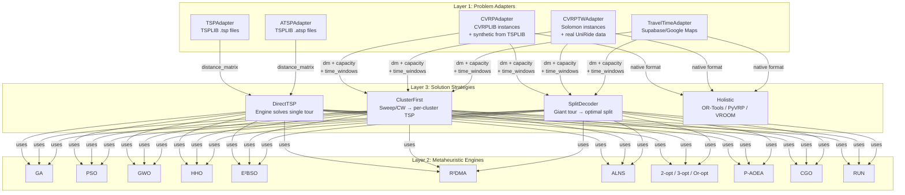
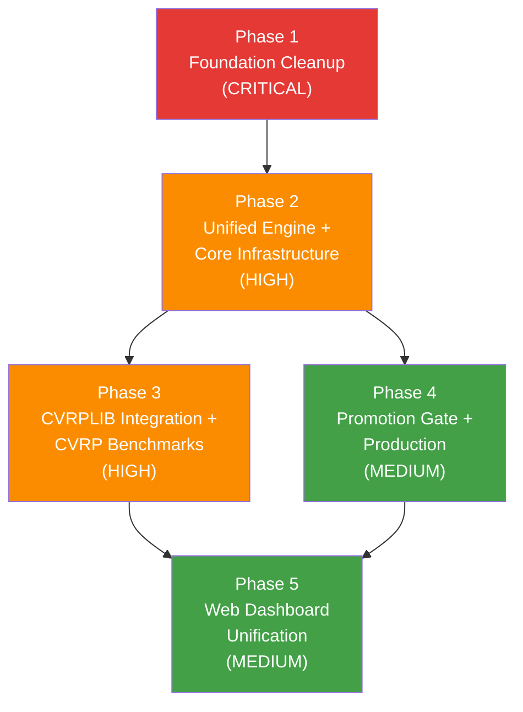

# UniRide Ecosystem — Unified Master Plan & Execution Specification

**Date:** May 26, 2026, 00:35 (UTC+3)  
**Architect:** Antigravity (Google DeepMind - Gemini 2.5 Pro, Advanced Agentic Coding)  
**Purpose:** Single source of truth for the entire UniRide refactoring. Covers architecture, all 5 phases, and detailed execution specs for AI agents.

## Core-First Amendment (Codex Implementation Ground)

All critical solver, benchmark, matrix, decoder, algorithm, and result logic must live in `uniride_core` and its subfolders. `optimizer_api` remains a compatibility/application layer for the current UniRide web app and external callers: it should translate FastAPI/web requests into `uniride_core` problem objects, call core engines/functions, and translate core results back to existing response schemas.

`uniride_core` must never import `optimizer_api`. Any reusable code currently owned by `optimizer_api` should be moved into `uniride_core` first, with `optimizer_api` retaining thin wrappers only where needed for backward compatibility.

Capacity is vector-first from Phase 2 onward. Standard CVRP maps to a single demand/capacity dimension, while UniRide maps to multi-dimensional passenger capacity such as `[sw, so]`. CVRPTW support must preserve travel-time matrices, asymmetric costs, service times, max route duration, pickup/dropoff direction, and time-window violation metrics.

---

## Table of Contents

1. [The Core Challenge](#1-the-core-challenge)
2. [Three-Layer Solver Architecture](#2-three-layer-solver-architecture)
3. [Algorithm Inventory — Current State](#3-algorithm-inventory--current-state)
4. [Phase 1: Foundation Cleanup](#phase-1-foundation-cleanup-critical)
5. [Phase 2: Unified Engine + Core Infrastructure](#phase-2-unified-engine--core-infrastructure-high)
6. [Phase 3: CVRPLIB Integration + CVRP Benchmark Support](#phase-3-cvrplib-integration--cvrp-benchmark-support-high)
7. [Phase 4: Promotion Gate + Production Integration](#phase-4-promotion-gate--production-integration-medium)
8. [Phase 5: Data & Web Dashboard Unification](#phase-5-data--web-dashboard-unification-medium)
9. [Verification Checklists](#verification-checklists)

---

## 1. The Core Challenge

**Write an algorithm ONCE, use it EVERYWHERE:**

```
Same Algorithm Implementation
         │
         ├── Benchmark on TSPLIB (TSP/ATSP)    → Academic Paper #1
         ├── Benchmark on CVRPLIB (CVRP)        → Academic Paper #2
         ├── Benchmark on Real Data (CVRPTW)     → Academic Paper #3
         └── Deploy in UniRide Web (Production)  → Student transportation
```

Currently this is **impossible** because:
- `sota_tsp/` solvers accept `List[int]` + distance matrix → TSP only
- `optimizer_api/strategies/` accept `OptimizationRequest` → CVRP/CVRPTW only
- An algorithm must be reimplemented to cross from research to production

### Resolved User Decisions

| Question | Decision |
|:---------|:---------|
| Web benchmark page | **Keep both** — quick web benchmarks + academic DB as source of truth. **Adjustable parameters** on web. |
| Academic benchmark algorithms | **All algorithms available** — Pipeline A/B, Holistic, Heuristic, SOTA, and Numba variants |
| CVRPLIB integration | **Separate dedicated effort** (Phase 3 in this plan) — detailed execution spec included |
| Promotion automation | **Semi-automated CLI** — `python -m academic_benchmark promote` validates criteria before promoting |
| TSPLIB data location | **SQLite DB-first** — `academic_benchmark/tsplib_data/tsplib.db` is canonical |
| Travel time matrix | **Preferred over Euclidean** — fallback to EUC_2D/ATT if unavailable. Synthetic conversion (dist ÷ speed + noise) for benchmarks |
| `faz0_interactive.py` | **DELETE** — broken legacy |
| `run_sota_benchmark.py` | **DELETE** — dead code, web uses its own `benchmark_runner.py` |

---

## 2. Three-Layer Solver Architecture



**Key insight:** Every metaheuristic operates on the same primitive — **permuting a sequence of nodes and evaluating cost via a distance/time matrix**. The difference between TSP and CVRP is not in the algorithm, but in **how the permutation is decoded** (single tour vs. split into routes).

| Layer | Responsibility | Lives In |
|:------|:--------------|:---------|
| **Problem Adapter** | Converts any problem format into `distance_matrix` + `constraints` | `uniride_core/adapters/` |
| **Metaheuristic Engine** | Pure algorithm: takes `distance_matrix`, returns `permutation` + `cost` | `uniride_core/algorithms/` |
| **Solution Strategy** | Wraps engine for a problem type: TSP→direct, CVRP→cluster+TSP or TSP+split | `optimizer_api/strategies/` + `academic_benchmark/` |

---

## 3. Algorithm Inventory — Baseline State at Plan Start

### In `uniride_core/algorithms/sota_tsp/` (Pure Python)

| Algorithm | TSP | ATSP | CVRP | CVRPTW | Notes |
|:----------|:---:|:----:|:----:|:------:|:------|
| E²BSO, R²DMA, P-AOEA, CGO, RUN, ALNS | ✅ | ✅ | ❌ | ❌ | Need CVRP wrapper (Phase 2-3) |

### In `optimizer_api/strategies/` (Production Wrappers)

| Algorithm | TSP | ATSP | CVRP | CVRPTW | Notes |
|:----------|:---:|:----:|:----:|:------:|:------|
| GA/PSO/GWO/HHO (Sweep) | ❌ | ❌ | ✅ | ✅ | Cluster-first pipeline |
| GA/PSO/GWO/HHO (Split) | ❌ | ❌ | ✅ | ✅ | Route-first + Split pipeline |
| OR-Tools, PyVRP, VROOM | ❌ | ❌ | ✅ | ✅ | Holistic solvers |
| E²BSO, R²DMA | ❌ | ❌ | ✅ | ❌ | SOTA wrappers |
| 2-opt, Greedy | ❌ | ❌ | ✅ | ❌ | Heuristics |

### In `academic_benchmark/` (Via registry_setup.py)

| Algorithm | TSP | ATSP | CVRP | Notes |
|:----------|:---:|:----:|:----:|:------|
| Numba-2opt, 3opt, Or-opt, Swap, Hybrid, GA, PSO, GWO, HHO | ✅ | ✅ | ❌ | Local search + metaheuristic |
| SOTA-E2BSO, R2DMA, P-AOEA, CGO, RUN, ALNS | ✅ | ✅ | ❌ | Via SOTA executor |

**Original Gap at Plan Start:** No algorithm could be benchmarked on CVRP/CVRPTW in `academic_benchmark`.

## 3A. Algorithm Inventory — Current Status as of 2026-05-31

### In `uniride_core/algorithms/`

| Capability | TSP | ATSP | CVRP | CVRPTW | UniRide | Current Status |
|:-----------|:---:|:----:|:----:|:------:|:-------:|:---------------|
| Core matrix engines (`GreedyMatrixEngine`, TSP/local-search engines) | ✅ | ✅ | ✅ | ✅ | ✅ | Matrix-first execution path is available through `RoutingProblem` and `MatrixBenchmarkRunner`. |
| Metaheuristic TSP engines (GA, PSO, GWO, HHO, TwoOpt) | ✅ | ✅ | via split | via split | via split | Critical TSP/metaheuristic logic moved to `uniride_core`; production wrappers delegate. |
| Split engines (GA/PSO/GWO/HHO Split) | ✅ via direct delegation | ✅ via direct delegation | ✅ | ✅ | ✅ | Split strategy internals moved to `uniride_core`; wrappers remain in `optimizer_api`. For pure TSP/ATSP, split-compatible matrix engines call the corresponding direct core engine and return one tour/route rather than forcing artificial vehicle splitting. |
| Holistic CVRP adapters (OR-Tools, PyVRP, VROOM) | ✅ | ✅ | ✅ | partial | partial | Core-owned adapters and unified `solve_problem(RoutingProblem)` dispatch exist. OR-Tools and PyVRP use native adapters; VROOM uses native pyvroom when possible and deterministic sweep fallback when the Windows pyvroom matrix API rejects the buffer format. |
| SOTA TSP solvers (E²BSO, R²DMA, P-AOEA, CGO, RUN, ALNS) | ✅ | ✅ | via registry/split wrapper path | via registry/split wrapper path | via registry/split wrapper path | Academic CVRP/CVRPTW registry entries exist, but full large-dataset validation remains pending. |

### In `academic_benchmark/`

| Capability | Status | Evidence / Notes |
|:-----------|:-------|:-----------------|
| SQLite problem source of truth | ✅ Available | Unified storage handles TSP, ATSP, CVRP, CVRPTW, and UniRide problem shapes. |
| CVRPLIB/Solomon facade | ✅ Available | `academic_benchmark.cvrplib_manager` delegates to `tsplib_manager.store_academic_text()` / `store_routing_problem()`. |
| Smoke dataset coverage | ✅ Available locally | Real DB seeded with `smoke-tsp`, `smoke-atsp`, `smoke-cvrp`, `smoke-solomon`, and `smoke-uniride`. |
| Matrix-native smoke benchmark | ✅ Passed locally | Run id `academic-matrix-smoke-20260531`: 5 persisted results, 0 errors. |
| Full academic/core test gate | ✅ Passed | `python -m pytest academic_benchmark/tests uniride_core/tests -q` passes with 310 tests. |
| Promoted config generation | ✅ Available | Promotion manager generated 26 configs from existing `best_solutions`; generated JSON is local/ignored. |
| Web/API sanity path | ⏳ Next | Verify matrix-native web execution with editable params and academic read endpoints. |
| Full CVRPLIB/Solomon dataset scale | ✅ Starter real dataset available | Raw public CVRPLIB/Solomon files are tracked under `academic_benchmark/datasets/raw/`; the local SQLite DB was seeded from those files and a first real matrix benchmark slice ran successfully. Broader validation still remains before promotion. |

---

## Phase 1: Foundation Cleanup (CRITICAL) — Status: DONE

> **Risk:** 🟢 Zero to Low — No behavioral changes to production.  
> **Goal:** Delete dead code, fix security, fix reverse dependencies.

### Files to Study First

| File | Why |
|:-----|:----|
| [tsplib_parser.py](file:///c:/Users/yekta/Masaüstü/AiCode/FirebaseUniRide/UniRide/uniride_core/algorithms/tsplib_parser.py) | Contains hardcoded reverse dependency to `optimizer_api` |
| [test_direct.py](file:///c:/Users/yekta/Masaüstü/AiCode/FirebaseUniRide/UniRide/test_direct.py) | Contains hardcoded Azure API key |
| [param_spaces.py](file:///c:/Users/yekta/Masaüstü/AiCode/FirebaseUniRide/UniRide/academic_benchmark/param_spaces.py) | Missing ALNS-TSP entry |
| [benchmark_utils.py](file:///c:/Users/yekta/Masaüstü/AiCode/FirebaseUniRide/UniRide/academic_benchmark/benchmark_utils.py) | TSPLIB_OPTIMALS (129 entries) to merge into core |

### Task 1.1: Delete Dead Files — DONE

| File | Action | Reason |
|:-----|:-------|:-------|
| `optimizer_api/faz0_interactive.py` | **DELETE** | 3,142 lines, broken imports (`TSPLIBProblemInfo`), superseded by `cli_engine.py` |
| `optimizer_api/run_sota_benchmark.py` | **DELETE** | Broken import: `from academic_benchmark.run_sota_benchmark import main`. Web uses `benchmark_runner.py`. |

### Task 1.2: Fix Hardcoded API Key — DONE

**File:** `test_direct.py`  
**Change:** Replace hardcoded Azure API key with `os.environ.get("AZURE_OPENAI_API_KEY")`  
**User action:** Rotate key in Azure portal.

### Task 1.3: Fix Reverse Dependency — DONE

**File:** `uniride_core/algorithms/tsplib_parser.py` (line 35-36)  
**Change:** Replace `../../optimizer_api/tests/tsplib_data` with env var fallback:
```python
TSPLIB_DATA_DIR = os.environ.get(
    "TSPLIB_DATA_DIR",
    os.path.join(os.path.dirname(__file__), '..', '..', 'tsplib_data')
)
```
**Purpose:** Core must never import from `optimizer_api`.

### Task 1.4: Add Missing ALNS-TSP Parameter Space — DONE

**File:** `academic_benchmark/param_spaces.py`  
**Change:** Add entry:
```python
"ALNS-TSP": {
    "population_size":  {"type": "int",   "doe": [24, 36, 48],   "optuna": (20, 60)},
    "max_iterations":   {"type": "int",   "doe": [200, 320, 450],"optuna": (150, 500)},
    "remove_ratio":     {"type": "float", "doe": [0.10, 0.15, 0.20], "optuna": (0.05, 0.25)},
    "time_limit":       {"type": "float", "doe": [300.0, 600.0, 1200.0], "optuna": None},
}
```

### Task 1.5: Merge TSPLIB_OPTIMALS Into Core — DONE

**Files:** `uniride_core/algorithms/tsplib_parser.py` (47 entries) ← `academic_benchmark/benchmark_utils.py` (129 entries)  
**Change:** Merge the comprehensive 129-entry dict into core. Update `benchmark_utils.py` to import from core:
```python
from uniride_core.algorithms.tsplib_parser import TSPLIB_OPTIMALS
```

### Task 1.6: Fix Signal Handler Conflicts — DONE

**Files:** `academic_benchmark/smart_benchmark.py` (line 136), `academic_benchmark/cli_engine.py` (line 263)  
**Change:** Use a guard to chain signal handlers instead of overwriting.

### Phase 1 Verification

```bash
cd optimizer_api && python -c "from main import app; print('API OK')"
python -c "from academic_benchmark.param_spaces import SOTA_PARAM_SPACES; assert 'ALNS-TSP' in SOTA_PARAM_SPACES; print('ALNS OK')"
grep -r "optimizer_api" uniride_core/  # Should return 0 results
python -c "from uniride_core.algorithms.tsplib_parser import TSPLIB_OPTIMALS; assert len(TSPLIB_OPTIMALS) >= 129; print(f'OK: {len(TSPLIB_OPTIMALS)} entries')"
```

---

## Phase 2: Unified Engine + Core Infrastructure (HIGH) — Status: DONE

> **Risk:** 🟡 Medium — New abstractions, but backward compatible.  
> **Goal:** Create `UnifiedEngine`, `MatrixBuilder`, `SplitDecoder`, and `CVRPResult` in `uniride_core`.  
> **Dependencies:** Phase 1 complete.

### Files to Study First

| File | Why |
|:-----|:----|
| [base_solver.py](file:///c:/Users/yekta/Masaüstü/AiCode/FirebaseUniRide/UniRide/uniride_core/algorithms/sota_tsp/base_solver.py) | Current `BaseTSPSolver` ABC — new `UnifiedEngine` must coexist |
| [models.py](file:///c:/Users/yekta/Masaüstü/AiCode/FirebaseUniRide/UniRide/uniride_core/models.py) | `ProblemInstance`, `TSPResult` — extend with CVRP fields |
| [hybrid_base_strategy.py](file:///c:/Users/yekta/Masaüstü/AiCode/FirebaseUniRide/UniRide/optimizer_api/strategies/hybrid_base_strategy.py) | Contains Split logic to extract into core |

### Task 2.1: Extend `ProblemInstance` and Create `CVRPResult` — DONE

**File:** `uniride_core/models.py` (MODIFY — add ~30 lines)

Add to `ProblemInstance`:
```python
demands: Optional[List[int]] = None              # demand per node, index 0 = depot (0)
service_times: Optional[List[int]] = None        # service time per node (CVRPTW)
num_vehicles_bks: Optional[int] = None           # BKS vehicle count
```

New dataclass:
```python
@dataclass
class CVRPResult:
    """Output from a CVRP/CVRPTW optimization algorithm."""
    algorithm: str
    routes: List[List[int]]              # List of routes, each is list of node indices
    total_cost: float
    num_vehicles: int
    time_ms: float = 0.0
    optimal_gap: Optional[float] = None
    capacity_violations: int = 0
    tw_violations: int = 0
    convergence_curve: Optional[List[float]] = None
    iterations: int = 0
    seed: Optional[int] = None
    params: Dict[str, Any] = field(default_factory=dict)
    route_costs: Optional[List[float]] = None
    route_loads: Optional[List[int]] = None
```

### Task 2.2: Create `MatrixBuilder` Adapter — DONE

**File:** `uniride_core/adapters/__init__.py` (NEW — empty)  
**File:** `uniride_core/adapters/matrix_builder.py` (NEW — ~120 lines)

```python
class MatrixBuilder:
    @staticmethod
    def from_coordinates(coords, edge_weight_type="EUC_2D") -> np.ndarray:
        """Build distance matrix using tsplib_distance_by_type. Returns int32."""

    @staticmethod
    def from_explicit_matrix(matrix: List[List[float]]) -> np.ndarray:
        """Convert explicit matrix to numpy. Returns float64."""

    @staticmethod
    def from_travel_times(time_matrix: List[List[float]]) -> np.ndarray:
        """Convert travel time matrix. Returns float64."""

    @staticmethod
    def tsplib_to_travel_time(coords, speed_kmh=40.0, noise_pct=0.10, seed=42) -> np.ndarray:
        """Convert TSPLIB coords to synthetic travel times.
        travel_time_min = (euclidean_dist / speed_kmh) * 60 + noise
        Returns float64."""
```

**MUST use** `uniride_core.algorithms.tsplib_parser.tsplib_distance_by_type` for distance calculation.

### Task 2.3: Create Split Decoder — DONE

**File:** `uniride_core/algorithms/split_decoder.py` (NEW — ~200 lines)

Pure math module — **NO web/API dependencies**.

```python
def optimal_split(permutation, distance_matrix, demands, capacity, depot=0) -> List[List[int]]:
    """Bellman-style DP split: giant tour → feasible CVRP routes. O(n²)."""

def split_with_time_windows(permutation, dm, demands, capacity, time_windows, service_times, depot=0) -> List[List[int]]:
    """Split with time window feasibility checks."""

def calculate_route_cost(route, distance_matrix, depot=0) -> float:
    """Cost of depot → c1 → c2 → ... → depot."""

def calculate_total_cost(routes, distance_matrix, depot=0) -> float:
    """Sum of all route costs."""

def validate_cvrp_solution(routes, demands, capacity, num_customers) -> Tuple[bool, List[str]]:
    """Check: all customers visited once, no route exceeds capacity."""

def validate_cvrptw_solution(routes, dm, demands, capacity, time_windows, service_times, depot=0) -> Tuple[bool, List[str]]:
    """Check CVRP + time window adherence."""
```

**Implementation hint:** Extract the Split logic from `optimizer_api/strategies/ga_split_strategy.py` and/or `hybrid_base_strategy.py`.

### Task 2.4: Create `UnifiedEngine` ABC — DONE

**File:** `uniride_core/algorithms/base_engine.py` (NEW — ~60 lines)

```python
class UnifiedEngine(ABC):
    @abstractmethod
    def optimize_permutation(self, distance_matrix, config, seed) -> PermutationResult:
        """Return best permutation and its cost."""

    def solve_tsp(self, dm, config, seed) -> TSPResult:
        """Direct TSP: permutation = tour."""

    def solve_cvrp(self, dm, config, seed, demands, capacity, depot=0, split_method="optimal_split") -> CVRPResult:
        """CVRP: permutation → optimal_split → routes."""

    def solve_cvrptw(self, dm, config, seed, demands, capacity, depot, time_windows, service_times) -> CVRPTWResult:
        """CVRPTW: permutation → split with time window checks."""
```

**Backward compatibility:** Existing `BaseTSPSolver` stays. Solvers can inherit both:
```python
class E2BSO_TSP(BaseTSPSolver, UnifiedEngine):
    def optimize_permutation(self, dm, config, seed):
        # Same algorithm code as _solve()
    def _solve(self):
        # Legacy interface → delegates to optimize_permutation()
```

### Phase 2 Verification

```bash
python -c "
from uniride_core.models import ProblemInstance, CVRPResult
from uniride_core.adapters.matrix_builder import MatrixBuilder
from uniride_core.algorithms.split_decoder import optimal_split, validate_cvrp_solution
import numpy as np

# Test MatrixBuilder
coords = [(0,0), (3,4), (6,8)]
dm = MatrixBuilder.from_coordinates(coords, 'EUC_2D')
assert dm.shape == (3, 3) and dm[0,1] == 5

# Test SplitDecoder
dm6 = np.array([[0,10,20,30,40,50],[10,0,15,25,35,45],[20,15,0,10,20,30],
                [30,25,10,0,10,20],[40,35,20,10,0,10],[50,45,30,20,10,0]], dtype=np.float64)
routes = optimal_split([1,2,3,4,5], dm6, [0,3,4,3,4,3], capacity=8, depot=0)
ok, errs = validate_cvrp_solution(routes, [0,3,4,3,4,3], 8, 5)
assert ok, errs
print(f'Phase 2 OK: dm={dm.shape}, routes={len(routes)}')
"
```

---

## Phase 3: CVRPLIB Integration + CVRP Benchmark Support (HIGH) — Status: PARTIAL

> **Risk:** 🟡 Medium — New external dependency (`vrplib`), new DB, new executors.  
> **Goal:** Download CVRPLIB/Solomon instances, store in SQLite, register CVRP executors, extend dashboard.  
> **Dependencies:** Phase 2 complete (needs `CVRPResult`, `MatrixBuilder`, `split_decoder`).

### Files to Study First

| File | Why |
|:-----|:----|
| [tsplib_manager.py](file:///c:/Users/yekta/Masaüstü/AiCode/FirebaseUniRide/UniRide/academic_benchmark/tsplib_manager.py) | **Primary pattern reference** — `cvrplib_manager.py` must mirror this |
| [engine_core.py](file:///c:/Users/yekta/Masaüstü/AiCode/FirebaseUniRide/UniRide/academic_benchmark/engine_core.py) | `AlgorithmRegistry`, `RunResult` — executor signature |
| [registry_setup.py](file:///c:/Users/yekta/Masaüstü/AiCode/FirebaseUniRide/UniRide/academic_benchmark/core/registry_setup.py) | Pattern for CVRP executor registration |
| [param_spaces.py](file:///c:/Users/yekta/Masaüstü/AiCode/FirebaseUniRide/UniRide/academic_benchmark/param_spaces.py) | Pattern for param space addition |

### Task 3.1: Install / Verify Optional Importer Dependencies — DONE / ENVIRONMENT VERIFIED

`vrplib`, `ortools`, `pyvrp`, and the `pyvroom` package's `vroom` module are
importable in the current environment. The academic importer and holistic
adapter code should still keep graceful optional-dependency handling so the
application can start when one of these packages is missing on another machine.

### Task 3.2: Create CVRPLIB Manager — PARTIAL / INTEGRATED

**File:** `academic_benchmark/cvrplib_manager.py` (NEW — ~450 lines)

Implemented as a facade over the unified academic SQLite schema, not as a
second CVRP-only database. It exposes file/text import helpers, CVRP/CVRPTW
listing, legacy `ProblemInstance` conversion, and a small CLI:
`python -m academic_benchmark.cvrplib_manager <import|list|status>`.

**Directory layout:**
```
academic_benchmark/cvrplib_data/
├── cvrplib.db              ← SQLite DB
├── instances/              ← Downloaded .vrp / .sol files
└── solomon/                ← Solomon VRPTW instances
```

**SQLite Schema (6 tables):**

```sql
CREATE TABLE IF NOT EXISTS cvrp_problems (
    name TEXT PRIMARY KEY,
    dimension INTEGER NOT NULL,
    num_customers INTEGER NOT NULL,       -- dimension - 1
    capacity INTEGER NOT NULL,
    best_known REAL,                      -- BKS cost
    num_vehicles_bks INTEGER,
    problem_type TEXT NOT NULL DEFAULT 'CVRP',  -- 'CVRP' or 'CVRPTW'
    dataset TEXT NOT NULL,                -- 'augerat_A', 'cmt', 'solomon_R1', etc.
    category TEXT NOT NULL,               -- 'small' (≤50), 'medium' (≤200), 'large' (>200)
    edge_weight_type TEXT NOT NULL DEFAULT 'EUC_2D',
    source TEXT DEFAULT 'cvrplib',
    extracted_at TEXT, comment TEXT
);

CREATE TABLE IF NOT EXISTS cvrp_coordinates (
    problem_name TEXT NOT NULL, node_idx INTEGER NOT NULL,
    x REAL NOT NULL, y REAL NOT NULL,
    PRIMARY KEY (problem_name, node_idx),
    FOREIGN KEY (problem_name) REFERENCES cvrp_problems(name) ON DELETE CASCADE
);

CREATE TABLE IF NOT EXISTS cvrp_demands (
    problem_name TEXT NOT NULL, node_idx INTEGER NOT NULL, demand INTEGER NOT NULL,
    PRIMARY KEY (problem_name, node_idx),
    FOREIGN KEY (problem_name) REFERENCES cvrp_problems(name) ON DELETE CASCADE
);

CREATE TABLE IF NOT EXISTS cvrp_time_windows (
    problem_name TEXT NOT NULL, node_idx INTEGER NOT NULL,
    ready_time INTEGER NOT NULL, due_date INTEGER NOT NULL,
    service_time INTEGER NOT NULL DEFAULT 0,
    PRIMARY KEY (problem_name, node_idx),
    FOREIGN KEY (problem_name) REFERENCES cvrp_problems(name) ON DELETE CASCADE
);

CREATE TABLE IF NOT EXISTS cvrp_distance_matrices (
    problem_name TEXT PRIMARY KEY, matrix_blob BLOB NOT NULL,
    dtype TEXT NOT NULL DEFAULT 'int32', shape_n INTEGER NOT NULL,
    edge_weight_type TEXT NOT NULL, computed_at TEXT NOT NULL,
    FOREIGN KEY (problem_name) REFERENCES cvrp_problems(name) ON DELETE CASCADE
);

CREATE TABLE IF NOT EXISTS cvrp_best_solutions (
    id INTEGER PRIMARY KEY AUTOINCREMENT,
    problem_name TEXT NOT NULL, algorithm TEXT NOT NULL,
    params_json TEXT NOT NULL, routes_json TEXT NOT NULL,
    total_cost REAL, num_vehicles INTEGER, gap REAL, timestamp TEXT NOT NULL,
    FOREIGN KEY (problem_name) REFERENCES cvrp_problems(name) ON DELETE CASCADE
);
```

**Required Functions:**

| Function | Description |
|:---------|:-----------|
| `import_cvrplib_text()` / `import_cvrplib_file()` | Parse and store CVRPLIB CVRP instances through unified academic storage |
| `import_solomon_text()` / `import_solomon_file()` | Parse and store Solomon CVRPTW instances through unified academic storage |
| `import_cvrp_paths(paths)` | Import supported `.vrp`, `.txt`, and `.solomon` files from files/directories |
| `load_cvrp_problem(name)` | Load a CVRP/CVRPTW problem as a core `RoutingProblem` |
| `get_cvrp_problems(db_path, max_dim, as_legacy)` | Return stored CVRP/CVRPTW rows, optionally as legacy `ProblemInstance` objects |
| `get_cvrp_problem_as_instance(problem_name, db_path)` | Return one CVRP/CVRPTW problem as legacy `ProblemInstance` |
| `summarize_cvrp_store()` | Print/count stored CVRP/CVRPTW problems |

**CLI entry point:** `python -m academic_benchmark.cvrplib_manager <import|list|status>`

**BKS Dictionary:** Include `CVRP_BKS` dict with known optimal values for Augerat A/B, CMT, and Solomon instances. Fetch complete values from CVRPLIB website or from `.sol` files.

### Task 3.3: Register CVRP Executors — DONE / INTEGRATED

**Files:** `academic_benchmark/core/registry_setup.py`, `academic_benchmark/tests/test_academic_cvrp_execution.py`

Registers `CVRP-{algo}` and `CVRPTW-{algo}` executors through the unified academic registry. Each executor:

1. Receives `ProblemInstance` with CVRP fields
2. Builds distance matrix via `MatrixBuilder`
3. Calls a matrix-native `UnifiedEngine.solve_problem()` path or a holistic core adapter
4. Runs core split/decoder behavior through the unified engine where applicable
5. Returns `RunResult` with CVRP/CVRPTW metrics

**Registers:** core greedy, core TSP meta engines, Numba compatibility aliases, split compatibility aliases, and holistic `OR-Tools`, `PyVRP`, and `VROOM` aliases for both CVRP and CVRPTW.

**Integration:** Implemented directly in `registry_setup.py` to avoid a second academic registry source.

### Task 3.4: Add CVRP Parameter Spaces — DONE

**File:** `academic_benchmark/param_spaces.py` (MODIFY — add ~40 lines)

```python
CVRP_PARAM_SPACES = {
    "CVRP-E2BSO-TSP": {
        **SOTA_PARAM_SPACES.get("E2BSO-TSP", {}),
        "split_method": {"type": "categorical", "doe": ["optimal_split"], "optuna": ["optimal_split"]},
    },
    # ... repeat for all CVRP algorithms
}
SOTA_PARAM_SPACES.update(CVRP_PARAM_SPACES)
```

### Task 3.5: Create Synthetic CVRP/CVRPTW Generator — DONE

**File:** `academic_benchmark/synthetic_cvrp_generator.py` (NEW — ~150 lines)

```python
def generate_cvrp_from_tsplib(problem_name, capacity=None, demand_range=(1,10), seed=42):
    """Create CVRP from TSPLIB TSP: add random demands + capacity."""

def generate_cvrptw_from_tsplib(problem_name, capacity=None, speed_kmh=40.0, time_window_width=60, seed=42):
    """Create CVRPTW: add travel time matrix + random time windows."""

def batch_generate_cvrp(problem_names=None, max_dim=500, seed=42):
    """Generate CVRP instances for all eligible TSPLIB problems."""
```

### Task 3.6: Extend Dashboard for CVRP Metrics — DONE

**Files:** `academic_benchmark/dashboard.py`, `academic_benchmark/dashboard_utils.py`

Implemented first-class SQLite-backed routing metric reporting:
- dashboard now appends canonical `benchmark_results` rows from SQLite to the progress data frame,
- dashboard metric selection includes `objective_cost`, `tour_cost`, `num_vehicles`, `capacity_violations`, and `tw_violations`,
- dashboard labels now refer to routing problems instead of TSP-only problems,
- `dashboard_utils.py` normalizes DB rows into the existing dashboard progress schema so CSV workflows remain compatible.

Remaining polish for this task, if needed later: add a dedicated CVRP/CVRPTW tab with dataset-family grouping and BKS vehicle comparisons after the full CVRPLIB/Solomon importer is finalized.

### Phase 3 Verification

```bash
# 1. vrplib installed
python -c "import vrplib; print(f'vrplib {vrplib.__version__} OK')"

# 2. CVRPLIB manager works
python academic_benchmark/cvrplib_manager.py download --datasets A,B
python academic_benchmark/cvrplib_manager.py extract
python academic_benchmark/cvrplib_manager.py compute-dm
python academic_benchmark/cvrplib_manager.py status
python -c "
from academic_benchmark.cvrplib_manager import get_cvrp_problems
problems = get_cvrp_problems()
assert len(problems) >= 40
print(f'OK: {len(problems)} CVRP problems')
"

# 3. CVRP executors registered
python -c "
from academic_benchmark.engine_core import AlgorithmRegistry
import academic_benchmark.core.registry_setup
import academic_benchmark.core.cvrp_registry_setup
cvrp = [a for a in AlgorithmRegistry.list_algorithms() if a.startswith('CVRP-')]
assert len(cvrp) >= 6
print(f'CVRP algorithms: {cvrp}')
"

# 4. End-to-end test
python -c "
from academic_benchmark.engine_core import AlgorithmRegistry
import academic_benchmark.core.registry_setup
import academic_benchmark.core.cvrp_registry_setup
from academic_benchmark.cvrplib_manager import get_cvrp_problem_as_instance
problem = get_cvrp_problem_as_instance('A-n32-k5')
executor = AlgorithmRegistry.get_executor('CVRP-E2BSO-TSP')
result = executor(problem, {'population_size': 20, 'max_iterations': 50}, seed=42, run_idx=1)
print(f'E2E OK: {result.algorithm} cost={result.tour_cost} gap={result.gap_pct}%')
"
```

---

## Phase 4: Promotion Gate + Production Integration (MEDIUM) — Status: PARTIAL

> **Risk:** 🟡 Medium — Changes production algorithm loading.  
> **Goal:** Formalize the research → production pipeline. Promoted algorithms get locked params.  
> **Dependencies:** Phase 2 complete.

### Task 4.1: Create `promoted_configs.json` — DONE

**File:** `academic_benchmark/promoted_configs.py` (NEW)

```json
{
  "schema_version": 1,
  "source": "academic_db",
  "generated_at": "2026-05-31T12:00:00",
  "selection_rule": "best finite gap, then best finite objective/tour cost per algorithm/problem_type/matrix_kind",
  "configs": [
    {
      "algorithm": "Numba-Or-opt",
      "problem_type": "atsp",
      "matrix_kind": "travel_time",
      "params": {"max_passes": 2},
      "score": 20.0,
      "gap": null,
      "source_table": "benchmark_results",
      "selected_from": {"problem": "tiny-atsp", "run_id": "run-1"}
    }
  ]
}
```

Implemented as a generator/reader instead of committing a stale static JSON snapshot:
- `build_promoted_configs()` reads canonical SQLite rows from `best_solutions` and `benchmark_results`,
- `write_promoted_configs()` emits `academic_benchmark/benchmark_db/promoted_configs.json`,
- `resolve_promoted_params()` gives core/API callers a neutral parameter lookup by algorithm, problem type, and matrix kind,
- no `optimizer_api` ownership or imports are introduced.

### Task 4.2: Create Promotion Manager — DONE

**File:** `academic_benchmark/promotion_manager.py` (NEW)

```python
# CLI:
# python -m academic_benchmark.promotion_manager --dry-run
# python -m academic_benchmark.promotion_manager --output academic_benchmark/benchmark_db/promoted_configs.json
```

Implemented promotion workflow:
- builds promoted configs from academic SQLite rows,
- validates minimum config count and parameter presence,
- supports `--dry-run`, `--allow-empty-params`, `--db-path`, `--output`, and `--limit`,
- exits non-zero with a validation message instead of writing empty promotion files.

### Task 4.3: Update Strategy Registry — DONE

**Files:** `optimizer_api/strategies/__init__.py`, production wrappers, `promoted_config_loader.py`

- DONE: add `STRATEGY_FACTORIES` for every compatibility registry key.
- DONE: make `get_strategy()` return fresh strategy instances instead of reusing mutable singleton objects.
- DONE: keep backward-compatible `STRATEGY_REGISTRY` for read-only lookups and optional dependency availability checks.
- DONE: load promoted configs into SOTA strategy construction through fresh factories and request-local config merge.
- DONE: non-SOTA wrappers consume promoted configs automatically as default-only constructor values; explicit constructor config and request-level configs still win.
- DONE: academic parameter names (`pop_size`, `generations`, `pack_size`, `hawks`, etc.) are normalized to production wrapper keys.

### Task 4.4: Simplify SOTA Wrappers — PARTIAL / PROMOTION COMPLETE

**Files:** `ebso_strategy.py`, `rdma_strategy.py`, `aoea_strategy.py`, `sota_config_utils.py`, non-SOTA strategy wrappers (MODIFY/NEW)

- DONE: add request-level `sota_config` to `OptimizationRequest`.
- DONE: add dataclass-safe SOTA config merge helper that ignores unknown keys and preserves typed tuple fields.
- DONE: make E²BSO, R²DMA, and P-AOEA wrappers use request-local effective configs instead of mutating constructor configs.
- DONE: load optional promoted config JSON via `UNIRIDE_PROMOTED_CONFIG_PATH` / default academic benchmark path.
- DONE: GA/PSO/GWO/HHO, TwoOpt, and GA/PSO/GWO/HHO-Split wrappers load promoted defaults when no explicit constructor config is supplied.
- REMAINING: optionally route these wrappers through `UnifiedEngine` once promoted config injection and native routing variants are fully wired.

### Task 4.5: Update Web Algorithm Constants — DONE

**Files:** `src/lib/algorithm-constants.ts`, `src/services/optimizer-service.ts`, `optimizer_api/benchmark_runner.py`

- DONE: add Research-Promoted (SOTA) category to frontend algorithm constants.
- DONE: add SOTA keys, aliases, display names, descriptions, and complexity entries for E²BSO, R²DMA, and P-AOEA.
- DONE: keep alias normalization for `entropy_bso`, `e2b`, `rdma`, and `aoea`.
- DONE: forward quick-benchmark params for SOTA algorithms into `request.sota_config`.
- REMAINING: optionally render promoted-config evidence/status in the UI once academic read endpoints expose promotion metadata.

### Task 4.6: Web Benchmark Adjustable Parameters — DONE

**Files:** `src/app/(app)/admin/benchmark/page.tsx`, `optimizer_api/routers/benchmark.py`

- DONE: benchmark page already renders editable controls from `/api/benchmark/param-spaces`.
- DONE: backend now exposes web-facing SOTA aliases (`e2bso`, `r2dma`, `paoea`) mapped to academic SOTA parameter spaces.
- DONE: selected SOTA algorithm params now flow from web quick benchmark into backend `request.sota_config`.
- REMAINING: optional UI polish to display promoted-config evidence/status beside each SOTA algorithm.

---

## Phase 5: Data & Web Dashboard Unification (MEDIUM) — Status: PARTIAL

> **Risk:** 🟢 Low — Read-only integration, no changes to write paths.  
> **Goal:** Web app reads from academic SQLite DB. Both quick benchmarks and academic results visible.  
> **Dependencies:** Phases 2-3 complete.

### Task 5.1: New API Endpoints for Academic Results — DONE

**Files:** `optimizer_api/routers/benchmark.py`, `academic_benchmark/results_reader.py`

```python
@router.get("/academic/leaderboard")        # Algorithm comparison
@router.get("/academic/best")               # Best result lookup
@router.get("/academic/benchmark-results")  # Raw/summary result rows
@router.get("/academic/problems")           # TSPLIB/CVRPLIB/Solomon problem inventory
```

The academic problems endpoint reports SQLite source-of-truth metadata: problem type,
matrix kind, dimension, category, coordinate/matrix availability, routing constraint
availability, vehicle count, direction, depot index, and max route duration.

### Task 5.2: Web Benchmark Reads Academic DB — DONE

**Files:** Admin benchmark page and Next proxy routes read from both:
- In-memory `benchmark_state.py` for live runs
- SQLite DB for historical academic results

Implemented web-side academic problem inventory:
- `src/app/api/benchmark/academic/problems/route.ts` proxies the SQLite source-of-truth problem endpoint.
- `src/services/benchmark-service.ts` exposes typed `fetchAcademicProblems()` metadata for TSP, ATSP, CVRP, and CVRPTW.
- `src/app/(app)/admin/benchmark/page.tsx` merges live quick-run TSPLIB inventory with academic DB inventory, preserving academic routing metadata.
- `src/services/benchmark-service.test.ts` verifies the academic problem API contract and metadata mapping.

### Task 5.3: Real Data Export Tool — DONE

**Files:** `academic_benchmark/data_export.py`, `academic_benchmark/tests/test_data_export.py`

Export anonymized UniRide production data from Supabase for CVRPTW benchmarking.

Implemented:
- Pure `build_uniride_export_problem()` builder that converts UniRide-style depot, students, SW/SO demand, pickup/dropoff time windows, and travel-time matrices into core `RoutingProblem`.
- Anonymized matrix labels (`depot`, `student_001`, ...) and metadata that avoids original student IDs/names.
- `store_uniride_export()` storage through the unified academic SQLite problem schema.
- CLI paths for `--input-json` and optional `--from-supabase` export using `SUPABASE_URL` + `SUPABASE_SERVICE_ROLE_KEY`.

### Task 5.4: Thread-Safety Fix — DONE

**File:** `optimizer_api/strategies/__init__.py` (already in Phase 4)

Implemented:

- `STRATEGY_FACTORIES` returns fresh strategy instances from `get_strategy()`,
  avoiding shared mutable strategy objects on active request paths.
- `optimizer_api.utils.patterns.SingletonMeta` provides thread-safe
  double-checked singleton construction for app-owned shared utilities.
- `optimizer_api.utils.data_loader.DataLoader` uses `SingletonMeta` plus an
  `RLock` around matrix cache access and refresh.
- Focused verification: `python -m pytest optimizer_api\tests\test_strategy_registry_minor1.py academic_benchmark\tests\test_cvrplib_manager.py academic_benchmark\tests\test_seed_smoke_datasets.py -q` passes with 9 tests.

### Task 5.5: Scheduling Logic Extraction — DONE

**Files:** `optimizer_api/utils/scheduling.py`, `optimizer_api/tests/test_scheduling_utils.py`  
Extract `_calculate_scheduled_times()` + `_minutes_to_time()` from `optimization.py`.

Implemented:
- `calculate_scheduled_times()` utility for pickup backward scheduling and dropoff forward scheduling.
- `minutes_to_time()` clamped HH:MM conversion.
- `optimization.py` imports the utility instead of owning scheduling internals.
- Tests cover pickup, dropoff, and day-bound clamping behavior.

---

## File Summary — All Phases

| Phase | File | Action | ~Lines |
|:------|:-----|:-------|:-------|
| 1 | `optimizer_api/faz0_interactive.py` | DELETE | -3142 |
| 1 | `optimizer_api/run_sota_benchmark.py` | DELETE | -3 |
| 1 | `test_direct.py` | MODIFY | ~5 |
| 1 | `uniride_core/algorithms/tsplib_parser.py` | MODIFY | ~10 |
| 1 | `academic_benchmark/param_spaces.py` | MODIFY | +6 |
| 1 | `academic_benchmark/benchmark_utils.py` | MODIFY | ~3 |
| 1 | `academic_benchmark/smart_benchmark.py` | MODIFY | ~5 |
| 1 | `academic_benchmark/cli_engine.py` | MODIFY | ~5 |
| 2 | `uniride_core/models.py` | MODIFY | +30 |
| 2 | `uniride_core/adapters/__init__.py` | NEW | 1 |
| 2 | `uniride_core/adapters/matrix_builder.py` | NEW | ~120 |
| 2 | `uniride_core/algorithms/split_decoder.py` | NEW | ~200 |
| 2 | `uniride_core/algorithms/base_engine.py` | NEW | ~60 |
| 3 | `academic_benchmark/cvrplib_manager.py` | NEW | ~450 |
| 3 | `academic_benchmark/core/cvrp_registry_setup.py` | NEW | ~200 |
| 3 | `academic_benchmark/param_spaces.py` | MODIFY | +40 |
| 3 | `academic_benchmark/synthetic_cvrp_generator.py` | NEW | ~150 |
| 3 | `academic_benchmark/dashboard.py` | MODIFY | +100 |
| 4 | `promoted_configs.json` | NEW | ~50 |
| 4 | `academic_benchmark/promotion_manager.py` | NEW | ~150 |
| 4 | `optimizer_api/strategies/__init__.py` | MODIFY | ~50 |
| 4 | `optimizer_api/strategies/ebso_strategy.py` | MODIFY | -100 |
| 4 | `src/lib/algorithm-constants.ts` | MODIFY | +30 |
| 4 | `src/app/(app)/admin/benchmark/page.tsx` | MODIFY | +50 |
| 5 | `optimizer_api/routers/benchmark.py` | MODIFY | +60 |
| 5 | `src/app/api/benchmark/academic/problems/route.ts` | NEW | ~40 |
| 5 | `src/services/benchmark-service.ts` | MODIFY | +70 |
| 5 | `src/services/benchmark-service.test.ts` | NEW | ~50 |
| 5 | `academic_benchmark/data_export.py` | NEW | ~350 |
| 5 | `academic_benchmark/tests/test_data_export.py` | NEW | ~80 |
| 5 | `optimizer_api/utils/scheduling.py` | NEW | ~50 |

---

## Execution Order & Dependencies



> [!IMPORTANT]
> **For AI agents executing this plan:** Each phase has its own Verification section. Run ALL verification commands after completing a phase before moving to the next. If any check fails, fix before proceeding.

---

## Implemented Since Plan (2026-05-26)

Verified changes completed after initial plan authoring. Tests exist for each item.

### Infrastructure

- **SQLite benchmark source-of-truth** — `benchmark_runs` / `benchmark_results` tables added as canonical DB-backed store for benchmark data.
- **SQLite run updates fixed** — `save_benchmark_run()` updates existing run rows in place, so marking a run `completed` no longer deletes child `benchmark_results` through SQLite `REPLACE` cascade behavior.
- **Matrix-native benchmark runner path** — Benchmark runner accepts pre-built distance/duration matrices, avoiding redundant computation.
- **Matrix-native SQLite smoke coverage** — TSP, ATSP, CVRP, CVRPTW, and UniRide matrix-native benchmark results are persisted and queried through the canonical SQLite result tables.

### Algorithm Migration to `uniride_core`

| Module | Status | Details |
|:-------|:-------|:--------|
| `ga_split_engine.py` | **Moved** | Full GA-Split engine in `uniride_core`. `ga_split_strategy.py` is wrapper. |
| `pso_split_engine.py` | **Moved** | Full PSO-Split engine in `uniride_core`. `pso_split_strategy.py` is wrapper. |
| `gwo_split_engine.py` | **Moved** | Full GWO-Split engine in `uniride_core`. `gwo_split_strategy.py` is wrapper. |
| `hho_split_engine.py` | **Moved** | Full HHO-Split engine in `uniride_core`. `hho_split_strategy.py` is wrapper. |
| `tsp_meta_engines.py` — GA | **Moved** | `solve_ga_tsp`, `tournament_selection`, operators. Wrapper delegates. |
| `tsp_meta_engines.py` — PSO | **Moved** | `solve_pso_tsp`, swap-sequence velocity. Wrapper delegates. |
| `tsp_meta_engines.py` — GWO | **Moved** | `solve_gwo_tsp`, `update_gwo_position`, difference operators. Wrapper delegates. |
| `tsp_meta_engines.py` — HHO | **Moved** | `solve_hho_tsp`, siege methods, `levy_flight_permutation`. Wrapper delegates. |
| `tsp_meta_engines.py` — TwoOpt | **Moved** | `solve_two_opt_tsp`, `nearest_neighbor_route`. Wrapper delegates. |
| `ortools_cvrp_engine.py` | **Moved** | OR-Tools CVRP adapter is core-owned. `ortools_cvrp.py` is a thin production wrapper. |
| `pyvrp_cvrp_engine.py` | **Moved** | PyVRP CVRP adapter is core-owned with installed-library validation and infeasibility handling. |
| `vroom_cvrp_engine.py` | **Moved** | VROOM CVRP adapter and deterministic fallback are core-owned. `vroom_strategy.py` maps API responses only. |
| `cvrptw_decoder.py` | **Moved** | CVRPTW stable/bounded decoder selection and time-window helpers are core-owned. `cvrptw_wrapper.py` is a compatibility export. |
| `sota_common/` | **Moved** | String-indexed SOTA infrastructure now lives under `uniride_core.algorithms.sota_common`; `optimizer_api/strategies/sota_common` is compatibility-only. |
| `clustering_strategies/` + `VehicleCalculator` | **Moved** | Cluster-first vehicle assignment logic now lives in `uniride_core`; `optimizer_api/utils/clustering*` is compatibility-only. |

### Wrapper Pattern

All `optimizer_api/strategies/*_strategy.py` files now follow a consistent pattern:
1. Build `duration_func` closure from request context (time matrix + coordinates).
2. Delegate TSP solving to `uniride_core.algorithms.tsp_meta_engines.*`.
3. Handle request parsing, vehicle assignment, and response formatting only.

Stale imports (`logging`, `SingletonMeta`, unused `BaseRoutingStrategy`) cleaned from all strategy files.

### Tests

- `uniride_core/tests/test_tsp_meta_engines.py` — 7 tests covering GA, PSO, GWO, HHO, TwoOpt TSP solvers.
- `uniride_core/tests/test_meta_split_engines.py` — 3 tests covering GWO-Split, HHO-Split, PSO-Split.
- `uniride_core/tests/test_algorithm_imports.py` — Smoke test verifying all `__all__` exports are importable across 6 core modules.
- `optimizer_api/tests/test_all_strategies_smoke.py` — Integration smoke test for all strategy wrappers.

---

## Independent Review Follow-up (2026-05-31)

The independent v4 verification report is broadly correct on the core-first
architecture, but the following verified follow-ups remain:

| Finding | Status | Priority | Notes |
|:--------|:-------|:---------|:------|
| Frontend typecheck failure in `src/app/(app)/admin/vehicle-planning/page.tsx` | VERIFIED | High, non-academic | `npm run typecheck` currently fails with malformed JSX around `ScrollArea` and closing tags near line 325. This blocks full frontend build health but does not block academic benchmark CLI testing. |
| PSO production wrapper still has instance-level `self.rng` helper paths | VERIFIED | Medium | `optimizer_api/strategies/pso_strategy.py` still has `_shuffle()`, `_generate_random_velocity()`, `_combine_velocities()`, and fallback solver paths using `self.rng`. Remove or thread request-local rng through helpers. |
| HHO production wrapper still creates `self.rng` | VERIFIED / lower impact | Low | `hho_strategy.py` assigns `self.rng`, but active helper usage is much smaller than PSO. Remove if unused after confirming tests. |
| Duplicate `Direction` enum names | VERIFIED | Low/Medium | `optimizer_api.models.schemas.Direction` and `uniride_core.algorithms.string_split_decoder.Direction` are separate concepts. Rename production enum to `TripDirection` with backward-compatible alias later. |
| Duplicate SOTA Euclidean helper | VERIFIED | Low | `uniride_core.algorithms.sota_tsp.base_solver.BaseTSPSolver.euclidean_distance()` duplicates `distance.euclidean_distance_2d`; replace with canonical import. |
| `ProblemInstance` legacy/god-model shape | VERIFIED | Low now, medium later | Keep as legacy academic adapter until benchmark suite is stable. Model subpackage split is useful but should not precede today's academic benchmark readiness work. |
| `registry_setup.py` import claim in review was over-broad | CORRECTED | Informational | It imports from `academic_benchmark.engine_core` as expected. The important invariant remains: `uniride_core` does not import `academic_benchmark` or `optimizer_api`. |

---

## Candidate Research Extension: FCM-SRS Large-TSP Meta-Solver (2026-05-31)

Source document: `implementation_plan_fcm_hybrid.md`.

Status: **IMPLEMENTED / RESEARCH PREVIEW**. The reusable FCM clustering pieces
remain in `uniride_core.algorithms.clustering_strategies`, and the FCM
Split-Route-Stitch meta-solver is now implemented as
`uniride_core.algorithms.fcm_split_engine.FCMSplitMatrixEngine`. Academic
registry entries exist for `FCM-GA-TSP`, `FCM-PSO-TSP`, `FCM-GWO-TSP`, and
`FCM-HHO-TSP`, with DoE/Optuna parameter spaces for `fcm_clusters`, `fcm_m`,
`fcm_iterations`, and polish controls.

Design correction before implementation:

- Use only `uniride_core.algorithms.clustering_strategies.*` for FCM. The
  original plan's `optimizer_api.utils.clustering_strategies.fuzzy_cmeans`
  import is no longer acceptable under the core-first architecture.
- Keep FCM-SRS academic-first and matrix-first. It should not become a
  production default until it proves value in SQLite-backed academic runs.
- Start with coordinate-backed TSP large-instance decomposition. Explicit
  matrix-only ATSP needs a separate clustering/embedding decision; CVRP/CVRPTW
  decomposition needs capacity and time-window aware stitching and should be a
  later extension.
- Avoid nested oversubscription: prefer outer benchmark workers by default;
  only enable subproblem parallelism when the outer worker count is one.
- Clamp `fcm_m` above `1.0`. Initial tuning bounds should stay conservative,
  for example `[1.5, 2.5]`, with implementation guards for `[1.1, 3.0]`.

Implementation roadmap:

| Order | Task | Dependency | Notes |
|:------|:-----|:-----------|:------|
| FCM-1 | Add core `FCMSplitMatrixEngine` | DONE | Implemented in `uniride_core`; wraps existing core TSP solvers rather than duplicating GA/PSO/GWO/HHO logic. |
| FCM-2 | Add deterministic stitching and polish tests | DONE | Tests verify every node appears once and factory-created FCM engines solve matrix-native TSP problems. |
| FCM-3 | Register `FCM-GA-TSP`, `FCM-PSO-TSP`, `FCM-GWO-TSP`, `FCM-HHO-TSP` | DONE | Registered through academic/core registry construction without adding optimizer-api dependencies. |
| FCM-4 | Add Optuna/grid parameter spaces | DONE | Includes `fcm_clusters`, `fcm_m`, `fcm_iterations`, `fcm_min_cluster_size`, and polish controls with inherited base params. |
| FCM-5 | Run academic benchmark comparison versus pure base solvers | SMOKE COMPLETE / LARGE VALIDATION PENDING | `run_fcm_srs_comparison` persists paired core-vs-FCM results to SQLite. Initial 24-node smoke completed; medium/large sweeps are still required before promotion. |

---

## Remaining Tasks (Logical Order)

This list is reordered for today's priority: make the `academic_benchmark`
suite runnable end-to-end first, then return to production hardening.

| Order | Task | Phase | Dependency | Notes |
|:------|:-----|:------|:-----------|:------|
| 1 | Broaden CVRPLIB/Solomon benchmark execution | 3.2 / 3.3 | Depends on verified optional deps, seeded smoke path, and downloaded instance files | DONE for starter dataset download/import: selected CVRPLIB A/B instances and Solomon 100-customer files are tracked in `academic_benchmark/datasets/raw/` with source notes. Next step is broad multi-family/multi-seed execution beyond the first real slice. |
| 2 | Holistic solver constraint-validation pass | 3.3 / 4.2 | Partially done; remaining native CVRPTW enforcement depends on adapter work | Root causes identified and partially fixed. Scalar CVRP demand was being collapsed to unit SW/SO-style demand; this is fixed and CVRPLIB starter rows now match/clear BKS expectations for OR-Tools/PyVRP. Solomon was using integer TSPLIB EUC_2D distances; parser now uses double-precision Euclidean distances. Holistic CVRPTW rows now report time-window violations, so below-BKS infeasible rows are flagged instead of silently ranked. Remaining work: make OR-Tools/PyVRP/VROOM enforce time windows natively. |
| 3 | Additional controlled FCM-SRS validation | Phase 6 candidate | Independent after current controlled runs | DONE for first controlled pass on 144-node GA/PSO, 256-node PSO, and 500-node PSO. Continue only if targeting FCM promotion; add more seeds, dimensions, and real TSPLIB-style instances before promoting. |
| 4 | Promotion-quality config generation | 4.1 / 4.2 | Depends on tasks 1 and 2 with real datasets | Existing promotion manager works; rerun after real benchmark data is populated so generated configs are based on meaningful CVRP/CVRPTW evidence. |
| 5 | Production strategy migration: remaining SOTA wrappers | 4.x | Independent of academic runs, lower priority | E2BSO/R2DMA/P-AOEA wrappers delegate to core TSP solvers but still use typed constructor configs. Decide whether per-request SOTA config overrides are needed before changing behavior. |
| 6 | Production strategy migration: holistic wrapper thinning | 4.x | Depends on holistic comparison clarity | Keep `optimizer_api` responsible for API mapping only; move any remaining algorithm-critical OR-Tools/PyVRP/VROOM logic into `uniride_core` if found during comparison runs. |
| 7 | Packaging and requirements cleanup | Cross-phase | After dependency decisions | Pin or document optional packages (`vrplib`, `ortools`, `pyvrp`, `pyvroom`) consistently for local dev, CI, and production. Keep graceful fallback imports. |
| 8 | Full regression gate before release branch | Cross-phase | Depends on chosen release scope | Run academic/core pytest, focused optimizer API tests, and frontend typecheck together; document known optional skips/failures separately. |

### Progress Update (2026-05-31)

Completed today:

- Task 1: full academic/core verification is green — `python -m pytest academic_benchmark/tests uniride_core/tests -q` passes with 310 tests.
- Task 2: optional dependency check completed — `vrplib`, `ortools`, `pyvrp`, and the `pyvroom` package's `vroom` module are importable/available for current adapters.
- Task 3: `academic_benchmark.cvrplib_manager` added as a facade over unified SQLite storage; it does not introduce a second schema.
- Task 4: smoke seed utility added and executed locally. Real DB now has `smoke-tsp`, `smoke-atsp`, `smoke-cvrp`, `smoke-solomon`, and `smoke-uniride`.
- Task 5: matrix-native academic smoke benchmark added and executed locally with run id `academic-matrix-smoke-20260531`; 5 results persisted, 0 errors.
- Task 6: promotion manager dry-run and write completed locally; 26 configs generated from existing `best_solutions`, not smoke params. The generated JSON is ignored/untracked.
- Task 7: web/API sanity path verified locally. Academic problem/result endpoints read from SQLite, param spaces expose editable params, and matrix-native web execution persisted run id `web-matrix-sanity-20260531-r2` with editable `Core-TwoOpt-TSP` params.
- Task 8: CVRP/CVRPTW dashboard polish added. Dashboard utilities now derive dataset family, routing feasibility, constraint status, and vehicle gap; the Streamlit dashboard has a dedicated routing diagnostics tab.
- Task 10: frontend typecheck failure fixed. `src/app/(app)/admin/vehicle-planning/page.tsx` had a corrupted student-selection JSX block; `npm run typecheck` now passes.
- Task 11: PSO/HHO rng cleanup completed. `pso_strategy.py` and `hho_strategy.py` no longer keep `self.rng`; PSO legacy helpers use local RNG instances and active optimization keeps per-request RNG forwarding into `uniride_core`.
- Task 12: Direction enum rename completed. `optimizer_api.models.schemas.TripDirection` is now the canonical API enum and `Direction = TripDirection` remains as a compatibility alias for existing callers/tests.
- Task 13: SOTA Euclidean helper consolidation completed. `BaseTSPSolver.euclidean_distance()` now delegates to the canonical raw `euclidean_distance_2d` helper and regression tests cover direct coordinate matrix construction.
- Task 14: DataLoader ownership cleanup completed. `optimizer_api.utils.data_loader` remains app-owned because it owns Supabase credentials, cache TTL, and request-time matrix glue; its fallback Euclidean/haversine matrix helpers now use canonical `uniride_core.algorithms.distance` functions.
- Task 9: FCM-SRS large-TSP research extension implemented as a research preview. `FCMSplitMatrixEngine` lives in `uniride_core`, `FCM-GA/PSO/GWO/HHO-TSP` are available in the core factory and academic registry, and DoE/Optuna parameter spaces include FCM controls. Added `academic_benchmark.run_fcm_srs_comparison` as a repeatable SQLite validation gate with CLI runtime controls. Local run `fcm-srs-comparison-20260601` completed with 2 saved results and no errors; `Core-GA-TSP` beat `FCM-GA-TSP` on the 24-node synthetic smoke. Local run `fcm-srs-default-20260601` completed with 4 saved results and no errors on 36 nodes; `FCM-GA-TSP` slightly beat `Core-GA-TSP`, while `Core-PSO-TSP` beat `FCM-PSO-TSP`. Local run `fcm-srs-medium-20260601` completed with 4 saved results and no errors on 100 nodes; pure core GA/PSO remained slightly better. A 500-node paired pure-vs-FCM run timed out before persisting rows, but FCM-only `fcm-srs-large-fcm-pso-only-20260601` completed with 1 saved result and no errors, showing large-instance feasibility for the split path. Controlled run `fcm-srs-controlled-144-20260601` completed with 4 saved results and no errors using population 8, max iterations 5, and FCM polish 10: `FCM-GA-TSP` improved objective/runtime versus `Core-GA-TSP` (328.416 vs 348.220; 7.6s vs 36.8s), and `FCM-PSO-TSP` slightly improved objective versus `Core-PSO-TSP` with similar runtime (346.743 vs 349.776; 4.3s vs 4.2s). Controlled run `fcm-srs-controlled-256-pso-20260601` completed with 2 saved results and no errors: `FCM-PSO-TSP` was effectively tied on objective and somewhat faster than `Core-PSO-TSP` (384.194 vs 384.216; 31.0s vs 35.5s). Controlled run `fcm-srs-controlled-500-pso-20260601` completed with 2 saved results and no errors using population 6, max iterations 3, and FCM polish 5: `Core-PSO-TSP` had lower objective, while `FCM-PSO-TSP` was faster (518.643 vs 528.444; 252.4s vs 214.3s). Promotion still requires multi-seed and real benchmark-family validation.
- Task 15: CVRPLIB/Solomon facade CLI added. `python -m academic_benchmark.cvrplib_manager status` works against the local academic DB and reports the current smoke CVRP/CVRPTW counts (`total=2`, `CVRP=1`, `CVRPTW=1`). `import` supports supported files/directories without creating a second schema.
- Task 16: Split-engine TSP/ATSP compatibility dispatch completed. `GA-Split`, `PSO-Split`, `GWO-Split`, and `HHO-Split` are accepted by the core matrix engine factory for TSP/ATSP `RoutingProblem`s and delegate to their direct TSP metaheuristic engines, preserving split decoding for CVRP/CVRPTW/UniRide paths. Focused verification: `python -m pytest uniride_core\tests\test_split_engine_tsp_atsp_dispatch.py uniride_core\tests\test_engine_factory.py -q` passes with 12 tests, and academic registry/CVRP focused tests pass with 16 tests.
- Task 17: Holistic adapter unified dispatch completed. `OR-Tools`, `PyVRP`, and `VROOM` are accepted by the core matrix engine factory and solve TSP/ATSP as one-vehicle routing plus CVRP as `RoutingResult`. VROOM keeps native pyvroom use when available and falls back to deterministic sweep routing if the Windows pyvroom matrix API rejects the buffer format. Verification: `python -m pytest uniride_core\tests academic_benchmark\tests -q` passes with 343 tests.
- Task 18: Benchmark API request contract tightened. `BenchmarkRunRequest` now preserves the existing web payload shape while validating non-empty run ids, algorithm ids/names, problem names, matrix-native execution modes, run counts, workers, seeds, and skip-cache flags before runtime. Focused verification: `python -m pytest optimizer_api\tests\test_benchmark_run_request_schema.py optimizer_api\tests\test_benchmark_router_problem_loading.py -q` passes with 20 tests. Broader verification: `python -m pytest uniride_core\tests academic_benchmark\tests optimizer_api\tests\test_benchmark_run_request_schema.py optimizer_api\tests\test_benchmark_router_problem_loading.py -q` passes with 363 tests.
- Task 19: `academic_benchmark/bildiri2026/orchestrate_batch.py` subprocess hardening completed. Batch orchestration now invokes Python scripts with argv lists, fixed script-directory working directory, and no `shell=True`. Regression test added. Verification: `python -m pytest academic_benchmark\tests\test_orchestrate_batch.py academic_benchmark\tests uniride_core\tests -q` passes with 344 tests.
- Task 20: Academic `compute_gap` drift reduced. `academic_benchmark.core.evaluation.compute_gap()` is now a compatibility wrapper over the canonical `academic_benchmark.benchmark_utils.compute_gap()` helper, preserving the two-argument API while removing the second independent formula. Regression test added. Verification: `python -m pytest academic_benchmark\tests uniride_core\tests -q` passes with 345 tests.
- Task 21: Academic parameter-value validation duplication removed. `academic_benchmark.benchmark_utils.validate_param_value()` now has one implementation that supports both simple parser use and validator-bound interactive parameter edits; the overwritten duplicate was removed. Regression tests cover the 3-argument and 4-argument paths. Verification: `python -m pytest academic_benchmark\tests uniride_core\tests -q` passes with 347 tests.
- Task 22: Generic SQLite matrix-native benchmark CLI added. `python -m academic_benchmark.run_matrix_benchmark` can select stored academic problems by explicit name or problem type, instantiate core matrix engines by factory alias, run them directly on `RoutingProblem`, and persist all result/error rows to the academic SQLite source-of-truth. Current active workspace scan found no real CVRPLIB/Solomon files to import, so Task 1 broad import remains waiting on dataset files. Smoke CVRP/CVRPTW execution completed and persisted: `matrix-cvrp-cvrptw-core-20260601` saved 8 rows for `Core-Greedy-Routing`, `Core-TwoOpt-TSP`, `GA-Split`, and `PSO-Split`; `matrix-cvrp-cvrptw-holistic-20260601` saved 6 rows for `OR-Tools`, `PyVRP`, and `VROOM`; both had `errors=[]`. Verification: `python -m pytest academic_benchmark\tests uniride_core\tests -q` passes with 349 tests.
- Task 23: CVRPLIB/Solomon import readiness improved. `python -m academic_benchmark.cvrplib_manager scan <paths>` now reports supported, skipped, and missing files without writing SQLite, and the importer recognizes common Solomon `.vrptw` files in addition to `.txt` and `.solomon`. Verification: `python -m pytest academic_benchmark\tests uniride_core\tests -q` passes with 351 tests.
- Task 24: Public CVRP/CVRPTW starter datasets downloaded and placed. CVRPLIB starter files from <https://galgos.inf.puc-rio.br/cvrplib/en/instances> and SINTEF Solomon 100-customer files from <https://www.sintef.no/projectweb/top/vrptw/100-customers/> are tracked under `academic_benchmark/datasets/raw/` with `SOURCES.md`. Local ignored SQLite was seeded from those files and a real matrix slice (`matrix-real-slice-core-holistic-20260601`) saved 24 rows with `errors=[]`. Important caveat: holistic adapter outputs on real Solomon/CVRPLIB cases are not promotion-quality yet because some rows are suspiciously below known benchmark expectations; audit adapter constraint mapping before using them for algorithm ranking.
- Task 25: Lower-than-BKS holistic quality investigation completed for the first root causes. Fixed generic vector/scalar demand enforcement in OR-Tools, PyVRP, and VROOM core adapters, preserving UniRide SW/SO compatibility while honoring scalar CVRP loads. Fixed Solomon parser distance semantics to use double-precision Euclidean distances instead of TSPLIB integer rounding. Added CVRPTW post-validation for holistic results so time-window-infeasible Solomon rows are persisted with nonzero `tw_violations`. Reimported local ignored SQLite from tracked raw files and reran real slices: `matrix-real-slice-holistic-capacityfix-20260601` shows A-n32-k5 PyVRP = 784, A-n33-k5 OR-Tools/PyVRP = 661, and B-n31-k5 OR-Tools/PyVRP = 672; `matrix-real-solomon-holistic-twflag-20260601` shows remaining below-BKS Solomon rows carry high `tw_violations`. Verification: `python -m pytest academic_benchmark\tests uniride_core\tests -q` passes with 356 tests.

Recommended next task: implement native CVRPTW time-window and service-time enforcement in the OR-Tools, PyVRP, and VROOM core adapters, then exclude or separately rank rows where `tw_violations > 0` before promotion-quality leaderboard/config generation.

---

## Documents Superseded by This Plan

This single document replaces:
- `00_25.05.2026_opus_implementation_plan.md` (Master Architecture Plan)
- `CVRPLIB_Integration_Plan_2026_05_26_0020.md` (CVRPLIB Execution Spec)

Both documents can be archived or deleted.
