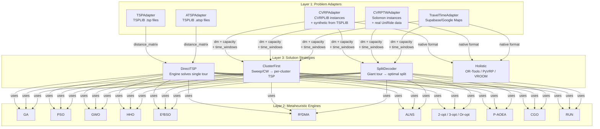
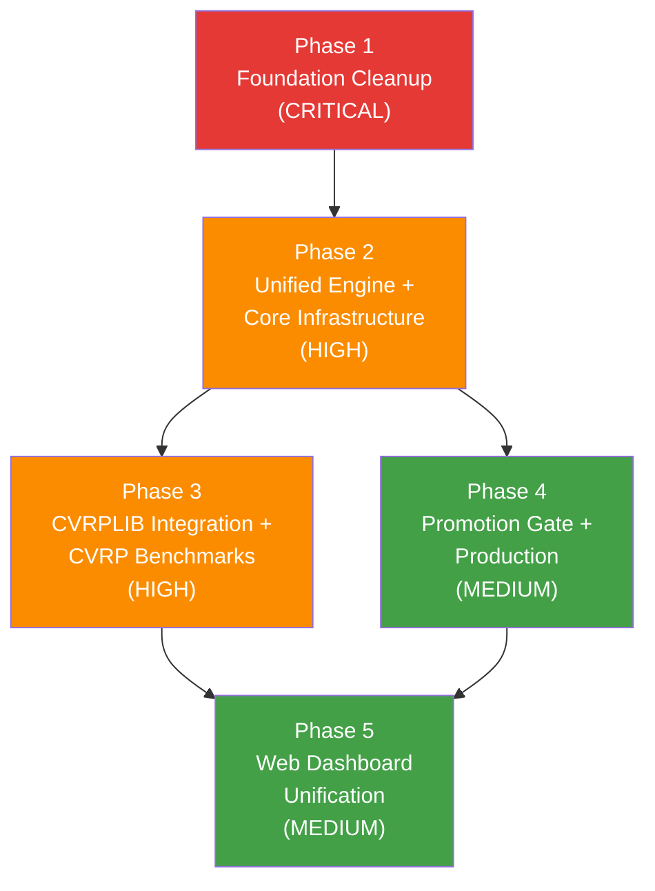

# UniRide Ecosystem — Unified Master Plan & Execution Specification

**Date:** May 26, 2026, 00:35 (UTC+3)  
**Architect:** Antigravity (Google DeepMind - Gemini 2.5 Pro, Advanced Agentic Coding)  
**Purpose:** Single source of truth for the entire UniRide refactoring. Covers architecture, all 5 phases, and detailed execution specs for AI agents.

## Core-First Amendment (Codex Implementation Ground)

All critical solver, benchmark, matrix, decoder, algorithm, and result logic must live in `uniride_core` and its subfolders. `optimizer_api` remains a compatibility/application layer for the current UniRide web app and external callers: it should translate FastAPI/web requests into `uniride_core` problem objects, call core engines/functions, and translate core results back to existing response schemas.

`uniride_core` must never import `optimizer_api`. Any reusable code currently owned by `optimizer_api` should be moved into `uniride_core` first, with `optimizer_api` retaining thin wrappers only where needed for backward compatibility.

Capacity is vector-first from Phase 2 onward. Standard CVRP maps to a single demand/capacity dimension, while UniRide maps to multi-dimensional passenger capacity such as `[sw, so]`. CVRPTW support must preserve travel-time matrices, asymmetric costs, service times, max route duration, pickup/dropoff direction, and time-window violation metrics.

---

## Table of Contents

1. [The Core Challenge](#1-the-core-challenge)
2. [Three-Layer Solver Architecture](#2-three-layer-solver-architecture)
3. [Algorithm Inventory — Current State](#3-algorithm-inventory--current-state)
4. [Phase 1: Foundation Cleanup](#phase-1-foundation-cleanup-critical)
5. [Phase 2: Unified Engine + Core Infrastructure](#phase-2-unified-engine--core-infrastructure-high)
6. [Phase 3: CVRPLIB Integration + CVRP Benchmark Support](#phase-3-cvrplib-integration--cvrp-benchmark-support-high)
7. [Phase 4: Promotion Gate + Production Integration](#phase-4-promotion-gate--production-integration-medium)
8. [Phase 5: Data & Web Dashboard Unification](#phase-5-data--web-dashboard-unification-medium)
9. [Verification Checklists](#verification-checklists)

---

## 1. The Core Challenge

**Write an algorithm ONCE, use it EVERYWHERE:**

```
Same Algorithm Implementation
         │
         ├── Benchmark on TSPLIB (TSP/ATSP)    → Academic Paper #1
         ├── Benchmark on CVRPLIB (CVRP)        → Academic Paper #2
         ├── Benchmark on Real Data (CVRPTW)     → Academic Paper #3
         └── Deploy in UniRide Web (Production)  → Student transportation
```

Currently this is **impossible** because:
- `sota_tsp/` solvers accept `List[int]` + distance matrix → TSP only
- `optimizer_api/strategies/` accept `OptimizationRequest` → CVRP/CVRPTW only
- An algorithm must be reimplemented to cross from research to production

### Resolved User Decisions

| Question | Decision |
|:---------|:---------|
| Web benchmark page | **Keep both** — quick web benchmarks + academic DB as source of truth. **Adjustable parameters** on web. |
| Academic benchmark algorithms | **All algorithms available** — Pipeline A/B, Holistic, Heuristic, SOTA, and Numba variants |
| CVRPLIB integration | **Separate dedicated effort** (Phase 3 in this plan) — detailed execution spec included |
| Promotion automation | **Semi-automated CLI** — `python -m academic_benchmark promote` validates criteria before promoting |
| TSPLIB data location | **SQLite DB-first** — `academic_benchmark/tsplib_data/tsplib.db` is canonical |
| Travel time matrix | **Preferred over Euclidean** — fallback to EUC_2D/ATT if unavailable. Synthetic conversion (dist ÷ speed + noise) for benchmarks |
| `faz0_interactive.py` | **DELETE** — broken legacy |
| `run_sota_benchmark.py` | **DELETE** — dead code, web uses its own `benchmark_runner.py` |

---

## 2. Three-Layer Solver Architecture



**Key insight:** Every metaheuristic operates on the same primitive — **permuting a sequence of nodes and evaluating cost via a distance/time matrix**. The difference between TSP and CVRP is not in the algorithm, but in **how the permutation is decoded** (single tour vs. split into routes).

| Layer | Responsibility | Lives In |
|:------|:--------------|:---------|
| **Problem Adapter** | Converts any problem format into `distance_matrix` + `constraints` | `uniride_core/adapters/` |
| **Metaheuristic Engine** | Pure algorithm: takes `distance_matrix`, returns `permutation` + `cost` | `uniride_core/algorithms/` |
| **Solution Strategy** | Wraps engine for a problem type: TSP→direct, CVRP→cluster+TSP or TSP+split | `optimizer_api/strategies/` + `academic_benchmark/` |

---

## 3. Algorithm Inventory — Current State

### In `uniride_core/algorithms/sota_tsp/` (Pure Python)

| Algorithm | TSP | ATSP | CVRP | CVRPTW | Notes |
|:----------|:---:|:----:|:----:|:------:|:------|
| E²BSO, R²DMA, P-AOEA, CGO, RUN, ALNS | ✅ | ✅ | ❌ | ❌ | Need CVRP wrapper (Phase 2-3) |

### In `optimizer_api/strategies/` (Production Wrappers)

| Algorithm | TSP | ATSP | CVRP | CVRPTW | Notes |
|:----------|:---:|:----:|:----:|:------:|:------|
| GA/PSO/GWO/HHO (Sweep) | ❌ | ❌ | ✅ | ✅ | Cluster-first pipeline |
| GA/PSO/GWO/HHO (Split) | ❌ | ❌ | ✅ | ✅ | Route-first + Split pipeline |
| OR-Tools, PyVRP, VROOM | ❌ | ❌ | ✅ | ✅ | Holistic solvers |
| E²BSO, R²DMA | ❌ | ❌ | ✅ | ❌ | SOTA wrappers |
| 2-opt, Greedy | ❌ | ❌ | ✅ | ❌ | Heuristics |

### In `academic_benchmark/` (Via registry_setup.py)

| Algorithm | TSP | ATSP | CVRP | Notes |
|:----------|:---:|:----:|:----:|:------|
| Numba-2opt, 3opt, Or-opt, Swap, Hybrid, GA, PSO, GWO, HHO | ✅ | ✅ | ❌ | Local search + metaheuristic |
| SOTA-E2BSO, R2DMA, P-AOEA, CGO, RUN, ALNS | ✅ | ✅ | ❌ | Via SOTA executor |

**The Gap:** No algorithm can currently be benchmarked on CVRP/CVRPTW in `academic_benchmark`.

---

## Phase 1: Foundation Cleanup (CRITICAL) — Status: DONE

> **Risk:** 🟢 Zero to Low — No behavioral changes to production.  
> **Goal:** Delete dead code, fix security, fix reverse dependencies.

### Files to Study First

| File | Why |
|:-----|:----|
| [tsplib_parser.py](file:///c:/Users/yekta/Masaüstü/AiCode/FirebaseUniRide/UniRide/uniride_core/algorithms/tsplib_parser.py) | Contains hardcoded reverse dependency to `optimizer_api` |
| [test_direct.py](file:///c:/Users/yekta/Masaüstü/AiCode/FirebaseUniRide/UniRide/test_direct.py) | Contains hardcoded Azure API key |
| [param_spaces.py](file:///c:/Users/yekta/Masaüstü/AiCode/FirebaseUniRide/UniRide/academic_benchmark/param_spaces.py) | Missing ALNS-TSP entry |
| [benchmark_utils.py](file:///c:/Users/yekta/Masaüstü/AiCode/FirebaseUniRide/UniRide/academic_benchmark/benchmark_utils.py) | TSPLIB_OPTIMALS (129 entries) to merge into core |

### Task 1.1: Delete Dead Files — DONE

| File | Action | Reason |
|:-----|:-------|:-------|
| `optimizer_api/faz0_interactive.py` | **DELETE** | 3,142 lines, broken imports (`TSPLIBProblemInfo`), superseded by `cli_engine.py` |
| `optimizer_api/run_sota_benchmark.py` | **DELETE** | Broken import: `from academic_benchmark.run_sota_benchmark import main`. Web uses `benchmark_runner.py`. |

### Task 1.2: Fix Hardcoded API Key — DONE

**File:** `test_direct.py`  
**Change:** Replace hardcoded Azure API key with `os.environ.get("AZURE_OPENAI_API_KEY")`  
**User action:** Rotate key in Azure portal.

### Task 1.3: Fix Reverse Dependency — DONE

**File:** `uniride_core/algorithms/tsplib_parser.py` (line 35-36)  
**Change:** Replace `../../optimizer_api/tests/tsplib_data` with env var fallback:
```python
TSPLIB_DATA_DIR = os.environ.get(
    "TSPLIB_DATA_DIR",
    os.path.join(os.path.dirname(__file__), '..', '..', 'tsplib_data')
)
```
**Purpose:** Core must never import from `optimizer_api`.

### Task 1.4: Add Missing ALNS-TSP Parameter Space — DONE

**File:** `academic_benchmark/param_spaces.py`  
**Change:** Add entry:
```python
"ALNS-TSP": {
    "population_size":  {"type": "int",   "doe": [24, 36, 48],   "optuna": (20, 60)},
    "max_iterations":   {"type": "int",   "doe": [200, 320, 450],"optuna": (150, 500)},
    "remove_ratio":     {"type": "float", "doe": [0.10, 0.15, 0.20], "optuna": (0.05, 0.25)},
    "time_limit":       {"type": "float", "doe": [300.0, 600.0, 1200.0], "optuna": None},
}
```

### Task 1.5: Merge TSPLIB_OPTIMALS Into Core — DONE

**Files:** `uniride_core/algorithms/tsplib_parser.py` (47 entries) ← `academic_benchmark/benchmark_utils.py` (129 entries)  
**Change:** Merge the comprehensive 129-entry dict into core. Update `benchmark_utils.py` to import from core:
```python
from uniride_core.algorithms.tsplib_parser import TSPLIB_OPTIMALS
```

### Task 1.6: Fix Signal Handler Conflicts — DONE

**Files:** `academic_benchmark/smart_benchmark.py` (line 136), `academic_benchmark/cli_engine.py` (line 263)  
**Change:** Use a guard to chain signal handlers instead of overwriting.

### Phase 1 Verification

```bash
cd optimizer_api && python -c "from main import app; print('API OK')"
python -c "from academic_benchmark.param_spaces import SOTA_PARAM_SPACES; assert 'ALNS-TSP' in SOTA_PARAM_SPACES; print('ALNS OK')"
grep -r "optimizer_api" uniride_core/  # Should return 0 results
python -c "from uniride_core.algorithms.tsplib_parser import TSPLIB_OPTIMALS; assert len(TSPLIB_OPTIMALS) >= 129; print(f'OK: {len(TSPLIB_OPTIMALS)} entries')"
```

---

## Phase 2: Unified Engine + Core Infrastructure (HIGH) — Status: DONE

> **Risk:** 🟡 Medium — New abstractions, but backward compatible.  
> **Goal:** Create `UnifiedEngine`, `MatrixBuilder`, `SplitDecoder`, and `CVRPResult` in `uniride_core`.  
> **Dependencies:** Phase 1 complete.

### Files to Study First

| File | Why |
|:-----|:----|
| [base_solver.py](file:///c:/Users/yekta/Masaüstü/AiCode/FirebaseUniRide/UniRide/uniride_core/algorithms/sota_tsp/base_solver.py) | Current `BaseTSPSolver` ABC — new `UnifiedEngine` must coexist |
| [models.py](file:///c:/Users/yekta/Masaüstü/AiCode/FirebaseUniRide/UniRide/uniride_core/models.py) | `ProblemInstance`, `TSPResult` — extend with CVRP fields |
| [hybrid_base_strategy.py](file:///c:/Users/yekta/Masaüstü/AiCode/FirebaseUniRide/UniRide/optimizer_api/strategies/hybrid_base_strategy.py) | Contains Split logic to extract into core |

### Task 2.1: Extend `ProblemInstance` and Create `CVRPResult` — DONE

**File:** `uniride_core/models.py` (MODIFY — add ~30 lines)

Add to `ProblemInstance`:
```python
demands: Optional[List[int]] = None              # demand per node, index 0 = depot (0)
service_times: Optional[List[int]] = None        # service time per node (CVRPTW)
num_vehicles_bks: Optional[int] = None           # BKS vehicle count
```

New dataclass:
```python
@dataclass
class CVRPResult:
    """Output from a CVRP/CVRPTW optimization algorithm."""
    algorithm: str
    routes: List[List[int]]              # List of routes, each is list of node indices
    total_cost: float
    num_vehicles: int
    time_ms: float = 0.0
    optimal_gap: Optional[float] = None
    capacity_violations: int = 0
    tw_violations: int = 0
    convergence_curve: Optional[List[float]] = None
    iterations: int = 0
    seed: Optional[int] = None
    params: Dict[str, Any] = field(default_factory=dict)
    route_costs: Optional[List[float]] = None
    route_loads: Optional[List[int]] = None
```

### Task 2.2: Create `MatrixBuilder` Adapter — DONE

**File:** `uniride_core/adapters/__init__.py` (NEW — empty)  
**File:** `uniride_core/adapters/matrix_builder.py` (NEW — ~120 lines)

```python
class MatrixBuilder:
    @staticmethod
    def from_coordinates(coords, edge_weight_type="EUC_2D") -> np.ndarray:
        """Build distance matrix using tsplib_distance_by_type. Returns int32."""

    @staticmethod
    def from_explicit_matrix(matrix: List[List[float]]) -> np.ndarray:
        """Convert explicit matrix to numpy. Returns float64."""

    @staticmethod
    def from_travel_times(time_matrix: List[List[float]]) -> np.ndarray:
        """Convert travel time matrix. Returns float64."""

    @staticmethod
    def tsplib_to_travel_time(coords, speed_kmh=40.0, noise_pct=0.10, seed=42) -> np.ndarray:
        """Convert TSPLIB coords to synthetic travel times.
        travel_time_min = (euclidean_dist / speed_kmh) * 60 + noise
        Returns float64."""
```

**MUST use** `uniride_core.algorithms.tsplib_parser.tsplib_distance_by_type` for distance calculation.

### Task 2.3: Create Split Decoder — DONE

**File:** `uniride_core/algorithms/split_decoder.py` (NEW — ~200 lines)

Pure math module — **NO web/API dependencies**.

```python
def optimal_split(permutation, distance_matrix, demands, capacity, depot=0) -> List[List[int]]:
    """Bellman-style DP split: giant tour → feasible CVRP routes. O(n²)."""

def split_with_time_windows(permutation, dm, demands, capacity, time_windows, service_times, depot=0) -> List[List[int]]:
    """Split with time window feasibility checks."""

def calculate_route_cost(route, distance_matrix, depot=0) -> float:
    """Cost of depot → c1 → c2 → ... → depot."""

def calculate_total_cost(routes, distance_matrix, depot=0) -> float:
    """Sum of all route costs."""

def validate_cvrp_solution(routes, demands, capacity, num_customers) -> Tuple[bool, List[str]]:
    """Check: all customers visited once, no route exceeds capacity."""

def validate_cvrptw_solution(routes, dm, demands, capacity, time_windows, service_times, depot=0) -> Tuple[bool, List[str]]:
    """Check CVRP + time window adherence."""
```

**Implementation hint:** Extract the Split logic from `optimizer_api/strategies/ga_split_strategy.py` and/or `hybrid_base_strategy.py`.

### Task 2.4: Create `UnifiedEngine` ABC — DONE

**File:** `uniride_core/algorithms/base_engine.py` (NEW — ~60 lines)

```python
class UnifiedEngine(ABC):
    @abstractmethod
    def optimize_permutation(self, distance_matrix, config, seed) -> PermutationResult:
        """Return best permutation and its cost."""

    def solve_tsp(self, dm, config, seed) -> TSPResult:
        """Direct TSP: permutation = tour."""

    def solve_cvrp(self, dm, config, seed, demands, capacity, depot=0, split_method="optimal_split") -> CVRPResult:
        """CVRP: permutation → optimal_split → routes."""

    def solve_cvrptw(self, dm, config, seed, demands, capacity, depot, time_windows, service_times) -> CVRPTWResult:
        """CVRPTW: permutation → split with time window checks."""
```

**Backward compatibility:** Existing `BaseTSPSolver` stays. Solvers can inherit both:
```python
class E2BSO_TSP(BaseTSPSolver, UnifiedEngine):
    def optimize_permutation(self, dm, config, seed):
        # Same algorithm code as _solve()
    def _solve(self):
        # Legacy interface → delegates to optimize_permutation()
```

### Phase 2 Verification

```bash
python -c "
from uniride_core.models import ProblemInstance, CVRPResult
from uniride_core.adapters.matrix_builder import MatrixBuilder
from uniride_core.algorithms.split_decoder import optimal_split, validate_cvrp_solution
import numpy as np

# Test MatrixBuilder
coords = [(0,0), (3,4), (6,8)]
dm = MatrixBuilder.from_coordinates(coords, 'EUC_2D')
assert dm.shape == (3, 3) and dm[0,1] == 5

# Test SplitDecoder
dm6 = np.array([[0,10,20,30,40,50],[10,0,15,25,35,45],[20,15,0,10,20,30],
                [30,25,10,0,10,20],[40,35,20,10,0,10],[50,45,30,20,10,0]], dtype=np.float64)
routes = optimal_split([1,2,3,4,5], dm6, [0,3,4,3,4,3], capacity=8, depot=0)
ok, errs = validate_cvrp_solution(routes, [0,3,4,3,4,3], 8, 5)
assert ok, errs
print(f'Phase 2 OK: dm={dm.shape}, routes={len(routes)}')
"
```

---

## Phase 3: CVRPLIB Integration + CVRP Benchmark Support (HIGH) — Status: PARTIAL

> **Risk:** 🟡 Medium — New external dependency (`vrplib`), new DB, new executors.  
> **Goal:** Download CVRPLIB/Solomon instances, store in SQLite, register CVRP executors, extend dashboard.  
> **Dependencies:** Phase 2 complete (needs `CVRPResult`, `MatrixBuilder`, `split_decoder`).

### Files to Study First

| File | Why |
|:-----|:----|
| [tsplib_manager.py](file:///c:/Users/yekta/Masaüstü/AiCode/FirebaseUniRide/UniRide/academic_benchmark/tsplib_manager.py) | **Primary pattern reference** — `cvrplib_manager.py` must mirror this |
| [engine_core.py](file:///c:/Users/yekta/Masaüstü/AiCode/FirebaseUniRide/UniRide/academic_benchmark/engine_core.py) | `AlgorithmRegistry`, `RunResult` — executor signature |
| [registry_setup.py](file:///c:/Users/yekta/Masaüstü/AiCode/FirebaseUniRide/UniRide/academic_benchmark/core/registry_setup.py) | Pattern for CVRP executor registration |
| [param_spaces.py](file:///c:/Users/yekta/Masaüstü/AiCode/FirebaseUniRide/UniRide/academic_benchmark/param_spaces.py) | Pattern for param space addition |

### Task 3.1: Install `vrplib` — PENDING

Add `vrplib>=2.2.0` to Python dependencies.

### Task 3.2: Create CVRPLIB Manager — PARTIAL / INTEGRATED

**File:** `academic_benchmark/cvrplib_manager.py` (NEW — ~450 lines)

Mirrors `tsplib_manager.py` structure exactly.

**Directory layout:**
```
academic_benchmark/cvrplib_data/
├── cvrplib.db              ← SQLite DB
├── instances/              ← Downloaded .vrp / .sol files
└── solomon/                ← Solomon VRPTW instances
```

**SQLite Schema (6 tables):**

```sql
CREATE TABLE IF NOT EXISTS cvrp_problems (
    name TEXT PRIMARY KEY,
    dimension INTEGER NOT NULL,
    num_customers INTEGER NOT NULL,       -- dimension - 1
    capacity INTEGER NOT NULL,
    best_known REAL,                      -- BKS cost
    num_vehicles_bks INTEGER,
    problem_type TEXT NOT NULL DEFAULT 'CVRP',  -- 'CVRP' or 'CVRPTW'
    dataset TEXT NOT NULL,                -- 'augerat_A', 'cmt', 'solomon_R1', etc.
    category TEXT NOT NULL,               -- 'small' (≤50), 'medium' (≤200), 'large' (>200)
    edge_weight_type TEXT NOT NULL DEFAULT 'EUC_2D',
    source TEXT DEFAULT 'cvrplib',
    extracted_at TEXT, comment TEXT
);

CREATE TABLE IF NOT EXISTS cvrp_coordinates (
    problem_name TEXT NOT NULL, node_idx INTEGER NOT NULL,
    x REAL NOT NULL, y REAL NOT NULL,
    PRIMARY KEY (problem_name, node_idx),
    FOREIGN KEY (problem_name) REFERENCES cvrp_problems(name) ON DELETE CASCADE
);

CREATE TABLE IF NOT EXISTS cvrp_demands (
    problem_name TEXT NOT NULL, node_idx INTEGER NOT NULL, demand INTEGER NOT NULL,
    PRIMARY KEY (problem_name, node_idx),
    FOREIGN KEY (problem_name) REFERENCES cvrp_problems(name) ON DELETE CASCADE
);

CREATE TABLE IF NOT EXISTS cvrp_time_windows (
    problem_name TEXT NOT NULL, node_idx INTEGER NOT NULL,
    ready_time INTEGER NOT NULL, due_date INTEGER NOT NULL,
    service_time INTEGER NOT NULL DEFAULT 0,
    PRIMARY KEY (problem_name, node_idx),
    FOREIGN KEY (problem_name) REFERENCES cvrp_problems(name) ON DELETE CASCADE
);

CREATE TABLE IF NOT EXISTS cvrp_distance_matrices (
    problem_name TEXT PRIMARY KEY, matrix_blob BLOB NOT NULL,
    dtype TEXT NOT NULL DEFAULT 'int32', shape_n INTEGER NOT NULL,
    edge_weight_type TEXT NOT NULL, computed_at TEXT NOT NULL,
    FOREIGN KEY (problem_name) REFERENCES cvrp_problems(name) ON DELETE CASCADE
);

CREATE TABLE IF NOT EXISTS cvrp_best_solutions (
    id INTEGER PRIMARY KEY AUTOINCREMENT,
    problem_name TEXT NOT NULL, algorithm TEXT NOT NULL,
    params_json TEXT NOT NULL, routes_json TEXT NOT NULL,
    total_cost REAL, num_vehicles INTEGER, gap REAL, timestamp TEXT NOT NULL,
    FOREIGN KEY (problem_name) REFERENCES cvrp_problems(name) ON DELETE CASCADE
);
```

**Required Functions:**

| Function | Description |
|:---------|:-----------|
| `download_cvrplib_instances(datasets, max_dimension, force)` | Download .vrp and .sol files using `vrplib.download()` |
| `download_solomon_instances(types, force)` | Download Solomon VRPTW instances |
| `cmd_extract(args)` | Parse downloaded files → SQLite DB. Use `vrplib.read_instance()` and `vrplib.read_solution()` |
| `cmd_compute_dm(args)` | Compute and cache distance matrices (zlib-compressed int32) |
| `cmd_status(args)` | Print DB statistics |
| `get_cvrp_problems(db_path, max_dim, dataset, problem_type)` | Return list of problem dicts (coords, demands, time_windows) |
| `get_cvrp_distance_matrix(problem_name, db_path)` | Load cached n×n int32 matrix |
| `get_cvrp_problem_as_instance(problem_name, db_path)` | Return as `ProblemInstance` — the bridge to engine system |

**CLI entry point:** `python academic_benchmark/cvrplib_manager.py <download|extract|compute-dm|status|download-solomon>`

**BKS Dictionary:** Include `CVRP_BKS` dict with known optimal values for Augerat A/B, CMT, and Solomon instances. Fetch complete values from CVRPLIB website or from `.sol` files.

### Task 3.3: Register CVRP Executors — PARTIAL / INTEGRATED

**File:** `academic_benchmark/core/cvrp_registry_setup.py` (NEW — ~200 lines)

Registers `CVRP-{algo}` executors for all existing TSP algorithms. Each executor:

1. Receives `ProblemInstance` with CVRP fields
2. Builds distance matrix via `MatrixBuilder`
3. Calls TSP solver → giant tour permutation
4. Runs `optimal_split()` → CVRP routes
5. Returns `RunResult` with CVRP metrics

```python
# Executor signature: (problem, params, seed, run_idx) → RunResult
def _make_cvrp_executor(base_algo, solver_factory):
    def executor(problem, params, seed, run_idx):
        dm = build_distance_matrix(problem)
        customer_dm = dm[customers_only]
        solver = solver_factory(params, seed)
        tsp_result = solver.solve_with_matrix(customer_dm)
        giant_tour = map_back_to_original_indices(tsp_result.tour)
        routes = optimal_split(giant_tour, dm, problem.demands, problem.capacity)
        total_cost = calculate_total_cost(routes, dm)
        return RunResult(problem=problem.name, algorithm=f"CVRP-{base_algo}", ...)
    return executor
```

**Registers:** `CVRP-E2BSO-TSP`, `CVRP-R2DMA-TSP`, `CVRP-P-AOEA-TSP`, `CVRP-CGO-TSP`, `CVRP-RUN-TSP`, `CVRP-ALNS-TSP`, `CVRP-Numba-GA`, `CVRP-Numba-PSO`, `CVRP-Numba-GWO`, `CVRP-Numba-HHO`, etc.

**Integration:** Import in `academic_benchmark/core/__init__.py` AFTER `registry_setup.py`.

### Task 3.4: Add CVRP Parameter Spaces — DONE

**File:** `academic_benchmark/param_spaces.py` (MODIFY — add ~40 lines)

```python
CVRP_PARAM_SPACES = {
    "CVRP-E2BSO-TSP": {
        **SOTA_PARAM_SPACES.get("E2BSO-TSP", {}),
        "split_method": {"type": "categorical", "doe": ["optimal_split"], "optuna": ["optimal_split"]},
    },
    # ... repeat for all CVRP algorithms
}
SOTA_PARAM_SPACES.update(CVRP_PARAM_SPACES)
```

### Task 3.5: Create Synthetic CVRP/CVRPTW Generator — DONE

**File:** `academic_benchmark/synthetic_cvrp_generator.py` (NEW — ~150 lines)

```python
def generate_cvrp_from_tsplib(problem_name, capacity=None, demand_range=(1,10), seed=42):
    """Create CVRP from TSPLIB TSP: add random demands + capacity."""

def generate_cvrptw_from_tsplib(problem_name, capacity=None, speed_kmh=40.0, time_window_width=60, seed=42):
    """Create CVRPTW: add travel time matrix + random time windows."""

def batch_generate_cvrp(problem_names=None, max_dim=500, seed=42):
    """Generate CVRP instances for all eligible TSPLIB problems."""
```

### Task 3.6: Extend Dashboard for CVRP Metrics — DONE

**Files:** `academic_benchmark/dashboard.py`, `academic_benchmark/dashboard_utils.py`

Implemented first-class SQLite-backed routing metric reporting:
- dashboard now appends canonical `benchmark_results` rows from SQLite to the progress data frame,
- dashboard metric selection includes `objective_cost`, `tour_cost`, `num_vehicles`, `capacity_violations`, and `tw_violations`,
- dashboard labels now refer to routing problems instead of TSP-only problems,
- `dashboard_utils.py` normalizes DB rows into the existing dashboard progress schema so CSV workflows remain compatible.

Remaining polish for this task, if needed later: add a dedicated CVRP/CVRPTW tab with dataset-family grouping and BKS vehicle comparisons after the full CVRPLIB/Solomon importer is finalized.

### Phase 3 Verification

```bash
# 1. vrplib installed
python -c "import vrplib; print(f'vrplib {vrplib.__version__} OK')"

# 2. CVRPLIB manager works
python academic_benchmark/cvrplib_manager.py download --datasets A,B
python academic_benchmark/cvrplib_manager.py extract
python academic_benchmark/cvrplib_manager.py compute-dm
python academic_benchmark/cvrplib_manager.py status
python -c "
from academic_benchmark.cvrplib_manager import get_cvrp_problems
problems = get_cvrp_problems()
assert len(problems) >= 40
print(f'OK: {len(problems)} CVRP problems')
"

# 3. CVRP executors registered
python -c "
from academic_benchmark.engine_core import AlgorithmRegistry
import academic_benchmark.core.registry_setup
import academic_benchmark.core.cvrp_registry_setup
cvrp = [a for a in AlgorithmRegistry.list_algorithms() if a.startswith('CVRP-')]
assert len(cvrp) >= 6
print(f'CVRP algorithms: {cvrp}')
"

# 4. End-to-end test
python -c "
from academic_benchmark.engine_core import AlgorithmRegistry
import academic_benchmark.core.registry_setup
import academic_benchmark.core.cvrp_registry_setup
from academic_benchmark.cvrplib_manager import get_cvrp_problem_as_instance
problem = get_cvrp_problem_as_instance('A-n32-k5')
executor = AlgorithmRegistry.get_executor('CVRP-E2BSO-TSP')
result = executor(problem, {'population_size': 20, 'max_iterations': 50}, seed=42, run_idx=1)
print(f'E2E OK: {result.algorithm} cost={result.tour_cost} gap={result.gap_pct}%')
"
```

---

## Phase 4: Promotion Gate + Production Integration (MEDIUM) — Status: PARTIAL

> **Risk:** 🟡 Medium — Changes production algorithm loading.  
> **Goal:** Formalize the research → production pipeline. Promoted algorithms get locked params.  
> **Dependencies:** Phase 2 complete.

### Task 4.1: Create `promoted_configs.json` — DONE

**File:** `academic_benchmark/promoted_configs.py` (NEW)

```json
{
  "schema_version": 1,
  "source": "academic_db",
  "generated_at": "2026-05-31T12:00:00",
  "selection_rule": "best finite gap, then best finite objective/tour cost per algorithm/problem_type/matrix_kind",
  "configs": [
    {
      "algorithm": "Numba-Or-opt",
      "problem_type": "atsp",
      "matrix_kind": "travel_time",
      "params": {"max_passes": 2},
      "score": 20.0,
      "gap": null,
      "source_table": "benchmark_results",
      "selected_from": {"problem": "tiny-atsp", "run_id": "run-1"}
    }
  ]
}
```

Implemented as a generator/reader instead of committing a stale static JSON snapshot:
- `build_promoted_configs()` reads canonical SQLite rows from `best_solutions` and `benchmark_results`,
- `write_promoted_configs()` emits `academic_benchmark/benchmark_db/promoted_configs.json`,
- `resolve_promoted_params()` gives core/API callers a neutral parameter lookup by algorithm, problem type, and matrix kind,
- no `optimizer_api` ownership or imports are introduced.

### Task 4.2: Create Promotion Manager — DONE

**File:** `academic_benchmark/promotion_manager.py` (NEW)

```python
# CLI:
# python -m academic_benchmark.promotion_manager --dry-run
# python -m academic_benchmark.promotion_manager --output academic_benchmark/benchmark_db/promoted_configs.json
```

Implemented promotion workflow:
- builds promoted configs from academic SQLite rows,
- validates minimum config count and parameter presence,
- supports `--dry-run`, `--allow-empty-params`, `--db-path`, `--output`, and `--limit`,
- exits non-zero with a validation message instead of writing empty promotion files.

### Task 4.3: Update Strategy Registry — PARTIAL

**File:** `optimizer_api/strategies/__init__.py` (MODIFY)

- DONE: add `STRATEGY_FACTORIES` for every compatibility registry key.
- DONE: make `get_strategy()` return fresh strategy instances instead of reusing mutable singleton objects.
- DONE: keep backward-compatible `STRATEGY_REGISTRY` for read-only lookups and optional dependency availability checks.
- REMAINING: load promoted configs into the strategies/wrappers once SOTA per-request config parity is finalized.

### Task 4.4: Simplify SOTA Wrappers — PARTIAL

**Files:** `ebso_strategy.py`, `rdma_strategy.py`, `aoea_strategy.py` (MODIFY)

After `UnifiedEngine` exists, these become thin wrappers:
```python
class E2BSoStrategy(BaseRoutingStrategy):
    def optimize(self, request):
        dm = MatrixBuilder.from_travel_times(request.time_matrix)
        engine = E2BSO_TSP(config=self._promoted_config)
        result = engine.solve_cvrp(dm, config, seed, demands, capacity)
        return self._convert_to_response(result, request)
```

### Task 4.5: Update Web Algorithm Constants — PENDING

**File:** `src/lib/algorithm-constants.ts` (MODIFY)

Add new "Research-Promoted (SOTA)" category populated from promoted configs.

### Task 4.6: Web Benchmark Adjustable Parameters — PARTIAL

**File:** `src/app/(app)/admin/benchmark/page.tsx` (MODIFY)

Add parameter adjustment UI (population_size, max_iterations, etc.) to the benchmark configuration tab.

---

## Phase 5: Data & Web Dashboard Unification (MEDIUM) — Status: PARTIAL

> **Risk:** 🟢 Low — Read-only integration, no changes to write paths.  
> **Goal:** Web app reads from academic SQLite DB. Both quick benchmarks and academic results visible.  
> **Dependencies:** Phases 2-3 complete.

### Task 5.1: New API Endpoints for Academic Results — PARTIAL

**File:** `optimizer_api/routers/benchmark.py` (MODIFY)

```python
@router.get("/academic/results")    # Read from academic SQLite DB
@router.get("/academic/problems")   # List TSPLIB + CVRPLIB problems
@router.get("/academic/leaderboard") # Algorithm comparison
```

### Task 5.2: Web Benchmark Reads Academic DB — PARTIAL

**File:** Admin benchmark page reads from both:
- In-memory `benchmark_state.py` for live runs
- SQLite DB for historical academic results

### Task 5.3: Real Data Export Tool — PENDING

**File:** `academic_benchmark/data_export.py` (NEW — ~100 lines)

Export anonymized UniRide production data from Supabase for CVRPTW benchmarking.

### Task 5.4: Thread-Safety Fix — PENDING

**File:** `optimizer_api/strategies/__init__.py` (already in Phase 4)

### Task 5.5: Scheduling Logic Extraction — PENDING

**File:** `optimizer_api/utils/scheduling.py` (NEW)  
Extract `_calculate_scheduled_times()` + `_minutes_to_time()` from `optimization.py`.

---

## File Summary — All Phases

| Phase | File | Action | ~Lines |
|:------|:-----|:-------|:-------|
| 1 | `optimizer_api/faz0_interactive.py` | DELETE | -3142 |
| 1 | `optimizer_api/run_sota_benchmark.py` | DELETE | -3 |
| 1 | `test_direct.py` | MODIFY | ~5 |
| 1 | `uniride_core/algorithms/tsplib_parser.py` | MODIFY | ~10 |
| 1 | `academic_benchmark/param_spaces.py` | MODIFY | +6 |
| 1 | `academic_benchmark/benchmark_utils.py` | MODIFY | ~3 |
| 1 | `academic_benchmark/smart_benchmark.py` | MODIFY | ~5 |
| 1 | `academic_benchmark/cli_engine.py` | MODIFY | ~5 |
| 2 | `uniride_core/models.py` | MODIFY | +30 |
| 2 | `uniride_core/adapters/__init__.py` | NEW | 1 |
| 2 | `uniride_core/adapters/matrix_builder.py` | NEW | ~120 |
| 2 | `uniride_core/algorithms/split_decoder.py` | NEW | ~200 |
| 2 | `uniride_core/algorithms/base_engine.py` | NEW | ~60 |
| 3 | `academic_benchmark/cvrplib_manager.py` | NEW | ~450 |
| 3 | `academic_benchmark/core/cvrp_registry_setup.py` | NEW | ~200 |
| 3 | `academic_benchmark/param_spaces.py` | MODIFY | +40 |
| 3 | `academic_benchmark/synthetic_cvrp_generator.py` | NEW | ~150 |
| 3 | `academic_benchmark/dashboard.py` | MODIFY | +100 |
| 4 | `promoted_configs.json` | NEW | ~50 |
| 4 | `academic_benchmark/promotion_manager.py` | NEW | ~150 |
| 4 | `optimizer_api/strategies/__init__.py` | MODIFY | ~50 |
| 4 | `optimizer_api/strategies/ebso_strategy.py` | MODIFY | -100 |
| 4 | `src/lib/algorithm-constants.ts` | MODIFY | +30 |
| 4 | `src/app/(app)/admin/benchmark/page.tsx` | MODIFY | +50 |
| 5 | `optimizer_api/routers/benchmark.py` | MODIFY | +60 |
| 5 | `academic_benchmark/data_export.py` | NEW | ~100 |
| 5 | `optimizer_api/utils/scheduling.py` | NEW | ~50 |

---

## Execution Order & Dependencies



> [!IMPORTANT]
> **For AI agents executing this plan:** Each phase has its own Verification section. Run ALL verification commands after completing a phase before moving to the next. If any check fails, fix before proceeding.

---

## Implemented Since Plan (2026-05-26)

Verified changes completed after initial plan authoring. Tests exist for each item.

### Infrastructure

- **SQLite benchmark source-of-truth** — `benchmark_runs` / `benchmark_results` tables added as canonical DB-backed store for benchmark data.
- **SQLite run updates fixed** — `save_benchmark_run()` updates existing run rows in place, so marking a run `completed` no longer deletes child `benchmark_results` through SQLite `REPLACE` cascade behavior.
- **Matrix-native benchmark runner path** — Benchmark runner accepts pre-built distance/duration matrices, avoiding redundant computation.
- **Matrix-native SQLite smoke coverage** — TSP, ATSP, CVRP, CVRPTW, and UniRide matrix-native benchmark results are persisted and queried through the canonical SQLite result tables.

### Algorithm Migration to `uniride_core`

| Module | Status | Details |
|:-------|:-------|:--------|
| `ga_split_engine.py` | **Moved** | Full GA-Split engine in `uniride_core`. `ga_split_strategy.py` is wrapper. |
| `pso_split_engine.py` | **Moved** | Full PSO-Split engine in `uniride_core`. `pso_split_strategy.py` is wrapper. |
| `gwo_split_engine.py` | **Moved** | Full GWO-Split engine in `uniride_core`. `gwo_split_strategy.py` is wrapper. |
| `hho_split_engine.py` | **Moved** | Full HHO-Split engine in `uniride_core`. `hho_split_strategy.py` is wrapper. |
| `tsp_meta_engines.py` — GA | **Moved** | `solve_ga_tsp`, `tournament_selection`, operators. Wrapper delegates. |
| `tsp_meta_engines.py` — PSO | **Moved** | `solve_pso_tsp`, swap-sequence velocity. Wrapper delegates. |
| `tsp_meta_engines.py` — GWO | **Moved** | `solve_gwo_tsp`, `update_gwo_position`, difference operators. Wrapper delegates. |
| `tsp_meta_engines.py` — HHO | **Moved** | `solve_hho_tsp`, siege methods, `levy_flight_permutation`. Wrapper delegates. |
| `tsp_meta_engines.py` — TwoOpt | **Moved** | `solve_two_opt_tsp`, `nearest_neighbor_route`. Wrapper delegates. |
| `ortools_cvrp_engine.py` | **Moved** | OR-Tools CVRP adapter is core-owned. `ortools_cvrp.py` is a thin production wrapper. |
| `pyvrp_cvrp_engine.py` | **Moved** | PyVRP CVRP adapter is core-owned with installed-library validation and infeasibility handling. |
| `vroom_cvrp_engine.py` | **Moved** | VROOM CVRP adapter and deterministic fallback are core-owned. `vroom_strategy.py` maps API responses only. |
| `cvrptw_decoder.py` | **Moved** | CVRPTW stable/bounded decoder selection and time-window helpers are core-owned. `cvrptw_wrapper.py` is a compatibility export. |
| `sota_common/` | **Moved** | String-indexed SOTA infrastructure now lives under `uniride_core.algorithms.sota_common`; `optimizer_api/strategies/sota_common` is compatibility-only. |
| `clustering_strategies/` + `VehicleCalculator` | **Moved** | Cluster-first vehicle assignment logic now lives in `uniride_core`; `optimizer_api/utils/clustering*` is compatibility-only. |

### Wrapper Pattern

All `optimizer_api/strategies/*_strategy.py` files now follow a consistent pattern:
1. Build `duration_func` closure from request context (time matrix + coordinates).
2. Delegate TSP solving to `uniride_core.algorithms.tsp_meta_engines.*`.
3. Handle request parsing, vehicle assignment, and response formatting only.

Stale imports (`logging`, `SingletonMeta`, unused `BaseRoutingStrategy`) cleaned from all strategy files.

### Tests

- `uniride_core/tests/test_tsp_meta_engines.py` — 7 tests covering GA, PSO, GWO, HHO, TwoOpt TSP solvers.
- `uniride_core/tests/test_meta_split_engines.py` — 3 tests covering GWO-Split, HHO-Split, PSO-Split.
- `uniride_core/tests/test_algorithm_imports.py` — Smoke test verifying all `__all__` exports are importable across 6 core modules.
- `optimizer_api/tests/test_all_strategies_smoke.py` — Integration smoke test for all strategy wrappers.

---

## Remaining Tasks (Logical Order)

This list is the current execution queue after the completed core-first migrations above.

| Order | Task | Phase | Dependency | Notes |
|:------|:-----|:------|:-----------|:------|
| 1 | Install and pin `vrplib` | 3.1 | Independent | Needed only for direct CVRPLIB/Solomon download/parsing workflows. Current text import path works through `MatrixBuilder` + `tsplib_manager.py`, but `vrplib` is still the planned library-backed source importer. |
| 2 | Decide CVRPLIB storage shape: keep integrated `tsplib_manager.py` path or add dedicated `cvrplib_manager.py` facade | 3.2 | Depends on Phase 2; blocks 3.4/3.6 polish | Current implementation stores CVRPLIB/Solomon text in the unified academic DB shape. If a dedicated manager is added, it should call the existing unified storage functions rather than introduce a separate DB truth. |
| 3 | Add/verify CVRP and CVRPTW algorithm registry coverage for all required families | 3.3 | Depends on Phase 2 and task 2 above | Existing `registry_setup.py` supports routing problems through the core matrix runner. Confirm full families: Pipeline A/B, holistic OR-Tools/PyVRP/VROOM, greedy, 2-opt/3-opt/Or-opt, GA, PSO, GWO, HHO. |
| 4 | Load promoted configs into runtime strategy construction | 4.3 / 4.4 | Depends on promoted config builder and SOTA config parity decision | Factory lookup now returns fresh instances. Next step is deciding how promoted params are injected, especially for typed SOTA configs. |
| 5 | Finish SOTA wrapper simplification and per-request config parity | 4.4 | Depends on promoted config shape | E2BSO/R2DMA/P-AOEA wrappers are thin, but still use typed constructor configs. Decide whether to support request-level config overrides consistently with GA/PSO/GWO/HHO. |
| 6 | Update web algorithm constants/categories | 4.5 | Depends on registry and promoted config shape | Add Research-Promoted/SOTA and routing-problem categories without breaking current UI keys. |
| 7 | Complete web benchmark adjustable-parameter UI | 4.6 | Depends on parameter-space API | Web quick benchmarks should remain editable/demo-friendly; academic DB remains source of truth. |
| 8 | Complete academic read endpoints | 5.1 | Depends on canonical DB queries | Current API exposes leaderboard/best/benchmark-results. Add or verify `/academic/problems` and any missing problem/result filters needed by the UI. |
| 9 | Complete web academic DB integration | 5.2 | Depends on task 8 | UI should read historical results from SQLite-backed endpoints and live quick runs from benchmark state. |
| 10 | Add real UniRide data export tool | 5.3 | Independent of promotion; depends on data access | Export anonymized production-like CVRPTW/UniRide matrices and constraints for academic benchmarking. |
| 11 | Add dedicated CVRP/CVRPTW dashboard polish | 3.6 | Depends on finalized CVRPLIB/Solomon importer | Optional follow-up: dataset-family grouping, BKS vehicle comparisons, and CVRP-specific LaTeX columns. |
| 12 | Extract scheduling utility module | 5.5 | Independent | Move scheduling calculations from route response code into a reusable app/core boundary module if they remain production-critical. |
| 13 | Continue cleanup of remaining `DataLoader` ownership | Cross-phase | After task 4 or when touching wrappers | Decide whether `optimizer_api.utils.data_loader` remains app-owned request/matrix glue, or whether a core matrix/context adapter should own more of it. |

Recommended next task: **Task 4.4, SOTA wrapper config parity**, because factory lookup is now fresh-instance safe and promoted config injection depends on a consistent runtime config path.

---

## Documents Superseded by This Plan

This single document replaces:
- `00_25.05.2026_opus_implementation_plan.md` (Master Architecture Plan)
- `CVRPLIB_Integration_Plan_2026_05_26_0020.md` (CVRPLIB Execution Spec)

Both documents can be archived or deleted.
