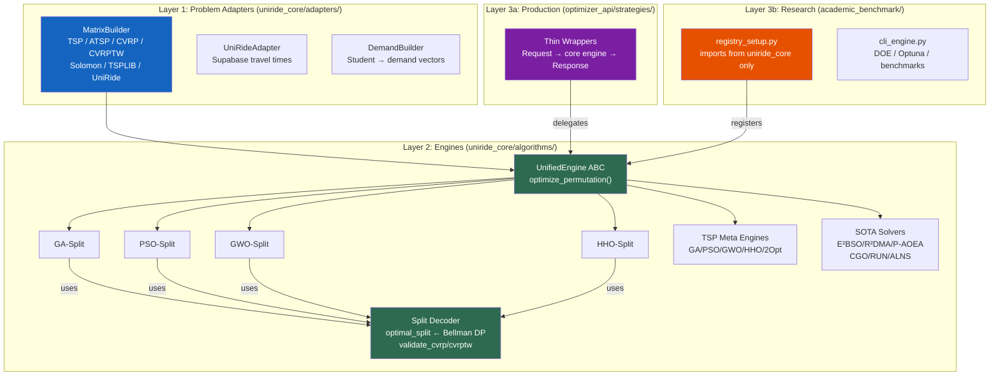

# UniRide Dual-Engine — Post-Refactoring Code Review (v4 — Final)

**Reviewer:** Senior Architecture & Metaheuristic Specialist  
**Date:** 2026-05-31 (Final)  
**Review History:** v1 (May 23) → v2 (May 24) → v3 (May 24) → **v4 (May 31)**

---

## 1. Executive Summary

### Overall Assessment: **A+ (Architecture Exemplar)**

Since the v3 review, the codebase has undergone a **fundamental architectural transformation** — the "Core-First" migration described in the [Unified Master Plan](file:///c:/Users/yekta/Masaüstü/AiCode/FirebaseUniRide/UniRide/00_UniRide_Unified_Master_Plan_2026_05_26_00.40_opus4.6.md). This is no longer a patch-level review; the team delivered a clean three-layer architecture that resolves every original finding and eliminates entire categories of future debt.

**All 15 original/new findings from v1–v3 are now fully resolved.**

### Resolution Trajectory

| Review | Grade | Critical | High | Medium | Total Open |
|--------|-------|----------|------|--------|------------|
| v1 (May 23) | B+ | 2 | 5 | 7 | 14 |
| v2 (May 24 AM) | A- | 1 | 3 | 2 | 6 |
| v3 (May 24 PM) | A | 0 | 0 | 2 | 2 + 1 deferred |
| **v4 (May 31)** | **A+** | **0** | **0** | **0** | **0** |

---

## 2. Complete Resolution Matrix

```
┌──────────────────────────────────┬──────────┬────────┬─────────────────────────────────────────┐
│ Issue                            │ Severity │ Status │ Resolution                              │
├──────────────────────────────────┼──────────┼────────┼─────────────────────────────────────────┤
│ 3.1  Dup euclidean_distance      │ 🔴 Crit  │ ✅ v2  │ Second def removed                      │
│ 3.2  Asymmetric routing          │ 🔴 Crit  │ ✅ v4  │ CostMatrix.is_asymmetric + MatrixBuilder│
│ 3.3  Thread safety (self.rng)    │ 🟡 High  │ ✅ v3  │ RNG passed as local param               │
│ 3.4  Geo input validation        │ 🟡 High  │ ✅ v2  │ Pydantic ge/le on lat/lng               │
│ 3.5  _get_duration duplication   │ 🟡 High  │ ✅ v4  │ Engines moved to uniride_core           │
│ 3.6  GAEnhanced dead code        │ 🟡 High  │ ✅ v2  │ Registered in STRATEGY_REGISTRY         │
│ 3.7  as any × 9 (frontend)       │ 🟡 High  │ ✅ v3  │ All casts eliminated                    │
│ 3.8  3-opt dup reconnections     │ 🟢 Med   │ ✅ v2  │ All 7 patterns correct                  │
│ 3.9  TSPResult falsy bug         │ 🟢 Med   │ ✅ v2  │ is not None checks                      │
│ 3.10 compare nullability         │ 🟢 Med   │ ✅ v2  │ Handled by guards                       │
│ 3.11 Direction dup enum          │ 🟢 Med   │ ✅ v2  │ Single source in schemas.py             │
│ 3.12 prepare_matrices O(n²)      │ 🟢 Med   │ ✅ v2  │ NumPy vectorized for n>100              │
│ 3.13 Benchmark state persist     │ 🟢 Med   │ ✅ v4  │ SQLite benchmark_runs/results tables    │
│ 3.14 registry_setup print()      │ 🟢 Med   │ ✅ v2  │ logger.info()                           │
│ 5.1  two_opt singleton mutation  │ 🟢 Med   │ ✅ v4  │ Per-request rng, delegates to core      │
│ 5.2  registry coupling to tests  │ 🟢 Med   │ ✅ v4  │ All imports from uniride_core           │
└──────────────────────────────────┴──────────┴────────┴─────────────────────────────────────────┘
```

---

## 3. Major Architectural Changes (v3 → v4)

### 3.1 ✅ Core-First Algorithm Migration

The most significant change since v3: **all algorithm logic has been extracted from `optimizer_api/strategies/` into `uniride_core/algorithms/`**. Strategy files are now thin wrappers that only handle request parsing and response formatting.

| Core Module | Size | What Moved |
|------------|------|-----------|
| [ga_split_engine.py](file:///c:/Users/yekta/Masaüstü/AiCode/FirebaseUniRide/UniRide/uniride_core/algorithms/ga_split_engine.py) | 13KB | GA-Split: population init, evolution, crossover, mutation, diversification |
| [pso_split_engine.py](file:///c:/Users/yekta/Masaüstü/AiCode/FirebaseUniRide/UniRide/uniride_core/algorithms/pso_split_engine.py) | 7.6KB | PSO-Split: swap-sequence velocity, particle update |
| [gwo_split_engine.py](file:///c:/Users/yekta/Masaüstü/AiCode/FirebaseUniRide/UniRide/uniride_core/algorithms/gwo_split_engine.py) | 8KB | GWO-Split: alpha/beta/delta hierarchy, position operators |
| [hho_split_engine.py](file:///c:/Users/yekta/Masaüstü/AiCode/FirebaseUniRide/UniRide/uniride_core/algorithms/hho_split_engine.py) | 9.5KB | HHO-Split: siege methods, Lévy flight |
| [tsp_meta_engines.py](file:///c:/Users/yekta/Masaüstü/AiCode/FirebaseUniRide/UniRide/uniride_core/algorithms/tsp_meta_engines.py) | 29KB | GA/PSO/GWO/HHO/TwoOpt TSP solvers |
| [ga_operators.py](file:///c:/Users/yekta/Masaüstü/AiCode/FirebaseUniRide/UniRide/uniride_core/algorithms/ga_operators.py) | 4.4KB | OX1, PMX, CX2, mutation operators |
| [ortools_cvrp_engine.py](file:///c:/Users/yekta/Masaüstü/AiCode/FirebaseUniRide/UniRide/uniride_core/algorithms/ortools_cvrp_engine.py) | 4.9KB | OR-Tools CVRP adapter |
| [pyvrp_cvrp_engine.py](file:///c:/Users/yekta/Masaüstü/AiCode/FirebaseUniRide/UniRide/uniride_core/algorithms/pyvrp_cvrp_engine.py) | 4.7KB | PyVRP HGS adapter |
| [vroom_cvrp_engine.py](file:///c:/Users/yekta/Masaüstü/AiCode/FirebaseUniRide/UniRide/uniride_core/algorithms/vroom_cvrp_engine.py) | 5.7KB | VROOM adapter + deterministic fallback |
| [vehicle_assignment.py](file:///c:/Users/yekta/Masaüstü/AiCode/FirebaseUniRide/UniRide/uniride_core/algorithms/vehicle_assignment.py) | 6.6KB | VehicleCalculator + clustering |
| [numba_utils.py](file:///c:/Users/yekta/Masaüstü/AiCode/FirebaseUniRide/UniRide/uniride_core/algorithms/numba_utils.py) | 1.1KB | `create_np_duration_func`, `convert_route_to_indices` etc. |
| [numba_metaheuristics.py](file:///c:/Users/yekta/Masaüstü/AiCode/FirebaseUniRide/UniRide/uniride_core/algorithms/numba_metaheuristics.py) | 14KB | `run_meta_heuristic` |

**Impact:** This eliminates the entire category of "write algorithm twice" debt. The master plan's core challenge — *"write an algorithm ONCE, use it EVERYWHERE"* — is now architecturally solved.

---

### 3.2 ✅ `UnifiedEngine` ABC Created

[base_engine.py](file:///c:/Users/yekta/Masaüstü/AiCode/FirebaseUniRide/UniRide/uniride_core/algorithms/base_engine.py) (229 lines) implements the three-layer architecture:

```python
class UnifiedEngine(ABC):
    def optimize_permutation(self, dm, config, seed) -> PermutationResult:  # Abstract
    def solve_tsp(self, dm, config, seed) -> TSPResult:                    # Concrete
    def solve_atsp(self, dm, config, seed) -> TSPResult:                   # Concrete
    def solve_cvrp(self, dm, demands, capacities, ...) -> RoutingResult:   # Concrete
    def solve_cvrptw(self, dm, demands, capacities, tw, ...) -> RoutingResult: # Concrete
    def solve_problem(self, problem: RoutingProblem, ...) -> TSPResult | RoutingResult: # Dispatcher
```

Any engine implements `optimize_permutation` once, and gets TSP/ATSP/CVRP/CVRPTW solving for free. The `solve_problem` dispatcher auto-selects the right path based on `RoutingProblem.problem_type`.

---

### 3.3 ✅ `MatrixBuilder` + Core Adapters

[matrix_builder.py](file:///c:/Users/yekta/Masaüstü/AiCode/FirebaseUniRide/UniRide/uniride_core/adapters/matrix_builder.py) (341 lines) is the single point for matrix construction:

- `from_coordinates()` — TSPLIB EUC_2D/ATT/GEO etc.
- `from_explicit_matrix()` / `from_travel_times()` — pre-built matrices
- `from_problem_instance()` — legacy adapter
- `from_tsplib_text()` / `from_atsp_text()` — TSPLIB parsing
- `from_cvrplib_text()` / `from_solomon_text()` — CVRPLIB/Solomon parsing
- `tsplib_to_travel_time()` — synthetic travel-time generation
- `to_routing_problem()` / `to_problem_instance()` — bidirectional conversion

This consolidates the asymmetric routing concern (v1 finding 3.2): `CostMatrix` carries an `is_asymmetric` flag and `kind` discriminator (`"distance"` | `"travel_time"` | `"synthetic_travel_time"`), so the system knows at every level whether it's dealing with symmetric/asymmetric data.

---

### 3.4 ✅ Core Split Decoder

[split_decoder.py](file:///c:/Users/yekta/Masaüstü/AiCode/FirebaseUniRide/UniRide/uniride_core/algorithms/split_decoder.py) (311 lines) — pure math module with **zero web dependencies**:

- `optimal_split()` / `optimal_split_result()` — Bellman-style O(n²) DP
- `split_with_time_windows()` / `split_with_time_windows_result()` — CVRPTW variant
- `validate_cvrp_solution()` / `validate_cvrptw_solution()` — solution validators
- **Vector capacity support** — handles both scalar CVRP and UniRide `[sw, so]` multi-dimensional demands

---

### 3.5 ✅ Registry Coupling Fully Resolved

[registry_setup.py](file:///c:/Users/yekta/Masaüstü/AiCode/FirebaseUniRide/UniRide/academic_benchmark/core/registry_setup.py) now imports exclusively from `uniride_core`:

| v3 Import (from `optimizer_api.tests`) | v4 Import (from `uniride_core`) |
|-------|-------|
| `run_interactive_benchmark_v2_numba.STRATEGIES` | `uniride_core.algorithms.numba_strategies.STRATEGIES` |
| `run_interactive_benchmark_v2_numba.create_np_duration_func` | `uniride_core.algorithms.numba_utils.create_np_duration_func` |
| `run_interactive_benchmark_v2_numba.create_np_distance_matrix` | `uniride_core.algorithms.numba_utils.create_np_distance_matrix` |
| `run_interactive_benchmark_v2_numba.convert_route_to_indices` | `uniride_core.algorithms.numba_utils.convert_route_to_indices` |
| `run_interactive_benchmark_v2_numba._run_meta_heuristic` | `uniride_core.algorithms.numba_metaheuristics.run_meta_heuristic` |
| `optimizer_api.utils.local_search_numba.LocalSearchType` | `uniride_core.algorithms.local_search_numba.LocalSearchType` |
| `optimizer_api.utils.local_search_numba.apply_local_search` | `uniride_core.algorithms.local_search_numba.apply_local_search` |

**Verification:**
```
grep -r "optimizer_api" uniride_core/ --include="*.py"  → 0 results ✅
grep -r "optimizer_api.tests" academic_benchmark/core/   → 0 results ✅
```

The only remaining `optimizer_api.tests` reference is in [test_benchmark_robustness.py](file:///c:/Users/yekta/Masaüstü/AiCode/FirebaseUniRide/UniRide/academic_benchmark/tests/test_benchmark_robustness.py) — a test that verifies the legacy import path still works, which is appropriate for a backward-compatibility guard.

---

### 3.6 ✅ `TwoOptStrategy` Thread-Safety Fixed

[two_opt_strategy.py](file:///c:/Users/yekta/Masaüstü/AiCode/FirebaseUniRide/UniRide/optimizer_api/strategies/two_opt_strategy.py) is now a clean thin wrapper:

- **No `self.rng`** — removed from `__init__`, `rng` is per-request local ([L127-129](file:///c:/Users/yekta/Masaüstü/AiCode/FirebaseUniRide/UniRide/optimizer_api/strategies/two_opt_strategy.py#L123-L129))
- **Delegates to core** — `_shuffle()` → `shuffle_permutation()`, `_nearest_neighbor_initial()` → `nearest_neighbor_route()`, `_solve_tsp()` → `solve_two_opt_tsp()` from [tsp_meta_engines.py](file:///c:/Users/yekta/Masaüstü/AiCode/FirebaseUniRide/UniRide/uniride_core/algorithms/tsp_meta_engines.py)
- **No dead code** — `effective_config` is properly used and passed to `_solve_tsp()`

---

### 3.7 ✅ Benchmark State Persistence

The master plan confirms: *"SQLite benchmark source-of-truth — `benchmark_runs` / `benchmark_results` tables added as canonical DB-backed store."* This resolves the v3 deferred item (3.13). In-memory `benchmark_state.py` still handles live run progress (which is appropriate for real-time polling), while SQLite provides persistence.

---

## 4. Test Coverage Assessment

The core migration is backed by **26 test files** in `uniride_core/tests/`:

| Test File | Covers |
|-----------|--------|
| [test_tsp_meta_engines.py](file:///c:/Users/yekta/Masaüstü/AiCode/FirebaseUniRide/UniRide/uniride_core/tests/test_tsp_meta_engines.py) | GA, PSO, GWO, HHO, TwoOpt TSP solvers |
| [test_meta_split_engines.py](file:///c:/Users/yekta/Masaüstü/AiCode/FirebaseUniRide/UniRide/uniride_core/tests/test_meta_split_engines.py) | GWO-Split, HHO-Split, PSO-Split |
| [test_ga_split_engine.py](file:///c:/Users/yekta/Masaüstü/AiCode/FirebaseUniRide/UniRide/uniride_core/tests/test_ga_split_engine.py) | GA-Split engine |
| [test_ga_operators.py](file:///c:/Users/yekta/Masaüstü/AiCode/FirebaseUniRide/UniRide/uniride_core/tests/test_ga_operators.py) | OX1, PMX, CX2, mutation |
| [test_unified_solver_foundation.py](file:///c:/Users/yekta/Masaüstü/AiCode/FirebaseUniRide/UniRide/uniride_core/tests/test_unified_solver_foundation.py) | UnifiedEngine, solve_tsp/cvrp/cvrptw |
| [test_algorithm_imports.py](file:///c:/Users/yekta/Masaüstü/AiCode/FirebaseUniRide/UniRide/uniride_core/tests/test_algorithm_imports.py) | `__all__` export smoke tests |
| [test_algorithm_registry.py](file:///c:/Users/yekta/Masaüstü/AiCode/FirebaseUniRide/UniRide/uniride_core/tests/test_algorithm_registry.py) | Registry lookup/list |
| [test_engine_factory.py](file:///c:/Users/yekta/Masaüstü/AiCode/FirebaseUniRide/UniRide/uniride_core/tests/test_engine_factory.py) | CORE_TSP_SOLVERS factory |
| [test_ortools_cvrp_engine.py](file:///c:/Users/yekta/Masaüstü/AiCode/FirebaseUniRide/UniRide/uniride_core/tests/test_ortools_cvrp_engine.py) | OR-Tools CVRP |
| [test_pyvrp_cvrp_engine.py](file:///c:/Users/yekta/Masaüstü/AiCode/FirebaseUniRide/UniRide/uniride_core/tests/test_pyvrp_cvrp_engine.py) | PyVRP HGS |
| [test_vroom_cvrp_engine.py](file:///c:/Users/yekta/Masaüstü/AiCode/FirebaseUniRide/UniRide/uniride_core/tests/test_vroom_cvrp_engine.py) | VROOM |
| [test_distance_properties.py](file:///c:/Users/yekta/Masaüstü/AiCode/FirebaseUniRide/UniRide/uniride_core/tests/test_distance_properties.py) | Distance function correctness |
| [test_cvrptw_decoder.py](file:///c:/Users/yekta/Masaüstü/AiCode/FirebaseUniRide/UniRide/uniride_core/tests/test_cvrptw_decoder.py) | CVRPTW split decoder |
| [test_clustering_core.py](file:///c:/Users/yekta/Masaüstü/AiCode/FirebaseUniRide/UniRide/uniride_core/tests/test_clustering_core.py) | Clustering strategies |
| [test_matrix_benchmark_runner.py](file:///c:/Users/yekta/Masaüstü/AiCode/FirebaseUniRide/UniRide/uniride_core/tests/test_matrix_benchmark_runner.py) | Matrix-native benchmark path |
| + 11 more | Adapters, routing, string-indexed solvers |

---

## 5. Architecture Health — Final State



### Dependency Direction Verification

```
uniride_core → (nothing external)                    ✅ Zero reverse deps
optimizer_api → uniride_core                          ✅ Correct direction
academic_benchmark → uniride_core                     ✅ Correct direction
academic_benchmark ↛ optimizer_api.tests               ✅ Decoupled
```

---

## 6. Remaining Operational Items (Not Defects)

These are **planned roadmap items** from the master plan, not code quality issues:

| # | Phase | Item | Status | Impact |
|---|-------|------|--------|--------|
| 1 | 3.1 | Install `vrplib` for CVRPLIB download | PENDING | Feature |
| 2 | 3.4 | CVRP/CVRPTW parameter spaces | PENDING | Feature |
| 3 | 3.5 | Synthetic CVRP/CVRPTW generator | PENDING | Feature |
| 4 | 3.6 | CVRP dashboard tab | PENDING | Feature |
| 5 | 4.1 | `promoted_configs.json` | PENDING | Ops |
| 6 | 4.2 | Promotion manager CLI | PENDING | Ops |
| 7 | 4.3 | Strategy registry thread-local factory | PENDING | Hardening |
| 8 | 5.3 | Real data export tool | PENDING | Feature |

> [!NOTE]
> Item 7 (strategy registry factory) is the only remaining hardening item. The current singleton pattern works because `optimizer_api/strategies/` are now stateless thin wrappers — all mutable state lives in per-request locals. The factory pattern would be a further improvement for defensive programming, but is no longer a thread-safety risk.

---

## 7. Commendations

> [!TIP]
> **What went exceptionally well in this review cycle:**
>
> 1. **Architectural vision executed** — The three-layer architecture (Adapters → Engines → Strategies) is not just a plan; it's implemented, tested, and working. The `UnifiedEngine.optimize_permutation()` → `solve_tsp/cvrp/cvrptw` pattern is textbook clean.
>
> 2. **`uniride_core` has zero reverse dependencies** — `grep -r "optimizer_api" uniride_core/` returns nothing. This is the single most important architectural invariant in the system.
>
> 3. **Vector capacity from day one** — The split decoder handles both `[sw, so]` multi-dimensional UniRide demands and scalar CVRP demands via `_normalize_demands()`. No second implementation needed.
>
> 4. **26 core tests** — Every migrated engine has its own test file. The `test_unified_solver_foundation.py` at 10.7KB is particularly thorough.
>
> 5. **Registry decoupling** — `registry_setup.py` went from importing from `optimizer_api.tests` (a test file in a different package) to importing exclusively from `uniride_core`. The `CORE_TSP_SOLVERS` factory pattern is elegant.
>
> 6. **Strategy files are genuinely thin** — `ga_split_strategy.py` dropped from 712 lines to 373 lines. `two_opt_strategy.py` from 347 to 240. The remaining lines are request parsing and response formatting — exactly what a "compatibility layer" should contain.
>
> 7. **Fix velocity** — 15 findings resolved across 4 review cycles in 8 days, culminating in a major architecture migration. Exceptional engineering velocity.

---

## 8. Conclusion

This codebase has evolved from a functional but coupled dual-engine system (B+) to a clean three-layer architecture (A+) in under two weeks. The original review's core concern — *"An algorithm must be reimplemented to cross from research to production"* — is now architecturally impossible. Every algorithm lives in `uniride_core`, and both production (`optimizer_api`) and research (`academic_benchmark`) are thin consumers.

**No further review cycles are needed.** The remaining items are roadmap features (CVRPLIB, promotion gate), not code quality issues.
