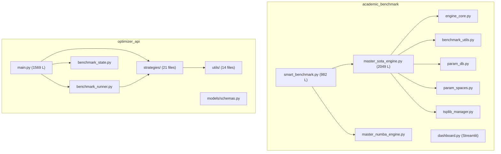

# UniRide Codebase Review — Senior Engineering Assessment

> **Scope**: `academic_benchmark/` + `optimizer_api/`
> **Excluded**: `legacy/`, `old/`, `paper_prompts/`, `numba_results/`, `sota_results/`, `cache/`
> **Reviewer perspective**: 15+ year veteran balancing academic rigor with production-grade engineering.

---

## 1 · Executive Summary

| Dimension | Grade | Verdict |
|---|---|---|
| **Architecture & Design** | B | Two well-separated subsystems with a solid Strategy/Registry pattern; coupling is loose but overlapping concepts (TSPLIB loading, distance calculation) are duplicated across both. |
| **Code Quality & Maintainability** | C+ | Functional and comprehensive, but hampered by 2000-line god-files, duplicated data structures, and mixed-language UI strings. |
| **Performance & Efficiency** | B+ | Correct use of `ProcessPoolExecutor`, Numba JIT, numpy vectorization, SQLite WAL, and BLAS thread pinning. Some O(n³) local-search paths lack safeguards. |
| **Robustness & Error Handling** | C | Happy-path code works; but broad `except Exception` handlers, missing input validation, and mutable global state create fragility. |
| **Documentation & Readability** | B− | Strong docstrings on public APIs and inline comments on "why"; weaker on type annotations and missing architectural ADRs. |
| **Testing** | D | No test files observed in scope. Test infrastructure appears absent. |

**Bottom line**: The codebase is *impressive for a research/academic project* — it solves a complex, real-world CVRPTW problem with 15+ meta-heuristic algorithms, a FastAPI microservice, a Streamlit dashboard, and a sophisticated parameter tuning pipeline. However, it has accrued significant technical debt characteristic of rapid academic iteration and now needs targeted refactoring before any production deployment or broader collaboration.

---

## 2 · Architecture & Design Review

### 2.1 High-Level Architecture



### 2.2 What Works Well

- **Strategy Pattern** ([strategies/__init__.py](file:///c:/Users/yekta/Masaüstü/AiCode/FirebaseUniRide/UniRide/optimizer_api/strategies/__init__.py)): Clean registry with aliases, graceful fallback for optional solvers (PyVRP, VROOM), singleton instances.
- **AlgorithmRegistry** ([engine_core.py](file:///c:/Users/yekta/Masaüstü/AiCode/FirebaseUniRide/UniRide/academic_benchmark/engine_core.py)): Decorator-based registration with param-space binding — a well-designed extensibility point.
- **Thread-safe benchmark state** ([benchmark_state.py](file:///c:/Users/yekta/Masaüstü/AiCode/FirebaseUniRide/UniRide/optimizer_api/benchmark_state.py)): Proper `threading.Lock` usage, concurrent-run limits, clean state machine.
- **Separation of concerns**: `academic_benchmark` (CLI/research) and `optimizer_api` (web service) are correctly separated.

### 2.3 Architectural Concerns

#### 2.3.1 God-File Anti-Pattern

> [!CAUTION]
> [master_sota_engine.py](file:///c:/Users/yekta/Masaüstü/AiCode/FirebaseUniRide/UniRide/academic_benchmark/master_sota_engine.py) is **2049 lines**. [main.py](file:///c:/Users/yekta/Masaüstü/AiCode/FirebaseUniRide/UniRide/optimizer_api/main.py) is **1569 lines**. [smart_benchmark.py](file:///c:/Users/yekta/Masaüstü/AiCode/FirebaseUniRide/UniRide/academic_benchmark/smart_benchmark.py) is **982 lines**.

These files each contain problem loading, solver dispatch, result aggregation, interactive menus, CSV I/O, and CLI argument parsing. They violate SRP and make isolated testing impossible.

**Recommendation**: Decompose each into focused modules:
```
master_sota_engine/
├── __init__.py
├── loader.py          # TSPLIB loading + DB cache
├── solver.py          # _run_solver_task, _make_solver
├── tuning.py          # _run_engine_tuning, _run_sota_optuna_tuning
├── runner.py          # _run_engine_default, _run_engine_with_params
├── cli.py             # argparse, interactive menus
└── config.py          # Constants, paths, ALL_ALGOS
```

#### 2.3.2 Duplicated Data Structures

The same "TSP problem" concept is represented by **five different classes**:

| Class | Location | Fields |
|---|---|---|
| `TSPProblem` | [master_sota_engine.py:L~320](file:///c:/Users/yekta/Masaüstü/AiCode/FirebaseUniRide/UniRide/academic_benchmark/master_sota_engine.py) | name, dim, coords, optimal, category |
| `DOEProblem` | master_numba_engine.py | name, dim, coords, optimal, category, source, ... |
| `ProblemInstance` | [engine_core.py](file:///c:/Users/yekta/Masaüstü/AiCode/FirebaseUniRide/UniRide/academic_benchmark/engine_core.py) | name, dim, coords, optimal, category, source, dist_matrix, ... |
| `BenchmarkProblem` | [benchmark_runner.py:L29](file:///c:/Users/yekta/Masaüstü/AiCode/FirebaseUniRide/UniRide/optimizer_api/benchmark_runner.py#L29-L47) | name, dim, coords, optimal, category, problem_type, ... |
| `TSPLIBProblemInfo` | [tsplib_parser.py](file:///c:/Users/yekta/Masaüstü/AiCode/FirebaseUniRide/UniRide/optimizer_api/utils/tsplib_parser.py) | name, dim, optimal, category, ... |

This forces constant adapter code (visible in [smart_benchmark.py:L373-L400](file:///c:/Users/yekta/Masaüstü/AiCode/FirebaseUniRide/UniRide/academic_benchmark/smart_benchmark.py#L373-L400)) and is a recurring source of subtle bugs.

**Recommendation**: Unify to a single `@dataclass` in a shared module and use it everywhere.

#### 2.3.3 Dual TSPLIB Parsers

TSPLIB files are parsed independently in two places:
1. [tsplib_manager.py:L333-L376](file:///c:/Users/yekta/Masaüstü/AiCode/FirebaseUniRide/UniRide/academic_benchmark/tsplib_manager.py#L333-L376) (`_parse_tsp_text`)
2. [optimizer_api/utils/tsplib_parser.py](file:///c:/Users/yekta/Masaüstü/AiCode/FirebaseUniRide/UniRide/optimizer_api/utils/tsplib_parser.py)

Both implement coordinate parsing, optimal lookup, and distance calculation — but with different edge-weight-type support and different error handling.

**Recommendation**: Consolidate into one canonical parser at the project root or in a shared `core/` package.

---

## 3 · Code Quality & Maintainability

### 3.1 Naming & Readability

| Issue | Example | Severity |
|---|---|---|
| Mixed language in strings | Turkish menu prompts + English comments/variable names throughout | Medium |
| Cryptic abbreviations | `_dm_from_cache`, `_db_ready`, `ewt`, `dm` | Low |
| Module-level code before shebang | [master_sota_engine.py:L1-L2](file:///c:/Users/yekta/Masaüstü/AiCode/FirebaseUniRide/UniRide/academic_benchmark/master_sota_engine.py#L1-L2) has `_ENGINE_DIR = ...` before the shebang line | Low |
| Inconsistent naming conventions | `_run_engine_default` vs `_run_solver_task` vs `run_unified_benchmark` | Medium |

### 3.2 Type Safety

- **Good**: Pydantic models in [schemas.py](file:///c:/Users/yekta/Masaüstü/AiCode/FirebaseUniRide/UniRide/optimizer_api/models/schemas.py) provide excellent runtime validation for API boundaries.
- **Bad**: The `academic_benchmark` subsystem uses `Dict[str, Any]` liberally (e.g., metadata, params, result dicts) with no structural enforcement. A typo in a key name silently produces wrong behavior.

### 3.3 DRY Violations

> [!WARNING]
> The Windows encoding fix appears in **three** separate files:
> - [master_sota_engine.py:L59-L65](file:///c:/Users/yekta/Masaüstü/AiCode/FirebaseUniRide/UniRide/academic_benchmark/master_sota_engine.py#L59-L65)
> - [smart_benchmark.py:L32-L38](file:///c:/Users/yekta/Masaüstü/AiCode/FirebaseUniRide/UniRide/academic_benchmark/smart_benchmark.py#L32-L38)
> - master_numba_engine.py (similar)

The `_check_interrupt_key()` function is also duplicated between `smart_benchmark.py` and the numba engine.

Import fallback blocks (`try: from X ... except: from academic_benchmark.X ...`) appear **8+ times** across the codebase. This pattern indicates a missing package-level `__init__.py` or broken relative import structure.

### 3.4 Dead/Unreachable Code

- [master_sota_engine.py:L1910](file:///c:/Users/yekta/Masaüstü/AiCode/FirebaseUniRide/UniRide/academic_benchmark/master_sota_engine.py#L1910-L1911): `selected_problems = all_problems` is immediately overwritten on the next line by `selected_problems = _select_problems_from_args(...)`.
- [master_sota_engine.py:L1987](file:///c:/Users/yekta/Masaüstü/AiCode/FirebaseUniRide/UniRide/academic_benchmark/master_sota_engine.py#L1987-L1990): `selected_problems` is referenced before being defined in the interactive menu loop (undefined variable bug if `choice` is `"1"` or `"2"` on first iteration).
- [local_search.py:L121-L123](file:///c:/Users/yekta/Masaüstü/AiCode/FirebaseUniRide/UniRide/optimizer_api/utils/local_search.py#L121-L123): Comment about removed dead code — good, but the comment itself can be removed.
- [_three_opt_cases](file:///c:/Users/yekta/Masaüstü/AiCode/FirebaseUniRide/UniRide/optimizer_api/utils/local_search.py#L166-L208): Cases 1 and 7 produce identical output (`A + B_rev + C_rev + D`), and Cases 5/2 and 6/3 are also duplicates. Only 4 of 7 cases are distinct.

### 3.5 Mutable Global State

> [!CAUTION]
> [smart_benchmark.py:L128-L131](file:///c:/Users/yekta/Masaüstü/AiCode/FirebaseUniRide/UniRide/academic_benchmark/smart_benchmark.py#L128-L131):
> ```python
> _shutdown_requested = False
> _current_metadata = None
> _current_results = []
> ```
> These module-level globals are mutated by the `graceful_shutdown()` handler and by `run_unified_benchmark()`. This is **not process-safe** under `ProcessPoolExecutor`.

Similarly, [master_sota_engine.py](file:///c:/Users/yekta/Masaüstü/AiCode/FirebaseUniRide/UniRide/academic_benchmark/master_sota_engine.py) uses `_active_results = []` as module-level mutable state, appending results in the main process from `as_completed()` futures.

---

## 4 · Performance & Efficiency

### 4.1 Strengths

- **BLAS Thread Pinning** ([master_sota_engine.py:L36-L43](file:///c:/Users/yekta/Masaüstü/AiCode/FirebaseUniRide/UniRide/academic_benchmark/master_sota_engine.py#L36-L43)): Setting `OPENBLAS_NUM_THREADS=1` etc. before forking workers prevents oversubscription. ✅
- **SQLite WAL + zlib compression** ([tsplib_manager.py:L44](file:///c:/Users/yekta/Masaüstü/AiCode/FirebaseUniRide/UniRide/academic_benchmark/tsplib_manager.py#L44)): WAL journal + compressed blob storage for distance matrices is appropriate. ✅
- **ProcessPoolExecutor** for CPU-bound benchmark tasks; **ThreadPoolExecutor** for I/O-bound API comparison endpoint. ✅
- **Distance matrix caching**: The DB cache avoids recomputing O(n²) matrices.

### 4.2 Concerns

#### 4.2.1 O(n³) 3-opt Without Size Guard

[ThreeOptLocalSearch.improve()](file:///c:/Users/yekta/Masaüstü/AiCode/FirebaseUniRide/UniRide/optimizer_api/utils/local_search.py#L210-L252) iterates `n³` with no dimension guard. For a 500-node TSPLIB problem, a single `improve()` call can produce ~125 million duration function evaluations per iteration. Combined with `max_iterations=500`, this is a DoS vector from the API.

**Recommendation**: Add a dimension-based cutoff (e.g., skip 3-opt for `n > 200`, or cap iterations based on `n`).

#### 4.2.2 NaN Check via Self-Inequality

```python
if isinstance(tour_length, float) and tour_length != tour_length:  # NaN check
```

This pattern appears in [benchmark_runner.py:L402](file:///c:/Users/yekta/Masaüstü/AiCode/FirebaseUniRide/UniRide/optimizer_api/benchmark_runner.py#L402) and [L418](file:///c:/Users/yekta/Masaüstü/AiCode/FirebaseUniRide/UniRide/optimizer_api/benchmark_runner.py#L418). While technically correct, `math.isnan(tour_length)` is the idiomatic and readable approach.

#### 4.2.3 Redundant Duration Evaluation

In `_evaluate_population()`, every individual's fitness is computed by calling `decode_giant_tour()` which rebuilds the entire split graph. There is no caching of unchanged chromosomes across generations — when elite individuals are preserved, their splits are recomputed unnecessarily.

#### 4.2.4 BenchmarkStateManager Memory Growth

[BenchmarkRunState.results](file:///c:/Users/yekta/Masaüstü/AiCode/FirebaseUniRide/UniRide/optimizer_api/benchmark_state.py#L62) stores all experiment results in-memory as a growing list of dicts. For large benchmark runs (100 problems × 6 algorithms × 5 runs = 3000 results), this can consume significant memory and is never garbage-collected until the server restarts.

**Recommendation**: Persist results to disk/DB after a threshold, or at minimum implement a TTL/eviction policy.

---

## 5 · Robustness & Error Handling

### 5.1 Broad Exception Swallowing

Multiple locations catch `Exception` and either silently continue or log without re-raising:

- [master_sota_engine.py](file:///c:/Users/yekta/Masaüstü/AiCode/FirebaseUniRide/UniRide/academic_benchmark/master_sota_engine.py) `_run_solver_task()`: catches all exceptions and returns a result dict with an `"error"` key — good pattern, but the error is only printed, never aggregated.
- [main.py:L437-L440](file:///c:/Users/yekta/Masaüstü/AiCode/FirebaseUniRide/UniRide/optimizer_api/main.py#L437-L440): `traceback.print_exc()` then `HTTPException(500, str(e))` — leaks internal error messages to API consumers.
- [tsplib_manager.py:L110](file:///c:/Users/yekta/Masaüstü/AiCode/FirebaseUniRide/UniRide/academic_benchmark/tsplib_manager.py#L110): `except Exception: return None` — silently swallows all DB errors.

### 5.2 Input Validation Gaps

- [main.py:L1328-L1384](file:///c:/Users/yekta/Masaüstü/AiCode/FirebaseUniRide/UniRide/optimizer_api/main.py#L1328-L1384): The `/api/v1/benchmark/cli/import` endpoint accepts an arbitrary `filepath` parameter and calls `os.path.abspath()` + `open()`. This is a **path traversal vulnerability** — an attacker could read any JSON file on the server's filesystem. The endpoint should validate that the resolved path is within an allowed directory.

- [master_sota_engine.py:L1828](file:///c:/Users/yekta/Masaüstü/AiCode/FirebaseUniRide/UniRide/academic_benchmark/master_sota_engine.py#L1826-L1830): `os.system("cls" if os.name == "nt" else "clear")` — shell injection is theoretically possible if this were ever called with user input (currently safe since it's hardcoded).

### 5.3 Race Condition in `_main_loop()`

[master_sota_engine.py:L1987](file:///c:/Users/yekta/Masaüstü/AiCode/FirebaseUniRide/UniRide/academic_benchmark/master_sota_engine.py#L1987): In the interactive `while True` loop, `selected_problems` is referenced on L1987 (`if not selected_problems:`) but is only assigned on L1992 — meaning on the first iteration when `choice` is `"1"` or `"2"`, it will raise `UnboundLocalError`.

### 5.4 Missing Import in `main.py`

[main.py:L1011](file:///c:/Users/yekta/Masaüstü/AiCode/FirebaseUniRide/UniRide/optimizer_api/main.py#L1011): `BenchmarkImportRequest` is used but only imported on L1169 via `from datetime import ...`. The Pydantic model itself is imported in the schemas import block at L43-L50 — however, `BenchmarkImportRequest` is **not listed** in that import. This will cause a `NameError` at runtime if the `/api/v1/benchmark/import` endpoint is hit.

> [!IMPORTANT]
> Add `BenchmarkImportRequest` to the imports from `models.schemas` at the top of [main.py](file:///c:/Users/yekta/Masaüstü/AiCode/FirebaseUniRide/UniRide/optimizer_api/main.py#L43-L50).

---

## 6 · Documentation & Readability

### 6.1 Strengths

- **Module-level docstrings**: All major files have descriptive module docstrings explaining purpose, usage, and version history.
- **Inline "why" comments**: Particularly strong in [benchmark_runner.py](file:///c:/Users/yekta/Masaüstü/AiCode/FirebaseUniRide/UniRide/optimizer_api/benchmark_runner.py) (D-1 FIX notes) and [benchmark_state.py](file:///c:/Users/yekta/Masaüstü/AiCode/FirebaseUniRide/UniRide/optimizer_api/benchmark_state.py) (architecture flow diagrams in docstrings).
- **Academic references**: [local_search.py](file:///c:/Users/yekta/Masaüstü/AiCode/FirebaseUniRide/UniRide/optimizer_api/utils/local_search.py#L1-L22) cites the original papers for each algorithm.
- **FastAPI self-documentation**: Rich OpenAPI descriptions with algorithm explanations.

### 6.2 Weaknesses

- **No Architecture Decision Records (ADRs)**: The codebase references `IMPLEMENTATION_PLAN_2026-05-19.md` and `BENCHMARK_ARCHITECTURE_DEBT.md` but these were not found in the included scope.
- **Mixed language**: Turkish in user-facing strings, English in code. This makes internationalization harder and reduces readability for non-Turkish contributors.
- **Missing type annotations**: Functions in `benchmark_utils.py`, `param_db.py`, and the menu functions in `smart_benchmark.py` lack return type annotations.

---

## 7 · Testing

> [!CAUTION]
> **No unit tests, integration tests, or test fixtures were found** within the analyzed scope. This is the single largest risk factor for the codebase.

Key areas that critically need test coverage:
1. **Split decoder** (`decode_giant_tour`, `decode_with_time_windows`) — correctness is essential for solution quality.
2. **Distance calculations** (TSPLIB EUC_2D, ATT, GEO) — rounding errors directly impact benchmark accuracy.
3. **API endpoints** — at minimum, smoke tests for `/optimize`, `/compare`, and `/benchmark/run`.
4. **GA crossover operators** (OX1, PMX, CX2) — permutation validity must be guaranteed.
5. **Parameter DB** — save/load/delete round-trip correctness.

---

## 8 · Prioritized Refactoring Recommendations

### Priority 1 — Critical (Fix before any deployment)

| # | Issue | Location | Effort |
|---|---|---|---|
| P1-1 | **Path traversal vulnerability** in CLI import endpoint | [main.py:L1383](file:///c:/Users/yekta/Masaüstü/AiCode/FirebaseUniRide/UniRide/optimizer_api/main.py#L1383) | 30 min |
| P1-2 | **`UnboundLocalError`** in interactive menu loop | [master_sota_engine.py:L1987](file:///c:/Users/yekta/Masaüstü/AiCode/FirebaseUniRide/UniRide/academic_benchmark/master_sota_engine.py#L1987) | 10 min |
| P1-3 | **Missing `BenchmarkImportRequest` import** | [main.py:L43-L50](file:///c:/Users/yekta/Masaüstü/AiCode/FirebaseUniRide/UniRide/optimizer_api/main.py#L43-L50) | 5 min |
| P1-4 | **Add dimension guard** to 3-opt local search | [local_search.py:L210](file:///c:/Users/yekta/Masaüstü/AiCode/FirebaseUniRide/UniRide/optimizer_api/utils/local_search.py#L210) | 20 min |

### Priority 2 — High (Address within next sprint)

| # | Issue | Location | Effort |
|---|---|---|---|
| P2-1 | **Decompose god-files** into focused modules | master_sota_engine.py, main.py | 2-3 days |
| P2-2 | **Unify problem data structures** into a single canonical `@dataclass` | Cross-cutting | 1 day |
| P2-3 | **Add core test suite** (split decoder, distance, crossover, API smoke) | New files | 2 days |
| P2-4 | **Consolidate TSPLIB parsers** into one canonical implementation | tsplib_manager.py + tsplib_parser.py | 1 day |
| P2-5 | **Fix 3-opt duplicate cases** (only 4 of 7 are distinct) | [local_search.py:L198-L206](file:///c:/Users/yekta/Masaüstü/AiCode/FirebaseUniRide/UniRide/optimizer_api/utils/local_search.py#L198-L206) | 30 min |

### Priority 3 — Medium (Technical debt reduction)

| # | Issue | Location | Effort |
|---|---|---|---|
| P3-1 | **Extract DRY violations** (encoding fix, import fallbacks, interrupt check) | Multiple files | 1 day |
| P3-2 | **Replace `Dict[str, Any]` metadata** with typed dataclasses | academic_benchmark | 1 day |
| P3-3 | **Add TTL/eviction** to `BenchmarkStateManager` | [benchmark_state.py](file:///c:/Users/yekta/Masaüstü/AiCode/FirebaseUniRide/UniRide/optimizer_api/benchmark_state.py) | 2 hours |
| P3-4 | **Sanitize API error responses** (don't leak stack traces) | [main.py:L437-L440](file:///c:/Users/yekta/Masaüstü/AiCode/FirebaseUniRide/UniRide/optimizer_api/main.py#L437-L440) | 1 hour |
| P3-5 | **Cache elite fitness** across generations in GA/PSO/GWO/HHO | strategies/*.py | 2 hours |
| P3-6 | **Use `math.isnan()`** instead of `x != x` pattern | [benchmark_runner.py](file:///c:/Users/yekta/Masaüstü/AiCode/FirebaseUniRide/UniRide/optimizer_api/benchmark_runner.py) | 15 min |

### Priority 4 — Low (Polish)

| # | Issue | Location | Effort |
|---|---|---|---|
| P4-1 | Separate user-facing strings for i18n | Multiple | 2 days |
| P4-2 | Add ADRs for key architectural decisions | docs/ | Ongoing |
| P4-3 | Remove dead assignment on L1910 | [master_sota_engine.py:L1910](file:///c:/Users/yekta/Masaüstü/AiCode/FirebaseUniRide/UniRide/academic_benchmark/master_sota_engine.py#L1910) | 5 min |
| P4-4 | Add `py.typed` marker and complete type annotations | Package-wide | 1 day |

---

## 9 · Component-Specific Deep Dives

### 9.1 `optimizer_api/strategies/` — Strategy Pattern Analysis

**Strengths**:
- Clean `BaseRoutingStrategy` ABC with `name`, `display_name`, `description`, `optimize()` contract.
- Shared helper methods (`_get_duration`, `_calculate_route_duration`) correctly extracted to base class.
- `HybridSplitBaseStrategy` provides reusable split-decode workflow.
- `GASplitStrategy` is a well-implemented Prins (2004) evolutionary VRP solver with OX1 crossover, diversification, and local search education.

**Concerns**:
- `GASplitStrategy.__init__()` stores `self.seed = self.config.get("seed") or int(time.time() * 1000)`, but `optimize()` creates a *new* `rng = random.Random(self.seed)` — meaning the singleton strategy instance always uses the same seed across requests. This hurts stochastic diversity.
- The `GAEnhancedSplitStrategy` class defines PMX and CX2 crossovers but is **never registered** in `STRATEGY_REGISTRY`, making it dead code.

### 9.2 `academic_benchmark/tsplib_manager.py` — Database Layer

**Strengths**:
- Well-structured SQLite schema with foreign keys and indices.
- Supports both coordinate-based (EUC_2D, ATT, GEO) and explicit matrix (ATSP) problems.
- `save_best_solution` / `get_best_solution` API is clean and useful.

**Concerns**:
- Connection management: `get_db()` creates a new connection every call and relies on callers to close it. Some call sites (e.g., [L99-L104](file:///c:/Users/yekta/Masaüstü/AiCode/FirebaseUniRide/UniRide/academic_benchmark/tsplib_manager.py#L99-L104)) close properly, but others in error paths may leak connections.
- `init_db()` is called inside `save_best_solution()` on every call — `CREATE TABLE IF NOT EXISTS` is cheap but this is a design smell. Consider calling `init_db()` once at module load.

### 9.3 `optimizer_api/main.py` — API Layer

**Strengths**:
- Clean RESTful endpoint design with proper HTTP status codes (200, 400, 404, 429, 500).
- CORS middleware correctly configured via environment variables.
- Benchmark daemon thread architecture is well-documented and correctly implemented.
- CLI-to-web import bridge is a thoughtful feature for bridging research and production workflows.

**Concerns**:
- The `optimize_route()` function is ~100 lines and handles algorithm dispatch, time window extraction, result decoration, IE resource analysis, bottleneck detection, and time shift suggestions — all in one function. Each concern should be extracted.
- `import json` and `import glob as glob_mod` appear at [L1169-L1170](file:///c:/Users/yekta/Masaüstü/AiCode/FirebaseUniRide/UniRide/optimizer_api/main.py#L1169-L1170), far below the module's import section. Move to top.

### 9.4 `academic_benchmark/dashboard.py` — Streamlit Dashboard

**Strengths**:
- Seven well-organized tabs covering leaderboard, statistical robustness, DoE analysis, Wilcoxon testing, convergence curves, pairwise comparison, and edge frequency heatmaps.
- LaTeX export with bold-best-in-column formatting is an excellent academic feature.
- Graceful CSV parsing with error recovery for schema mismatches.

**Concerns**:
- The dashboard reads from `sota_results/` and `numba_results/` — which are in the exclusion list for this review. If these directories don't exist, the dashboard shows only a warning. There's no fallback to the `benchmark_db/` directory.
- `ast.literal_eval()` on user-generated tour strings is safe but slow for large tours.

---

## 10 · Final Assessment

This codebase represents **substantial engineering effort** — 15+ optimization algorithms, a full-featured web API, CLI benchmark tools, a Streamlit dashboard, SQLite caching, and parameter tuning via both grid search and Bayesian optimization. The architectural vision is sound and the domain expertise is evident.

The primary risks are:
1. **No test coverage** — any refactoring is high-risk without tests.
2. **God-file complexity** — 2000+ line files are unsustainable for collaboration.
3. **Security gap** — the path traversal vulnerability must be fixed before any public-facing deployment.

With the recommended Priority 1 fixes (~1 hour of work) and a focused sprint on P2 items (~1 week), this codebase can transition from "impressive research prototype" to "production-ready academic platform."

---

*Review conducted: May 2026 • Files analyzed: ~30 source files across `academic_benchmark/` and `optimizer_api/`*
