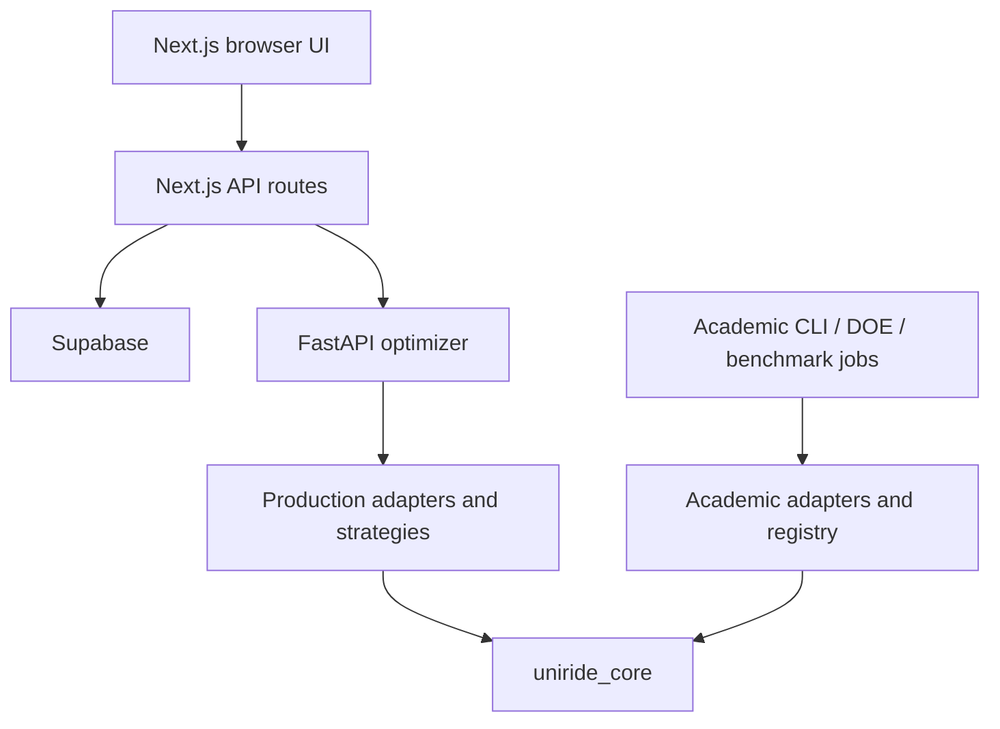

# UniRide Current Architecture

**Verified:** 2026-07-16; corrected and synchronized 2026-08-01
**Current baseline:** branch `WIP`, commit `0ebd63d337dc3fca1a1c9e7644910ecf2e620a79`

This document describes the current code structure, not the intended end state. Known defects are explicit so diagrams are not mistaken for production certification.

## 1. Dual-Engine System

UniRide has three principal layers:

1. **Production engine:** Next.js application, Next.js API routes, Supabase, and FastAPI optimization service.
2. **Academic engine:** dataset management, DOE/tuning, repeated experiments, and result analysis.
3. **Shared kernel:** `uniride_core`.



The Next.js layer is intended to be a backend-for-frontend that owns user authorization and translates application data into optimizer requests. Some current paths bypass this boundary, and FastAPI lacks service-level authentication.

## 2. Source Boundaries

### `src/`: web application and BFF

Responsibilities:

- administrator, student, and driver interfaces;
- same-origin API routes under `src/app/api`;
- Supabase browser/server clients;
- production request translation;
- benchmark control and polling pages.

Verified limitations:

- Vehicle Planning and Sandbox have missing bearer-token paths.
- Direction is not propagated consistently through optimization and persistence.
- Benchmark polling is duplicated and permits overlapping requests.
- Track Ride is a placeholder: no map SDK or route-geometry contract exists.
- Some browser code calls FastAPI directly.

### `optimizer_api/`: production optimizer and benchmark control plane

Responsibilities:

- FastAPI application and routers;
- Pydantic production DTOs;
- executable strategy adapters;
- travel-matrix loading via an injectable `TimeMatrixRepository` backed by the process-level `DataLoader` singleton;
- web benchmark orchestration.

Verified limitations:

- Shared executable strategy instances coexist with fresh-instance factories.
- Request sizes and algorithm configurations are insufficiently bounded.
- Benchmark admission and creation are non-atomic; stop does not cancel work.
- CLI preview/import accepted caller-selected filesystem paths.
- `DataLoader` is a verified process-level singleton that delegates to an injectable `TimeMatrixRepository` (`optimizer_api/utils/matrix_repository.py`): explicit `load`/`refresh(force)`/`close` lifecycle, TTL with injected clock, provider timeout (`TIME_MATRIX_PROVIDER_TIMEOUT_SECONDS`, version-guarded SDK option), last-known-good retention on refresh failure, and `health()` cache metadata (source, loaded, stale, age, ttl, locations, edges, last_error). Missing, zero, negative, or non-finite off-diagonal arcs are rejected with `IncompleteTravelMatrixError`; residual matrix items: generic `route_metrics` 15-minute fallback labeling and production/academic metric separation.
- Production promoted-config loading imports `academic_benchmark.promoted_configs`, leaving the production-to-academic dependency boundary porous.
- FastAPI routers have no authentication dependency.

### `uniride_core/`: shared mathematical kernel

Contains distance functions, clustering, split decoders, metaheuristic engines, local search, Numba kernels, ALNS/SOTA operators, solver adapters, and routing models.

The dependency direction is mostly sound: the core does not intentionally depend on FastAPI or academic orchestration. The model boundary remains incomplete because legacy core models combine TSPLIB metadata, benchmark fields, and production constraints.
The 2026-08-01 re-verification refuted the earlier “broken DataLoader singleton” claim. The 2026-08-07 matrix-repository work preserved that singleton (as a facade over an injectable `TimeMatrixRepository`) and closed the cache-health gap with tested `health()` metadata; the 2B work added provider timeout, last-known-good retention, and fail-closed arc rejection. Remaining: `route_metrics` generic fallback labeling, matrix provenance, and production/academic isolation.

### `academic_benchmark/`: experiment system

Contains the academic registry, CLI orchestration, dataset managers, DOE/tuning, parameter promotion, persistence, analysis, and visualization.

It should share solver implementations and neutral problem/result models, but not production request state, web-job state, or mutable executable instances.

## 3. Production Request Flow

```text
UI action
  -> authenticated Next.js API route
  -> application-to-optimizer translation
  -> FastAPI OptimizationRequest
  -> request-scoped strategy
  -> matrix/data adapter
  -> uniride_core solver
  -> feasibility certificate
  -> OptimizationResponse
  -> application persistence/UI
```

The request-scoped strategy and feasibility-certificate steps are target-state requirements; current code still uses shared registry instances and lacks a universal final certificate.

## 4. Algorithm Pipelines

### Pipeline A: cluster first, route second

GA, PSO, GWO, and HHO group students and optimize a route inside each group. This is an active production path, not obsolete code.

Current risks:

- duration violations can be returned as successful best-effort assignments;
- time windows are not enforced consistently during route construction;
- clustering randomness is not fully controlled;
- repeated physical locations are represented inconsistently.

### Pipeline B: giant tour plus split

GA-Split, PSO-Split, GWO-Split, and HHO-Split build a giant tour and partition it into vehicle routes.

Current risks:

- demand and student maps use physical `location_code` instead of unique customer identity;
- duplicate stops can overwrite records or break permutation crossover;
- time-window DP initialization and pickup-prefix construction are incorrect;
- soft penalties and hard feasibility are not consistently separated.

### Reference and research solvers

OR-Tools, PyVRP, and VROOM were selected as industry, quality, and scalability baselines. PyVRP and VROOM are optional. ALNS and original metaheuristic variants are research assets, not evidence of production correctness.

## 5. Shared-Core Contract

```text
Production DTO --------> production adapter --+
                                            |
Academic dataset ------> academic adapter -----+--> RoutingProblem
                                                     |
                                                     v
                                                  Solver
                                                     |
                                                     v
                                            FeasibilityCertificate
                                                     |
                                                     v
                                                RoutingResult
```

The core should own:

- unique customer identity distinct from physical stop identity;
- cost matrix with units, directionality, provenance, and completeness;
- constraint profile;
- deterministic solver inputs;
- neutral result/violation structures;
- one independent final feasibility certificate.

Production owns authentication, user DTOs, provider-specific geography, route geometry, and operational errors. Academic tooling owns dataset paths, BKS/optima, gaps, seeds, DOE metadata, environment manifests, and persistence.

## 6. Matrix Architecture

Production loading path (verified in 2A/2B): the process-level `DataLoader` singleton delegates to an injectable `TimeMatrixRepository` whose `TravelTimeProvider` seam fetches `time_matrix` rows from Supabase (with a configurable provider timeout and last-known-good retention) and falls back to coordinate distance; the repository exposes explicit lifecycle, cache-health, and rejects missing/invalid off-diagonal arcs via `IncompleteTravelMatrixError` (see `optimizer_api/utils/matrix_repository.py` and `optimizer_api/utils/data_loader.py`).

Current critical risk: missing directed arcs can still become generic fallback edges in the `route_metrics` layer (`DEFAULT_TRAVEL_FALLBACK_MINUTES`), and an academic/coordinate path can still produce Euclidean-degree or fabricated edges. These silently change route order, feasibility, and benchmark rankings.

Required rules:

1. Every matrix declares domain, units, directionality, source, generated-at time, and hash.
2. Missing, non-finite, negative, or off-diagonal zero arcs fail closed unless explicitly modeled.
3. Production geography uses an explicit travel-time provider or labeled approximation.
4. Academic instances use their declared TSPLIB/CVRPLIB metric.
5. Adapters never change metric domains silently.

## 7. Job and Concurrency Architecture

Current benchmark jobs run as daemon threads and store status in one process-local singleton. This is a development prototype.

Production target:

- durable job queue and worker processes;
- atomic admission and idempotent creation;
- cooperative cancellation;
- persistent status, heartbeat, owner, result location, and failure details;
- request-local RNG objects;
- server-side work budgets and rate limits.

## 8. Frontend and GIS

There is no current GIS renderer. Route steps contain logical endpoints, duration, and distance, not road geometry.

Required sequence:

1. establish one authoritative location catalog;
2. return encoded polyline or GeoJSON from a trusted backend;
3. add a real map component;
4. memoize derived layers and stabilize handlers;
5. update CSP only for the selected provider.

The missing geometry contract—not map memoization—is the present blocker.

## 9. Historical Design Decisions Preserved

- Dual-engine separation was intentional because operational stability and academic experimentation have different success criteria.
- Pipeline A and Pipeline B were retained to explore different speed, scale, and quality trade-offs.
- External solvers were selected as baselines rather than novel contributions.
- ALNS was favored for interpretable problem-aware destroy/repair, adaptive scoring, simulated annealing, and local search.
- FCM exploration emphasized preserving memberships and transferring ambiguous border customers.
- Reproducibility planning consistently called for fixed seeds, common resource limits, code-change invalidation, repeated runs, and statistical comparison.
- Alternative paths included HHO-guided operator probabilities, operator-policy co-evolution, entropy-driven diversity, structural/resonance crossover, and Pareto scenario presentation. None is a selected production architecture.

## 10. Architectural Invariants

1. No response reports success without a shared feasibility certificate.
2. Customer identity and physical location identity are separate.
3. Matrix provenance and completeness are mandatory.
4. Executable strategies are request/job scoped; registry metadata is immutable.
5. Production and academic lifecycles remain separate.
6. Browser requests use authenticated same-origin routes.
7. Benchmark results require reproducible environment, dataset, seed, configuration, and feasibility evidence.
8. Archived documentation is historical evidence, never current authority.
