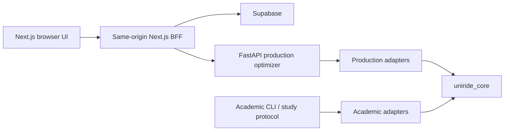

# UniRide Current Architecture

**Verified documentation snapshot:** 2026-08-10
**Evidence base:** `0b4bef6e77d4eda2812cbe773296978862c25599`
**Last verified code-bearing commit:** `ddd85e8b1cc5ed64a8163988b2e179a08c8cfd2f`

This describes current, verified boundaries. It is not a production-readiness claim. When this document conflicts with live code or executable tests, those sources win.

## 1. Dual-engine boundary



- **Production** owns identities and authorization, operational DTOs, authoritative locations, travel-time/provider policy, geometry, persistence, and operational failures.
- **Academic** owns TSPLIB/CVRPLIB sources, BKS/gaps, experiment manifests, seed schedules, DOE, statistics, and research-result persistence.
- **`uniride_core`** owns neutral routing models, constraints, algorithm implementations, local search, matrix contracts, and solver-independent validation.

The intended dependency flow is inward: adapters may depend on the core; the core must not depend on FastAPI, Next.js, academic persistence, or study orchestration.

## 2. Current request and study paths

### Production request path

```text
Browser -> authenticated Next.js BFF -> FastAPI production adapter
        -> request-scoped solver work -> uniride_core -> response/persistence
```

The admin route-test workflow now follows the authenticated same-origin `/api/optimize-route` BFF and no longer calls the optimizer directly from the browser. This is a scoped page-path correction, **not** general compute authentication.

### Academic path

```text
Dataset/study manifest -> academic registry/protocol -> canonical core solver
                      -> feasibility/result accounting -> analysis artifacts
```

Bildiri legacy solver material has a canonical-core boundary and archive/manifest protection. Academic execution remains separate from production request lifecycles.

## 3. Verified closures, with scope

| Area | Verified closure | Scope limit |
| --- | --- | --- |
| Customer identity | occurrence identity is preserved on the production paths covered by current tests | future/new strategy adapters still need the same contract review |
| Giant-tour splitting | split-decoder corrections cover infeasible-state initialization, prefixes, violation accounting, depot behavior, and missing directed arcs | does not certify every solver family universally |
| Academic solver ownership | active Bildiri GWO/HHO/Numba behavior is canonicalized behind the core boundary | not evidence that every research algorithm is publication-ready |
| Matrix integrity | injectable repository/lifecycle, timeout, last-known-good handling, strict invalid-arc rejection, and cache health are covered | matrix provenance and production/academic metric separation are still open |
| Determinism | seed `0` preservation and PSO deterministic seed handling are covered | each future stochastic algorithm must prove its own replay behavior |
| Python discovery | default pytest discovery is restricted to the three canonical suites | manual scripts remain historical/manual, not default test inputs |
| Optional solvers | health and default-compare enumeration tolerate unavailable optional solvers | explicit requested-algorithm policy remains a separate service concern |
| Supabase construction | proxy and driver routes defer client construction; credential-free build passes | credential-free build is not an authentication/security certification |
| Browser optimization test | admin route-test uses the authenticated BFF | other production/browser compute paths remain to be migrated |
| Dependencies | five unused **direct** root edges were removed | transitive Genkit packages and audit findings remain |

## 4. Open production boundaries

These are not closed by test count, a build pass, or documentation updates:

1. **Universal feasibility enforcement.** `/optimize` and `/compare` still need one final certificate that makes any hard-constraint violation impossible to report as successful.
2. **Compute protection and budgets.** General compute authentication, authorization, typed limits, alias deduplication, worker ceilings, cancellation semantics, and fair compare ranking remain incomplete.
3. **Durable execution.** Benchmark work is not yet a durable multi-worker job system with atomic admission, persisted heartbeat, idempotency, and cooperative cancellation.
4. **Matrix provenance.** Production travel time and academic problem metrics still require explicit, non-interchangeable provenance/domain/unit/directionality contracts.
5. **Frontend resilience.** State consolidation, cancellation/timeouts, polling, error handling, and the 158 lint warnings need focused work.
6. **GIS.** There is no current route-geometry contract or GIS renderer. Existing route lists and locations are not a map implementation.
7. **Dependency security.** `npm audit --omit=dev --json` reports 84 unresolved findings: 2 critical, 22 high, 59 moderate, and 1 low.

## 5. Solver and matrix contract

A production solver input must distinguish a customer occurrence from a physical stop. Multiple students can share coordinates without becoming one demand, time window, service requirement, or route stop.

A matrix must declare its source/domain, units, directionality, identity mapping, completeness, and validity. Invalid off-diagonal values fail closed on covered production paths. Academic TSPLIB/CVRPLIB distances and production travel-time estimates must never be silently substituted for one another.

A target neutral contract is:

```text
Production DTO --production adapter--+
                                      +-> RoutingProblem / CostMatrix / ConstraintProfile
Academic record --academic adapter---+                 |
                                                        v
                                                   Solver / Result
                                                        |
                                                        v
                                           FeasibilityCertificate
```

Production-specific geometry, users, authorization, and errors remain outside this neutral model. BKS/gaps, DOE metadata, dataset persistence, and statistical reporting remain academic-only.

## 6. Execution and concurrency

Registry metadata should be immutable. Executable strategies must be request/job scoped. Current compare and benchmark lifecycle work still requires typed policy, bounded resource allocation, cancellation that actually stops loops, and durable persistence before it can be treated as multi-worker production infrastructure.

## 7. Verification baseline

On 2026-08-10, the canonical Python suites passed **1,676 tests** with **48 warnings** in **238.17s**. Frontend Vitest passed **17 files / 37 tests** in **2.83s**; TypeScript passed; ESLint reported **0 errors / 158 warnings**; and a credential-free production build passed. `npm audit --omit=dev --json` still exited nonzero with the 84 findings above.

See [UniRide_Ultimate_Audit.md](UniRide_Ultimate_Audit.md) for qualifications, [ACTIVE_ROADMAP.md](ACTIVE_ROADMAP.md) for priority, and [NEXT_PHASE_EXECUTION_ROADMAP.md](NEXT_PHASE_EXECUTION_ROADMAP.md) for bounded future handoffs.
