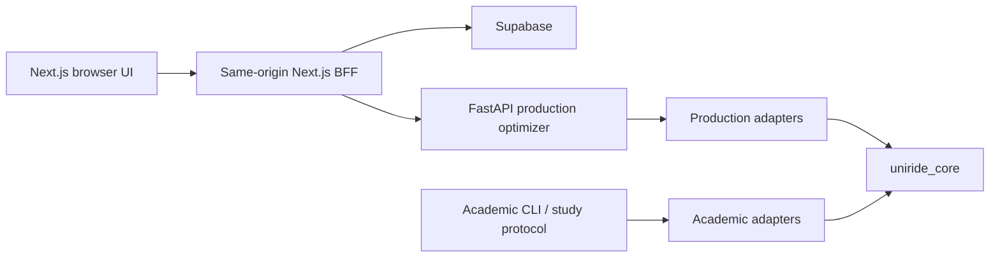

# UniRide Current Architecture

**Verified documentation snapshot:** 2026-08-14
**Evidence tip:** `ed54d5cebdc849fb0df2743692f0eca385a4750a`
**Last verified code-bearing commit:** `ed54d5c`

This describes current, verified boundaries. It is not a production-readiness claim. When this document conflicts with live code or executable tests, those sources win.

## 1. Dual-engine boundary



- **Production** owns identities and authorization, operational DTOs, authoritative locations, travel-time/provider policy, geometry, persistence, and operational failures.
- **Academic** owns TSPLIB/CVRPLIB sources, BKS/gaps, experiment manifests, seed schedules, DOE, statistics, and research-result persistence.
- **`uniride_core`** owns neutral routing models, constraints, algorithm implementations, local search, matrix contracts, and solver-independent validation.

The intended dependency flow is inward: adapters may depend on the core; the core must not depend on FastAPI, Next.js, academic persistence, or study orchestration.

## 2. Current request and study paths

### Production request path

```text
Browser -> authenticated Next.js BFF -> FastAPI internal-key boundary
        -> canonical alias resolution -> fresh request-scoped strategy
        -> immutable compute policy (lowering-only) -> request-scoped solver work
        -> Package A feasibility certificate -> deterministic admission/ranking -> response/persistence
```

The admin route-test workflow calls the authenticated same-origin `/api/optimize-route` BFF and no longer calls the optimizer directly from the browser. General production compute is now protected end to end:

- The FastAPI `optimization` router requires `X-Internal-API-Key` (constant-time compared, router-level dependency) for `POST /api/v1/optimize`, `POST /api/v1/compare`, and `POST /api/v1/vehicle-calculator`. `/health`, `/api/v1/strategies`, `/api/v1/extract-time-windows`, and `/api/v1/schedule-to-students` remain public.
- Next.js server code calls those heavy endpoints only through `optimizerFetch` (`src/lib/optimizer-server.ts`), which imports `server-only`, reads `OPTIMIZER_INTERNAL_API_KEY`, and injects it as a header. Public raw `fetch` is reserved for `/health` and `/api/v1/strategies`. The key is never exposed through a `NEXT_PUBLIC_*` variable, responses, or logs.
- Every submitted strategy key resolves through `resolve_strategy`/`resolve_unique_strategies` (`optimizer_api/strategies/canonical.py`) to one canonical identity; each canonical run receives a fresh instance from `resolution.create()`, which fails closed if the factory returns a mismatched name.
- `apply_compute_policy` (`optimizer_api/compute_policy.py`) applies the frozen, immutable `production-conservative-v1` profile to a request-local copy, returns typed `applied_policy` metadata, and caps native solver budgets (`solver_seconds`, `ls_time_limit`) per request. Overrides may lower ceilings but never raise them.
- `/optimize` and `/compare` results pass through the Package A feasibility certificate; a result is successful only when it is solver-successful **and** `feasibility_certificate.is_feasible`. Failed/infeasible/uncertified/timed-out results are never ranked. Best/fastest ranking is deterministic (duration, vehicles, canonical name / execution seconds, canonical name).
- `/compare` deduplicates aliases, runs at most `max_workers` (2) canonical workers, and applies one 120-second **soft** response deadline via `concurrent.futures.wait`. Pending futures are not waited on and the executor shuts down with `wait=False`; running threads may continue, so Package B is **not** hard cancellation.
- Exact/permutation requests with more than ten waypoints fail fast before the solver method is invoked (`ExactTSPSizeError` in `uniride_core/algorithms/string_exact_tsp.py`; router preflight for `optimize`, `compare`, and `_run_single_algorithm`), with the same sanitized unsuccessful shape used when a solver produces no valid result.

### Academic path

```text
Dataset/study manifest -> academic registry/protocol -> canonical core solver
                      -> feasibility/result accounting -> analysis artifacts
```

Bildiri legacy solver material has a canonical-core boundary and archive/manifest protection. Academic execution remains separate from production request lifecycles.

## 3. Verified closures, with scope

| Area | Verified closure | Scope limit |
| --- | --- | --- |
| Customer identity | occurrence identity is preserved on the production paths covered by current tests | future/new strategy adapters still need the same contract review |
| Giant-tour splitting | split-decoder corrections cover infeasible-state initialization, prefixes, violation accounting, depot behavior, and missing directed arcs | does not certify every solver family universally |
| Academic solver ownership | active Bildiri GWO/HHO/Numba behavior is canonicalized behind the core boundary | not evidence that every research algorithm is publication-ready |
| Matrix integrity | injectable repository/lifecycle, timeout, last-known-good handling, strict invalid-arc rejection, and cache health are covered | matrix provenance and production/academic metric separation are still open |
| Determinism | seed `0` preservation and PSO deterministic seed handling are covered | each future stochastic algorithm must prove its own replay behavior |
| Python discovery | default pytest discovery is restricted to the three canonical suites | manual scripts remain historical/manual, not default test inputs |
| Optional solvers | health and default-compare enumeration tolerate unavailable optional solvers | explicit requested-algorithm policy remains a separate service concern |
| Supabase construction | proxy and driver routes defer client construction; credential-free build passes | credential-free build is not an authentication/security certification |
| Browser optimization test | admin route-test uses the authenticated BFF | other production/browser compute paths remain to be migrated |
| Dependencies | five unused **direct** root edges were removed | transitive Genkit packages and audit findings remain |
| Compute authentication | all three heavy endpoints deny missing/wrong keys (403) and accept the correct key; public endpoints remain public; `UNIRIDE_DISABLE_AUTH=1` is a startup error under `APP_ENV=production` | auth is boundary-gated on the shared internal key, not per-tenant authorization |
| Compute profile | frozen `production-conservative-v1` ceilings; nine `UNIRIDE_COMPUTE_*` overrides validated at startup and may only lower ceilings; tuning allowlists are exhaustive and fail closed | no rate limiting; profile governs only the optimizer service |
| Canonical resolution | every alias resolves to one canonical identity; explicit alias duplicates execute once; fresh request-scoped instances per canonical run | future registry additions need the same contract review |
| Bounded comparison | at most 2 workers, one 120-second soft deadline, six canonical defaults, deterministic best/fastest ranking, certificate-gated admission | soft deadline is not hard cancellation or process isolation |
| Exact TSP | >10-waypoint exact/permutation requests fail fast without truncation and never invoke the solver | applies to the canonical permutation_tsp/exact paths; other solver limits unchanged |
| Server-only transport | heavy Next.js calls route through server-only `optimizerFetch`; browser boundary test blocks the internal key from client code | browser-facing pages depend on BFF routes continuing to enforce the boundary |

## 4. Open production boundaries

These are not closed by test count, a build pass, or documentation updates:

1. **Universal feasibility enforcement.** The Package A feasibility certificate is attached to `/optimize` and `/compare` results and is the final admission gate; requested-algorithm policy and any solver surface not covered by the certificate still need the same contract review.
2. **Compute protection and budgets.** Internal-key boundary authentication, typed lowering-only limits, alias deduplication, worker ceilings, soft deadlines, and deterministic compare ranking are implemented. **Hard solver cancellation, process isolation, rate limiting, per-tenant authorization, and durable jobs remain open.**
3. **Durable execution.** Benchmark work is not yet a durable multi-worker job system with atomic admission, persisted heartbeat, idempotency, and cooperative cancellation.
4. **Matrix provenance.** Production travel time and academic problem metrics still require explicit, non-interchangeable provenance/domain/unit/directionality contracts.
5. **Frontend resilience.** State consolidation, cancellation/timeouts, polling, error handling, and the 158 lint warnings need focused work.
6. **GIS.** There is no current route-geometry contract or GIS renderer. Existing route lists and locations are not a map implementation.
7. **Dependency security.** `npm audit --omit=dev --json` reports 84 unresolved findings: 2 critical, 22 high, 59 moderate, and 1 low.

## 5. Solver and matrix contract

A production solver input must distinguish a customer occurrence from a physical stop. Multiple students can share coordinates without becoming one demand, time window, service requirement, or route stop.

A matrix must declare its source/domain, units, directionality, identity mapping, completeness, and validity. Invalid off-diagonal values fail closed on covered production paths. Academic TSPLIB/CVRPLIB distances and production travel-time estimates must never be silently substituted for one another.

A target neutral contract is:

```text
Production DTO --production adapter--+
                                      +-> RoutingProblem / CostMatrix / ConstraintProfile
Academic record --academic adapter---+                 |
                                                        v
                                                   Solver / Result
                                                        |
                                                        v
                                           FeasibilityCertificate
```

Production-specific geometry, users, authorization, and errors remain outside this neutral model. BKS/gaps, DOE metadata, dataset persistence, and statistical reporting remain academic-only.

## 6. Execution and concurrency

Registry metadata should be immutable. Executable strategies must be request/job scoped. `/compare` now uses at most 2 canonical workers and a single 120-second soft response deadline; native solver budgets are capped per request. Because the deadline is soft (threads may continue, `wait=False` shutdown), hard cancellation that actually stops loops, process isolation, and durable persistence are still required before this can be treated as multi-worker production infrastructure.

## 7. Verification baseline

On 2026-08-14 at `ed54d5c`, the focused Package B Python gate passed **1,453 tests** in **37.37s**. The full affected Python suites passed **2,295 tests** with **1 skip** (Numba unavailable) and **3 warnings** in **167.78s**; the only remaining failure is `test_matrix_repository.py::test_provider_timeout_plumbed_into_sdk_client`, a pre-existing Supabase SDK provider-timeout drift reproduced on clean `WIP`. Frontend Vitest remains **21 files / 58 tests passed**; TypeScript passed; ESLint reported **0 errors / 158 warnings** (temporary waiver); and a credential-free production build passed with **57 static pages**. No frontend production source changed after those frontend gates. `npm audit --omit=dev --json` still exits nonzero with the 84 findings above. (An earlier mid-run observation of 20 additional auth-guard failures was a branch-induced suite-consistency artifact, not baseline debt; it is documented and corrected in the worklog.)

See [UniRide_Ultimate_Audit.md](UniRide_Ultimate_Audit.md) for qualifications, [ACTIVE_ROADMAP.md](ACTIVE_ROADMAP.md) for priority, and [NEXT_PHASE_EXECUTION_ROADMAP.md](NEXT_PHASE_EXECUTION_ROADMAP.md) for bounded future handoffs.
