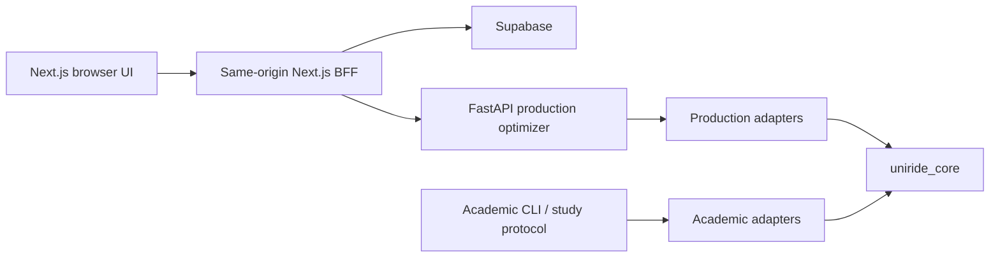

# UniRide Current Architecture

**Verified documentation snapshot:** 2026-09-02
**Historical verification evidence:** 2026-08-24 remediation derived from `fef5a2b537da7068b51b3b3a50c6d633a2853404`
**Latest scoped verification:** Dudullu Package 0 code gate on `codex/dudullu-package0-readiness-20260901` at `d983375d0307fa6b2ee7a995de9cbfa15fbf20e1`; live aggregate gate `BLOCKED-CONFIG`

This describes current, verified boundaries. It is not a production-readiness claim. When this document conflicts with live code or executable tests, those sources win.

## 1. Dual-engine boundary


```mermaid
flowchart LR
  UI[Next.js browser UI] --> BFF[Same-origin Next.js BFF]
  BFF --> DB[Supabase]
  BFF --> API[FastAPI production optimizer]
  API --> PA[Production adapters]
  CLI[Academic CLI / study protocol] --> AA[Academic adapters]
  PA --> CORE[uniride_core]
  AA --> CORE
```

- **Production** owns identities and authorization, operational DTOs, authoritative locations, travel-time/provider policy, geometry, persistence, and operational failures.
- **Academic** owns TSPLIB/CVRPLIB sources, BKS/gaps, experiment manifests, seed schedules, DOE, statistics, and research-result persistence.
- **`uniride_core`** owns neutral routing models, constraints, algorithm implementations, local search, matrix contracts, and solver-independent validation.

The intended dependency flow is inward: adapters may depend on the core; the core must not depend on FastAPI, Next.js, academic persistence, or study orchestration.

## 2. Current request and study paths

### Production request path

```text
Browser -> authenticated Next.js BFF -> FastAPI internal-key boundary
        -> canonical alias resolution -> fresh request-scoped strategy
        -> immutable compute policy (lowering-only) -> request-scoped solver work
        -> Package A feasibility certificate -> deterministic admission/ranking -> response/persistence
```

The admin route-test workflow calls the authenticated same-origin `/api/optimize-route` BFF and no longer calls the optimizer directly from the browser. General production compute is now protected end to end:

- The FastAPI `optimization` router requires `X-Internal-API-Key` (constant-time compared, router-level dependency) for `POST /api/v1/optimize`, `POST /api/v1/compare`, and `POST /api/v1/vehicle-calculator`. `/health`, `/api/v1/strategies`, `/api/v1/extract-time-windows`, and `/api/v1/schedule-to-students` remain public.
- Next.js server code calls those heavy endpoints only through `optimizerFetch` (`src/lib/optimizer-server.ts`), which imports `server-only`, reads `OPTIMIZER_INTERNAL_API_KEY`, and injects it as a header. Public raw `fetch` is reserved for `/health` and `/api/v1/strategies`. The key is never exposed through a `NEXT_PUBLIC_*` variable, responses, or logs.
- Every submitted strategy key resolves through `resolve_strategy`/`resolve_unique_strategies` (`optimizer_api/strategies/canonical.py`) to one canonical identity; each canonical run receives a fresh instance from `resolution.create()`, which fails closed if the factory returns a mismatched name.
- `apply_compute_policy` (`optimizer_api/compute_policy.py`) applies the frozen, immutable `production-conservative-v1` profile to a request-local copy, returns typed `applied_policy` metadata, and caps native solver budgets (`solver_seconds`, `ls_time_limit`) per request. Overrides may lower ceilings but never raise them.
- `/optimize` and `/compare` results pass through the Package A feasibility certificate; a result is successful only when it is solver-successful **and** `feasibility_certificate.is_feasible`. Failed/infeasible/uncertified/timed-out results are never ranked. Best/fastest ranking is deterministic (duration, vehicles, canonical name / execution seconds, canonical name).
- `/compare` deduplicates aliases, runs at most `max_workers` (2) canonical workers, and applies one 120-second **soft** response deadline via `concurrent.futures.wait`. Pending futures are not waited on and the executor shuts down with `wait=False`; running threads may continue, so Package B is **not** hard cancellation.
- Exact/permutation requests with more than ten waypoints fail fast before the solver method is invoked (`ExactTSPSizeError` in `uniride_core/algorithms/string_exact_tsp.py`; router preflight for `optimize`, `compare`, and `_run_single_algorithm`), with the same sanitized unsuccessful shape used when a solver produces no valid result.
- Dudullu Package 0 adds protected FastAPI `GET /api/v1/internal/readiness` for key handshake and `POST /api/v1/internal/readiness/time-matrix` for a redacted required-location matrix summary. The admin-only Next.js `GET /api/admin/dudullu-readiness` BFF reads narrow Supabase projections, calls the protected matrix endpoint through `optimizerFetch`, strictly reconstructs the allowlisted aggregate, and returns `Cache-Control: private, no-store`. It does not solve or mutate routes.
- `npm run dev:dudullu` is the local foreground launcher. It shares one in-memory internal key with both children, requires FastAPI health, the protected handshake, and the Next.js listener in the same poll before announcing readiness, and tears down both child trees when one exits. `--check-only` validates configuration without starting services.

### Academic path

```text
Dataset/study manifest -> academic registry/protocol -> canonical core solver
                      -> feasibility/result accounting -> analysis artifacts
```

Bildiri legacy solver material has a canonical-core boundary and archive/manifest protection. Academic execution remains separate from production request lifecycles.

## 3. Verified closures, with scope

| Area | Verified closure | Scope limit |
| --- | --- | --- |
| Customer identity | occurrence identity is preserved on the production paths covered by current tests | future/new strategy adapters still need the same contract review |
| Giant-tour splitting | split-decoder corrections cover infeasible-state initialization, prefixes, violation accounting, depot behavior, and missing directed arcs | does not certify every solver family universally |
| Academic solver ownership | active Bildiri GWO/HHO/Numba behavior is canonicalized behind the core boundary | not evidence that every research algorithm is publication-ready |
| Matrix integrity | injectable repository/lifecycle, timeout, last-known-good handling, strict invalid-arc rejection, and cache health are covered | matrix provenance and production/academic metric separation are still open |
| Matrix fail-closed (audit C2, repository part) | the stored Supabase `time_matrix` is the only source of operational travel times. With no authoritative matrix loaded, `TimeMatrixRepository.get_submatrix`/`get_duration` raise `MatrixUnavailableError` (never zeros, haversine or Euclidean values); a failed first load counts as stale and is retried with an exponential backoff (30 s, doubling per consecutive failure, capped at the cache TTL, reset on success; base `TIME_MATRIX_RETRY_BASE_SECONDS`; at most one fetch per window) without a restart; `get_submatrix` refreshes in every mode; unknown location codes raise `IncompleteTravelMatrixError`. Unbound `/optimize`, `/vehicle-calculator` and `/compare` map these to a redacted 503 (`travel-time matrix unavailable`) or 422 (`requested locations are missing from the travel-time matrix`); snapshot-bound requests keep their existing fail-closed response. `route_metrics.get_duration` is strict by default (no haversine, no generic 15-minute default). `APP_ENV=production` fails at startup without `SUPABASE_URL` and `SUPABASE_SERVICE_ROLE_KEY`, and also when `UNIRIDE_ALLOW_COORDINATE_FALLBACK` is set. That flag (truthy `1`/`true`/`yes`, default off) is the only way to get coordinate-derived stand-ins for DIRECT strategy and repository calls (tests, offline scripts); it does not affect the HTTP endpoints, which always require the stored matrix (the certificate cannot be judged on coordinates) and return 503 without it, flag or not. Its Euclidean path measures lat/lng degrees, not minutes (audit M3). The provider fetch runs under the repository lock, so a request can wait up to the provider timeout once per backoff window while the matrix is down | matrix provenance in responses (MT2) is open; PyVRP time scaling and the OR-Tools time-window bound rounding are documented follow-ups (the certifier re-costing and the OR-Tools arc/limit rounding are closed, see section 5); the geometric clustering strategies (kmeans, fuzzy c-means, sweep, hierarchical) use haversine on coordinates for grouping, not as travel times; `uniride_core` split/scheduling helpers still carry a 15-minute default for an arc missing from a matrix dict they were handed (not reachable with a complete repository submatrix, not removed) |
| Determinism | seed `0` preservation and PSO deterministic seed handling are covered | each future stochastic algorithm must prove its own replay behavior |
| Python discovery | default pytest discovery is restricted to the three canonical suites | manual scripts remain historical/manual, not default test inputs |
| Optional solvers | health and default-compare enumeration tolerate unavailable optional solvers | explicit requested-algorithm policy remains a separate service concern |
| Supabase construction | proxy and driver routes defer client construction; credential-free build passes | credential-free build is not an authentication/security certification |
| Browser optimization test | admin route-test uses the authenticated BFF | other production/browser compute paths remain to be migrated |
| Dependencies | five unused **direct** root edges were removed | transitive Genkit packages and audit findings remain |
| Compute authentication | all three heavy endpoints deny missing/wrong keys (403) and accept a valid key; public endpoints remain public; `UNIRIDE_DISABLE_AUTH=1` is a startup error under `APP_ENV=production`; tenant keys resolve to distinct tenant identities; blank/untrimmed/reserved IDs, blank/duplicate secrets, and reuse of the ops key fail closed | per-tenant budgets/quotas beyond rate windows are not implemented |
| Compute profile | frozen `production-conservative-v1` ceilings; nine `UNIRIDE_COMPUTE_*` overrides validated at startup and may only lower ceilings; tuning allowlists are exhaustive and fail closed; authenticated rate windows are tenant-keyed with IP fallback | the limiter and profile are process-local to the optimizer service, not distributed admission control |
| Canonical resolution | every alias resolves to one canonical identity; explicit alias duplicates execute once; fresh request-scoped instances per canonical run | future registry additions need the same contract review |
| Bounded comparison | at most 2 workers, one 120-second soft deadline, six canonical defaults, deterministic best/fastest ranking, certificate-gated admission | soft deadline is not hard cancellation or process isolation |
| Exact TSP | >10-waypoint exact/permutation requests fail fast without truncation and never invoke the solver | applies to the canonical permutation_tsp/exact paths; other solver limits unchanged |
| Server-only transport | heavy Next.js calls route through server-only `optimizerFetch`; browser boundary test blocks the internal key from client code | browser-facing pages depend on BFF routes continuing to enforce the boundary |
| Dudullu daily demand domain | pure TypeScript schedule filtering, separate pickup/dropoff occurrences, hourly waves with exact anchors, inclusive previous-day 22:00 `Europe/Istanbul` admission, exception/lead handling, and shift-eligibility precheck are covered by `src/services/daily-planning.test.ts`; final hardening fails closed on out-of-day anchors, blank identities, invalid runtime directions, and malformed source demands, with boundary-first same-wave ordering | no database/API/UI integration, no live-data verification, no optimizer/matrix binding, no full depot-chain timing, no physical-fleet assignment, and no publication |
| Dudullu Package 0 runtime boundary | protected FastAPI readiness routes, pure redacted analyzer, admin-only BFF, strict aggregate schemas, no-store responses, one-command local launcher, and child-process lifecycle are test-gated | 2026-09-02 aggregate gate is `BLOCKED-CONFIG`; no administrator bearer token was available, so current Supabase/matrix/fleet readiness is unverified |

## 4. Open production boundaries

These are not closed by test count, a build pass, or documentation updates:

1. **Feasibility extension discipline.** The current `/optimize`, `/compare`, and tested requested-algorithm/vehicle-calculator paths are certificate-gated. Every future solver, router, persistence, or response surface must prove the same fail-closed contract; present coverage is not a blanket production certification.
2. **Compute protection and budgets.** Internal-key boundary authentication, tenant-key authorization, typed lowering-only limits, alias deduplication, worker ceilings, soft deadlines, tenant-keyed rate windows with IP fallback, and deterministic compare ranking are implemented. **Hard solver cancellation, process isolation, distributed quota state, and durable jobs remain open.**
3. **Durable execution.** Benchmark work is not yet a durable multi-worker job system with atomic admission, persisted heartbeat, idempotency, and cooperative cancellation.
4. **Matrix provenance.** Production travel time and academic problem metrics still require explicit, non-interchangeable provenance/domain/unit/directionality contracts.
5. **Frontend resilience.** State consolidation, cancellation/timeouts, polling, error handling, and the 158 lint warnings need focused work.
6. **GIS.** There is no current route-geometry contract or GIS renderer. Existing route lists and locations are not a map implementation.
7. **Dependency security.** The last recorded `npm audit --omit=dev --json` reported 84 unresolved findings (2 critical, 22 high, 59 moderate, 1 low); that count was not refreshed on 2026-08-24.
8. **Dudullu daily operations.** Package 1 is the pure, tested demand/slot boundary. Package 0 implementation is code-gated, but its live aggregate gate is `BLOCKED-CONFIG` until an administrator token is available; historical 28-student/29-node material is not current evidence. Package 2 remains blocked and must provide an authenticated preview API, authoritative matrix ID/version/hash, independent used-arc checks, full depot-to-depot timing including the closing arc, and two-stage day-level physical-fleet assignment with truthful shortage/non-publishable semantics. Package 3 requires transactional versioned multi-wave publication and RLS; Package 4 owns admin/student workflows; Package 5 needs certified cross-wave before/after re-solves and lexicographic fleet-first savings; Package 6 is pilot/operations. No automatic student shifting or unverified savings claim is allowed.

## 5. Solver and matrix contract

A production solver input must distinguish a customer occurrence from a physical stop. Multiple students can share coordinates without becoming one demand, time window, service requirement, or route stop.

A matrix must declare its source/domain, units, directionality, identity mapping, completeness, and validity. Invalid off-diagonal values fail closed on covered production paths. Operational travel times come only from the stored Supabase `time_matrix` (owner requirement, 2026-10-05; live traffic data will be a later source); an unavailable matrix is an error, not a zero or coordinate-derived value (see the "Matrix fail-closed" row in section 3). Academic TSPLIB/CVRPLIB distances and production travel-time estimates must never be silently substituted for one another.

Per-student ride time (owner decision 2026-10-04): the optional production request field `max_ride_time` (minutes, 1-600, default `None` = no limit; independent of the vehicle-tour limit `max_travel_time`) bounds every student's in-vehicle time on a route `depot -> s1..sk -> depot`. Pickup: a student's ride is the travel from that student's stop to the campus including the closing arc (longest = first student). Dropoff: the travel from the campus to that student's stop (longest = last student). Students sharing a stop share one ride time. `ga_split` constructs against it in the `SplitDecoder` trip builders (capacity-only and time-window, both directions; waiting aboard counts where the decoder simulates it). The singleton fallback in `SplitDecoder.decode` (taken when no feasible split exists) does not enforce it: it returns one route per student flagged `"error"`, and the certificate is the safety net for that path. `check_ride_time` in the production response certifier rejects (`ride_time_violation`) any strategy result that violates it, whether or not that strategy knows the field. The certifier checks pure travel time only; waiting aboard is not visible to it (audit H2). Other strategies do not construct with the limit and rely on that rejection. `None` leaves every existing behaviour, benchmark and academic result unchanged; the academic `ConstraintProfile` does not carry the field.

Route certificate and the travel-time matrix (owner requirement 2026-10-05, audit C2, both halves integrated): `certify_optimization_response(request, response, arc_lookup)` no longer synthesizes a matrix from the response. `arc_lookup` is an injected `Callable[[str, str], float]` over physical location codes (depot id, student `location_code`); occurrence keys map to the physical code of their student, so two students at one stop are joined by the matrix's own zero arc. `routers/optimization.py` builds it with `verification/authoritative_arcs.authoritative_arc_lookup`: for a snapshot-bound request (`expected_matrix_sha256`) from the `arcs` of the same `matrix_snapshot` the digest vouches for, otherwise from the DataLoader repository through its public strict accessors `TimeMatrixRepository.capture_arcs(codes)` / `arc(origin, destination)`, which read the stored matrix only and raise `MatrixUnavailableError` / `IncompleteTravelMatrixError` (never coordinate-derived values, neither under `UNIRIDE_ALLOW_COORDINATE_FALLBACK` nor inside `academic_coordinate_scope()`). Every step is re-costed on its matrix arc: a reported duration that deviates by more than `ARC_DURATION_TOLERANCE = 0.005` min (half a unit of the 2-decimal `round(x, 2)` the responses publish; it absorbs formatting only, not solver rounding) is an `arc_duration_mismatch` error, an arc the matrix cannot answer or an endpoint that cannot be resolved to a matrix code is a `missing_arc` error, and a missing `arc_lookup` yields `is_feasible=False` with a sanitized `certify_error`. Capacity, `max_travel_time`, `ride_time_violation` and time-window checks then run on the matrix durations, never on the reported ones. Scope limits: for an unbound request the router copies the request's arcs out of the repository (`capture_arcs`, one atomic read) BEFORE the solve and certifies against that copy, so a matrix refresh during the solve cannot change the certificate's matrix; if that capture raises, the request fails with the redacted 503 (422 for unknown codes) before any solve, while a snapshot-bound request keeps the 200 "matrix snapshot unavailable or changed" response; the legacy `/benchmark` runner (`benchmark_runner`, `academic_coordinate_scope()`) certifies with `certify_benchmark_response` over the problem's own matrix and never uses this lookup (see the next paragraph for what changed for it); the certificate is exactly as authoritative as the matrix behind the lookup (it cannot be satisfied by coordinate-derived values, so with the dev opt-in on `/optimize` still returns 503 rather than an uncertifiable result). The OR-Tools engine (`ortools_cvrp_engine.py`) has an `arc_rounding` option: `"nearest"` is the default and preserves the historical scaled values and reporting byte for byte (the `academic_benchmark` OR-Tools callers); the operational `ortools_cvrp` strategy passes `"conservative"` except inside `academic_coordinate_scope()` (`in_academic_coordinate_scope()`), where it keeps `"nearest"` like the legacy runner, which scales arcs and service times up with `ceil` and the route limit down with `floor` (float noise guarded by 1e-9) so a route that meets the scaled limit meets `max_route_duration` in true minutes, and reports the true unscaled arc durations (rounded to 2 decimals like every other strategy). The cost is a slightly pessimistic internal objective (under 0.1 min per arc at the default scale of 10).

Legacy `/benchmark` runner and the academic package (C2 integration review): the runner executes the production strategies inside `academic_coordinate_scope()` on the problem's own coordinates. Parity is kept for `ortools_cvrp` (historical `"nearest"` rounding in scope). One behaviour change is intended and kept: the split strategies (`ga_split`, `pso_split`, `gwo_split`, `hho_split`) used to call `get_submatrix` without coordinates and therefore optimized on an all-zero matrix, which was the C2 defect itself; inside the scope they now optimize on the coordinate metric (measured on tiny12 EUC, seed 42: `ga_split` 556 -> 264, `pso_split` 468 -> 264). Earlier legacy-runner numbers for these four algorithms are not comparable with new ones. The `academic_benchmark` package itself is untouched: it does not use the repository or `route_metrics`, and its OR-Tools callers (`registry_setup.py`, `holistic_matrix_engine.py`) keep `"nearest"`.

Operational clustering (owner requirement 2026-10-05): the cluster-first strategies (`ga`, `pso`, `gwo`, `hho`, `two_opt`, `permutation_tsp`) pass the authoritative directed matrix, keyed by physical location code and including the depot, to `VehicleCalculator.calculate`, which hands it to the clustering strategy. `k_medoids` and `clarke_wright` read only matrix values and raise `MissingTravelTimeError` for a missing pair; their haversine fallback is removed (no caller relied on it: the only callers are `VehicleCalculator` and the FCM benchmark script `optimizer_api/tests/benchmark_hierarchical_threshold.py`, which does not use them). The geometric strategies (`kmeans`, `fuzzy_cmeans`, `fuzzy_cmeans_enhanced`, `hierarchical_fcm`, `sweep`) group by coordinates/centroids and do not compute travel times.

A target neutral contract is:

```text
Production DTO --production adapter--+
                                      +-> RoutingProblem / CostMatrix / ConstraintProfile
Academic record --academic adapter---+                 |
                                                        v
                                                   Solver / Result
                                                        |
                                                        v
                                           FeasibilityCertificate
```

Production-specific geometry, users, authorization, and errors remain outside this neutral model. BKS/gaps, DOE metadata, dataset persistence, and statistical reporting remain academic-only.

## 6. Execution and concurrency

Registry metadata should be immutable. Executable strategies must be request/job scoped. `/compare` now uses at most 2 canonical workers and a single 120-second soft response deadline; native solver budgets are capped per request. Because the deadline is soft (threads may continue, `wait=False` shutdown), hard cancellation that actually stops loops, process isolation, and durable persistence are still required before this can be treated as multi-worker production infrastructure.

## 7. Verification baseline

On 2026-08-24, branch `codex/audit-remediation-20260824` (base `fef5a2b`) passed full Python discovery with **3,355 passed, 1 skipped, 45 warnings in 429.17s**. Frontend Vitest passed **21 files / 58 tests in 78.99s** after restricting discovery to the current root `src` tree; TypeScript passed; ESLint reported **0 errors / 158 warnings** under the temporary waiver; and the Next.js 16.1.6 production build passed with **57 dynamic, server-rendered routes**. The previous environment-sensitive matrix test and ignored local Bildiri-boundary failures are closed. The npm security audit was not rerun, so the 84-finding figure above remains dated evidence rather than a current count.

On 2026-08-25, the Package 1 feature branch
`codex/dudullu-daily-planner-20260825` at `6ef36591215331bcd51b33a0f6f6508c62862702`
passed `daily-planning` (**1 file / 32 tests**) and the six named regression
files (**6 files / 19 tests**), `npm run typecheck` (**0 errors**), `npm run
lint` (**0 errors / 158 warnings**), and `git diff --check`. This is not a
current live-data or production-operation verification.

On 2026-09-02, Package 0 at `d983375` passed launcher **20/20**, focused
readiness Vitest **2 files / 43 tests**, focused FastAPI readiness **25 tests**,
TypeScript, and quiet lint. The local FastAPI health and Next.js listener both
returned HTTP 200. The authenticated BFF returned HTTP 401 because no
administrator bearer token was available, so the live aggregate state is
`BLOCKED-CONFIG`; no current student, matrix, driver, or vehicle count is
verified. See [docs/DUDULLU_RUNTIME_READINESS.md](docs/DUDULLU_RUNTIME_READINESS.md).

See [UniRide_Ultimate_Audit.md](UniRide_Ultimate_Audit.md) for qualifications, [ACTIVE_ROADMAP.md](ACTIVE_ROADMAP.md) for priority, and [NEXT_PHASE_EXECUTION_ROADMAP.md](NEXT_PHASE_EXECUTION_ROADMAP.md) for bounded future handoffs.
