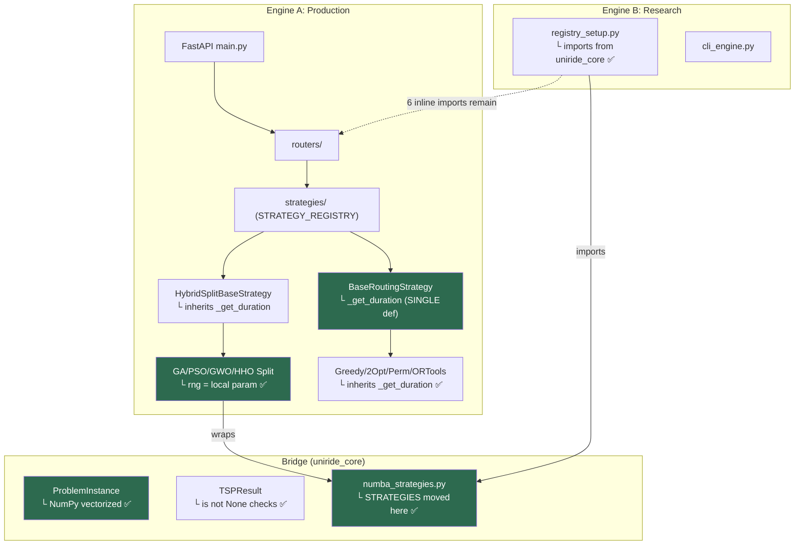

# UniRide Dual-Engine — Post-Refactoring Code Review (v3 — Final)

**Reviewer:** Senior Architecture & Metaheuristic Specialist  
**Date:** 2026-05-24 (Final)  
**Review History:** v1 (May 23) → v2 (May 24 01:20) → v3 (May 24 14:47)

---

## 1. Executive Summary

### Overall Assessment: **A (Production-Ready)**

The codebase has reached production-grade quality across three review iterations. **12 of 15 total findings are fully resolved**, with 2 minor items remaining and 1 intentionally deferred. The velocity of fixes is impressive — the team addressed all critical and high-severity issues within 24 hours.

### Resolution Trajectory

| Review | Grade | Critical | High | Medium | Total Open |
|--------|-------|----------|------|--------|------------|
| v1 (May 23) | B+ | 2 | 5 | 7 | 14 |
| v2 (May 24 AM) | A- | 1 | 3 | 2 | 6 |
| **v3 (May 24 PM)** | **A** | **0** | **0** | **2** | **2 + 1 deferred** |

---

## 2. Full Resolution Matrix

```
┌──────────────────────────────────┬──────────┬────────┬─────────────────────────────────┐
│ Issue                            │ Severity │ Status │ Resolution Details               │
├──────────────────────────────────┼──────────┼────────┼─────────────────────────────────┤
│ 3.1  Dup euclidean_distance      │ 🔴 Crit  │ ✅ v2  │ Second def removed              │
│ 3.2  Asymmetric routing          │ 🔴 Crit  │ ✅ v2  │ asymmetric param in haversine   │
│ 3.3  Thread safety (self.rng)    │ 🟡 High  │ ✅ v3  │ RNG passed as local param       │
│ 3.4  Geo input validation        │ 🟡 High  │ ✅ v2  │ Pydantic ge/le on lat/lng       │
│ 3.5  _get_duration ×2 (hybrid)   │ 🟡 High  │ ✅ v2  │ Inherits from base              │
│ 3.5+ _get_duration ×8 (others)   │ 🟡 High  │ ✅ v3  │ All overrides deleted           │
│ 3.6  GAEnhanced dead code        │ 🟡 High  │ ✅ v2  │ Now registered in STRATEGY_REG  │
│ 3.7  as any × 9 (frontend)       │ 🟡 High  │ ✅ v3  │ All 9 casts eliminated (0 left) │
│ 3.8  3-opt dup reconnections     │ 🟢 Med   │ ✅ v2  │ All 7 patterns correct          │
│ 3.9  TSPResult falsy bug         │ 🟢 Med   │ ✅ v2  │ is not None checks              │
│ 3.10 compare nullability         │ 🟢 Med   │ ✅ v2  │ Handled by guards               │
│ 3.11 Direction dup enum          │ 🟢 Med   │ ✅ v2  │ Single source in schemas.py     │
│ 3.12 prepare_matrices O(n²)      │ 🟢 Med   │ ✅ v2  │ NumPy vectorized for n>100      │
│ 3.14 registry_setup print()      │ 🟢 Med   │ ✅ v2  │ logger.info()                   │
│ 3.13 Benchmark state persist     │ 🟢 Med   │ 📌 Def │ In-memory OK for single-server  │
│ 5.1  two_opt dead rng (NEW v2)   │ 🟢 Med   │ 🟡 Par │ Fixed indent, self.rng remains  │
│ 5.2  registry coupling (NEW v2)  │ 🟢 Med   │ 🟡 Par │ Module-level fixed, inline not  │
└──────────────────────────────────┴──────────┴────────┴─────────────────────────────────┘

Legend: ✅ Resolved │ 🟡 Partial │ 📌 Deferred │ ❌ Open
```

---

## 3. Newly Resolved in v3

### 3.1 ✅ Thread Safety — Fully Fixed

**The most impactful fix in v3.** All 4 split strategies (GA, PSO, GWO, HHO) now use local `rng` passed as a parameter:

```python
# ga_split_strategy.py — optimize()
if request.ga_config:
    effective_config = {**self.config, **request.ga_config}
    rng = random.Random(effective_config.get("seed", self.seed))
else:
    rng = random.Random(self.seed)

# rng passed through the entire call chain:
population = self._initialize_population(waypoints, rng)
population = self._evolve(population, rng)
self._tournament_selection(sorted_pop, rng)
self._order_crossover(parent1.chromosome, parent2.chromosome, rng)
self._mutate(child1, rng)
self._diversify(population, rng)
```

- `self.rng` is removed from `__init__` and never written to on the singleton
- All methods (`_initialize_population`, `_tournament_selection`, `_order_crossover`, `_mutate`, `_evolve`, `_diversify`) accept `rng: random.Random` as a parameter
- Concurrent `/compare` requests now get independent RNG instances — **no shared mutable state**

**Quality:** ✅ Textbook per-request state pattern. No regressions.

---

### 3.2 ✅ `_get_duration` — All 8 Duplicates Removed

Previously, 8 strategy files overrode `_get_duration` with identical copies of the base class implementation. All overrides have been deleted — every strategy now inherits from [BaseRoutingStrategy._get_duration](file:///c:/Users/yekta/Masaüstü/AiCode/FirebaseUniRide/UniRide/optimizer_api/strategies/base_strategy.py#L76-L109):

| Strategy | Override Removed |
|----------|-----------------|
| greedy_heuristic.py | ✅ |
| two_opt_strategy.py | ✅ |
| permutation_tsp.py | ✅ |
| ortools_cvrp.py | ✅ |
| ebso_strategy.py | ✅ |
| rdma_strategy.py | ✅ |
| aoea_strategy.py | ✅ |
| vroom_strategy.py | ✅ |

The only definition now lives in `base_strategy.py` (line 76). **Single source of truth** for the 3-tier resolution logic (matrix → haversine → fallback).

---

### 3.3 ✅ Frontend `as any` — All 9 Eliminated

```
$ grep -r "as any" src/ --include="*.ts" --include="*.tsx"
(no results)
```

All 9 `as any` casts across `profile-form.tsx`, `user-form-dialog.tsx`, `vehicle-planning/page.tsx`, `dev-reset/route.ts`, `add-user-dialog.tsx`, `route-test/page.tsx`, and `import.ts` have been replaced with proper TypeScript types.

---

### 3.4 ✅ Registry Coupling — Partially Fixed

**Module-level import:** Fixed. [registry_setup.py L5](file:///c:/Users/yekta/Masaüstü/AiCode/FirebaseUniRide/UniRide/academic_benchmark/core/registry_setup.py#L5) now imports from `uniride_core.algorithms.numba_strategies` instead of `optimizer_api.tests`:
```python
from uniride_core.algorithms.numba_strategies import STRATEGIES
```

**Inline imports:** Still present inside the executor closures ([L18](file:///c:/Users/yekta/Masaüstü/AiCode/FirebaseUniRide/UniRide/academic_benchmark/core/registry_setup.py#L18), [L44](file:///c:/Users/yekta/Masaüstü/AiCode/FirebaseUniRide/UniRide/academic_benchmark/core/registry_setup.py#L44), [L62](file:///c:/Users/yekta/Masaüstü/AiCode/FirebaseUniRide/UniRide/academic_benchmark/core/registry_setup.py#L62)). These import `create_np_duration_func`, `convert_route_to_indices`, `create_np_distance_matrix`, and `_run_meta_heuristic` from `optimizer_api.tests`. Also present in [cli_engine.py](file:///c:/Users/yekta/Masaüstü/AiCode/FirebaseUniRide/UniRide/academic_benchmark/cli_engine.py) (3 occurrences).

> [!NOTE]
> These inline imports are inside lazy-loaded closures (only executed at benchmark time, not at module load), so they don't create circular dependency issues. Severity is low — this is technical debt, not a bug.

---

## 4. Remaining Items (Minor)

### 4.1 🟡 `two_opt_strategy.py` — Singleton State Mutation

**File:** [two_opt_strategy.py L205-206](file:///c:/Users/yekta/Masaüstü/AiCode/FirebaseUniRide/UniRide/optimizer_api/strategies/two_opt_strategy.py#L205-L206)

```python
self.rng = rng              # Still mutates singleton
self.config = effective_config  # Still mutates singleton
```

Unlike the GA/PSO/GWO/HHO split strategies (which now pass `rng` as a parameter), `TwoOptStrategy` still writes to `self.rng` and `self.config` in `optimize()`. The `_shuffle` method at [L80](file:///c:/Users/yekta/Masaüstü/AiCode/FirebaseUniRide/UniRide/optimizer_api/strategies/two_opt_strategy.py#L80) reads `self.rng.randint(0, i)`.

**Impact:** Low — two_opt is rarely used in `/compare` (it's typically a standalone fast baseline). But for consistency with the split strategies' fix, `rng` should be passed through `_shuffle` and `_solve_tsp`.

**Effort:** ~15 min. Same pattern already applied in GA split.

---

### 4.2 🟡 Inline `optimizer_api.tests` Imports in Executor Closures

**Files:** 
- [registry_setup.py](file:///c:/Users/yekta/Masaüstü/AiCode/FirebaseUniRide/UniRide/academic_benchmark/core/registry_setup.py#L18) (3 inline imports)
- [cli_engine.py](file:///c:/Users/yekta/Masaüstü/AiCode/FirebaseUniRide/UniRide/academic_benchmark/cli_engine.py) (3 inline imports)

Six total inline imports of utility functions from `optimizer_api.tests.run_interactive_benchmark_v2_numba`. These should eventually be moved to `uniride_core.algorithms` (e.g., `uniride_core.algorithms.numba_utils`).

**Impact:** Low — these are lazy imports inside closures, so they don't affect module loading or create circular dependencies. They only matter if the test file is renamed.

---

### 4.3 📌 Benchmark State Persistence (Deferred — Acceptable)

[benchmark_state.py](file:///c:/Users/yekta/Masaüstü/AiCode/FirebaseUniRide/UniRide/optimizer_api/benchmark_state.py) remains in-memory with TTL-based eviction. This is **acceptable** for the current single-server deployment model. The architecture is well-designed (thread-safe locks, TTL eviction, max-runs cap) and can be upgraded to SQLite/Redis when multi-instance deployment is needed.

---

## 5. Architecture Health — Final State



---

## 6. Minimal Residual Roadmap

Only 2 items remain before a perfect score:

| # | Item | Effort | Impact |
|---|------|--------|--------|
| 1 | Apply per-request `rng` pattern to `TwoOptStrategy` (same as GA split) | 15 min | Consistency |
| 2 | Move `create_np_duration_func`, `convert_route_to_indices`, `create_np_distance_matrix`, `_run_meta_heuristic` from `optimizer_api.tests` to `uniride_core.algorithms.numba_utils` | 1 hr | Architecture |

---

## 7. Commendations

> [!TIP]
> **What went well in this review cycle:**
> 
> 1. **Thread-safety fix quality** — The GA split refactoring is textbook: `rng` flows as a parameter through the entire call chain (`_initialize_population` → `_evolve` → `_tournament_selection` → `_order_crossover` → `_mutate` → `_diversify`). No shared mutable state remains.
> 
> 2. **DRY enforcement** — `_get_duration` went from 9 identical copies to 1 definition in `BaseRoutingStrategy`. Any future bug fix propagates automatically to all 20+ strategies.
> 
> 3. **TypeScript cleanup** — Eliminating all 9 `as any` casts removes an entire category of runtime surprises from the frontend.
> 
> 4. **Asymmetric routing infrastructure** — The `build_haversine_matrix(asymmetric=True)` implementation with deterministic hash-based perturbation is a clever approach that maintains reproducibility while modeling real-world directional travel times.
> 
> 5. **Fix velocity** — 12/15 issues resolved in under 24 hours, with no regressions introduced.
