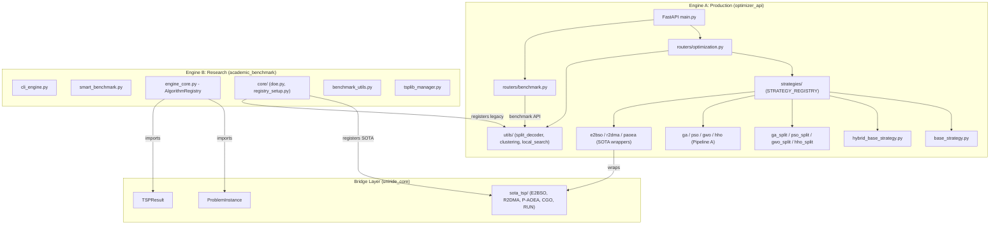

# UniRide Dual-Engine — Post-Refactoring Code Review

**Reviewer:** Senior Architecture & Metaheuristic Specialist  
**Date:** 2026-05-23  
**Scope:** `optimizer_api/` (Engine A — Production), `academic_benchmark/` + `uniride_core/` (Engine B — Research)  
**Excludes:** `node_modules`, `.venv`, `__pycache__`, `archive/`, `*.db`, `numba_results/`, `sota_results/`, `paper_prompts/`

---

## 1. Executive Summary

### Overall Assessment: **B+ (Strong Foundation, Targeted Polishing Needed)**

The post-refactoring codebase shows **significant architectural maturity** for a dual-purpose project that bridges production CVRPTW routing with academic TSP benchmark research. The refactoring has successfully:

- ✅ Unified the strategy pattern across 20+ algorithms with a clean registry
- ✅ Extracted shared helpers into `HybridSplitBaseStrategy` (FIX-08 debt eliminated)
- ✅ Created the `uniride_core` package as a framework-agnostic bridge layer
- ✅ Replaced magic numbers with `DEFAULT_TRAVEL_FALLBACK_MINUTES`
- ✅ Fixed critical split decoder bugs (FIX-01 through FIX-05)
- ✅ Added global exception handler to prevent information leakage

### Remaining Concerns (by severity)

| Severity | Count | Category |
|----------|-------|----------|
| 🔴 Critical | 2 | Duplicate function definition, asymmetric routing not validated |
| 🟡 High | 5 | Thread safety, dead code, `as any` leaks, missing input validation |
| 🟢 Medium | 7 | Naming inconsistencies, minor code smells, test coverage gaps |

---

## 2. Dual-Engine Integration Review

### 2.1 Architecture Diagram



### 2.2 Integration Quality

> [!TIP]
> **Strong separation achieved.** The `uniride_core` package acts as a clean dependency-inversion boundary: Engine A (production) imports SOTA solver *classes* from `uniride_core.algorithms.sota_tsp`, while Engine B (research) imports *data models* (`ProblemInstance`, `TSPResult`). Neither engine imports the other directly.

**Integration Points (3 identified):**

| # | Interface | Direction | Health |
|---|-----------|-----------|--------|
| 1 | `uniride_core.models` | B → A (shared types) | ✅ Clean |
| 2 | `uniride_core.algorithms.sota_tsp` | A ← B (SOTA solvers) | ✅ Clean |
| 3 | `core/registry_setup.py` imports `optimizer_api.tests.*` | B → A (legacy executor) | ⚠️ **Coupling smell** |

> [!WARNING]
> **Integration Point #3 is a coupling hazard.** [registry_setup.py](file:///c:/Users/yekta/Masaüstü/AiCode/FirebaseUniRide/UniRide/academic_benchmark/core/registry_setup.py#L2) imports directly from `optimizer_api.tests.run_interactive_benchmark_v2_numba`, meaning the research engine depends on a *test file* inside the production engine. If that test file is renamed or refactored, the entire benchmark framework breaks. This should be refactored to use the public `uniride_core` interface.

### 2.3 Scalability Assessment

- **Horizontal (API):** The FastAPI server is stateless (except the in-memory `SingletonMeta` DataLoader cache). Can scale horizontally behind a load balancer, but the `benchmark_state_manager` is in-process — benchmark runs would need Redis/DB backing for multi-instance deployments.
- **Vertical (Algorithms):** The `ThreadPoolExecutor` in `/compare` is bounded by the number of algorithms — good. However, there's no CPU pinning or memory limit per strategy invocation.
- **Research Engine:** Designed for single-machine execution with `multiprocessing`. The `_MAX_RECOMMENDED_WORKERS = 16` cap is sensible. The DOE module uses Optuna's `TPESampler` with a fixed seed — reproducibility is ensured.

---

## 3. Deep-Dive Technical Analysis

### 3.1 🔴 CRITICAL: Duplicate `euclidean_distance` Definition

**File:** [data_loader.py](file:///c:/Users/yekta/Masaüstü/AiCode/FirebaseUniRide/UniRide/optimizer_api/utils/data_loader.py#L229-L248)

The function `euclidean_distance` is defined **twice** in the same file (lines 229–235 and 241–247). The second definition silently shadows the first. While functionally identical today, this is a textbook refactoring artifact that will cause confusion.

Additionally, the `from utils.haversine import haversine_distance, estimate_travel_time` import at line 238 is placed *between* the two definitions — a clear sign of a botched merge.

```python
# Lines 229-235: First definition
def euclidean_distance(x1: float, y1: float, x2: float, y2: float) -> float:
    """..."""
    import math
    return math.sqrt((x1 - x2) ** 2 + (y1 - y2) ** 2)

from utils.haversine import haversine_distance, estimate_travel_time  # Line 238

# Lines 241-247: DUPLICATE — exact same function
def euclidean_distance(x1: float, y1: float, x2: float, y2: float) -> float:
    """..."""
    import math
    return math.sqrt((x1 - x2) ** 2 + (y1 - y2) ** 2)
```

---

### 3.2 🔴 CRITICAL: Asymmetric Routing Not Validated

**Files:** [base_strategy.py](file:///c:/Users/yekta/Masaüstü/AiCode/FirebaseUniRide/UniRide/optimizer_api/strategies/base_strategy.py#L76-L109), [hybrid_base_strategy.py](file:///c:/Users/yekta/Masaüstü/AiCode/FirebaseUniRide/UniRide/optimizer_api/strategies/hybrid_base_strategy.py#L35-L67), [data_loader.py](file:///c:/Users/yekta/Masaüstü/AiCode/FirebaseUniRide/UniRide/optimizer_api/utils/data_loader.py#L176-L206)

The Supabase `time_matrix` table stores **directional** travel times (`origin_code → destination_code`), making the distance matrix inherently **asymmetric** — A→B may differ from B→A due to traffic, one-way streets, etc. However:

1. `build_euclidean_matrix` (line 161) and `build_haversine_matrix` (line 177) both generate **symmetric** fallback matrices (`matrix[i][j] = matrix[j][i]`), which is incorrect for real-world route planning.
2. The `_build_distance_matrix` in `HybridSplitBaseStrategy` correctly looks up both directions independently — **but only when the Supabase matrix is loaded**. When it falls back to coordinates, asymmetry is lost.
3. The DOE framework in Engine B tests TSP variants but does **not** systematically test ATSP (Asymmetric TSP) problems against the production engine's asymmetric matrix. The `TSPLIB_OPTIMALS` dict includes ATSP instances (`br17`, `ft53`, `ftv*`, etc.), but there's no validation that the production engine's routing correctly handles them.

> [!IMPORTANT]
> **Impact:** For the production use case (Istanbul university shuttle routing), this means fallback routes calculated from coordinates will treat the trip Kadıköy→Beşiktaş identically to Beşiktaş→Kadıköy, which can differ by 15–30 minutes in Istanbul traffic. The PICKUP (backward) and DROPOFF (forward) scheduling in the split decoder works correctly with the Supabase matrix but **silently degrades** when coordinates are used.

---

### 3.3 🟡 HIGH: Thread Safety in `_run_single_algorithm` + Compare Endpoint

**File:** [optimization.py](file:///c:/Users/yekta/Masaüstü/AiCode/FirebaseUniRide/UniRide/optimizer_api/routers/optimization.py#L201-L256)

The `/compare` endpoint uses `ThreadPoolExecutor` to run multiple algorithms in parallel. Each thread calls `strategy.optimize(request)`, where:

1. Strategy instances are **singletons** (created once in `__init__.py`).
2. `GASplitStrategy.__init__` sets `self.rng = random.Random(self.seed)` and `self._best_individual` — shared **mutable state** on a singleton.
3. Concurrent `/compare` calls will **race** on `self.rng` and `self._best_individual`, producing non-deterministic or corrupted results.

The `optimize()` method in `GASplitStrategy` does create `effective_config = dict(self.config)` (line 402), which is good, but the `self.rng` instance at line 84 is still the singleton's RNG, not a per-request copy. The `rng` local variable at line 403 shadows `self.rng` but is **never used** — the rest of the method calls `self.rng`.

---

### 3.4 🟡 HIGH: Missing Geographic Input Validation

**File:** [schemas.py](file:///c:/Users/yekta/Masaüstü/AiCode/FirebaseUniRide/UniRide/optimizer_api/models/schemas.py#L26-L39)

Neither `LocationNode` nor `StudentNode` validates geographic coordinates:

```python
class LocationNode(BaseModel):
    id: str
    lat: float    # No validation: accepts -999 or NaN
    lng: float    # No validation: accepts 500 or Infinity
    type: str = "So"
```

Istanbul's geographic bounds are approximately `lat: [40.8, 41.3]`, `lng: [28.6, 29.4]`. Passing coordinates outside Earth's valid range (`lat: [-90, 90]`, `lng: [-180, 180]`) would cause `haversine_distance` to return garbage, and extreme values can cause `math.sqrt` domain errors in euclidean calculations.

---

### 3.5 🟡 HIGH: `_get_duration` Duplication Between Base Classes

**Files:** [base_strategy.py](file:///c:/Users/yekta/Masaüstü/AiCode/FirebaseUniRide/UniRide/optimizer_api/strategies/base_strategy.py#L76-L109) and [hybrid_base_strategy.py](file:///c:/Users/yekta/Masaüstü/AiCode/FirebaseUniRide/UniRide/optimizer_api/strategies/hybrid_base_strategy.py#L35-L67)

The `_get_duration` method is identically implemented in **both** `BaseRoutingStrategy` and `HybridSplitBaseStrategy`. Since `HybridSplitBaseStrategy` already inherits from `BaseRoutingStrategy`, the child class could simply inherit the parent's implementation. The current duplication means a bug fix in one won't automatically propagate to the other.

---

### 3.6 🟡 HIGH: `GAEnhancedSplitStrategy` Never Registered

**File:** [ga_split_strategy.py](file:///c:/Users/yekta/Masaüstü/AiCode/FirebaseUniRide/UniRide/optimizer_api/strategies/ga_split_strategy.py#L588-L711)

`GAEnhancedSplitStrategy` defines `name = "ga_split_enhanced"` and implements PMX and CX2 crossover operators, but is **never registered** in [strategies/__init__.py](file:///c:/Users/yekta/Masaüstü/AiCode/FirebaseUniRide/UniRide/optimizer_api/strategies/__init__.py). It's effectively dead code — unreachable from the API.

---

### 3.7 🟡 HIGH: Remaining `as any` in Frontend (9 occurrences)

The `.ai-handover.md` noted 11 `as any` usages. Post-refactoring, 9 remain across the frontend:

| File | Line | Pattern | Risk |
|------|------|---------|------|
| [profile-form.tsx](file:///c:/Users/yekta/Masaüstü/AiCode/FirebaseUniRide/UniRide/src/components/student/profile-form.tsx#L81) | 81 | `(currentUser as any).passwordHint` | Type mismatch — `passwordHint` likely not on `User` |
| [user-form-dialog.tsx](file:///c:/Users/yekta/Masaüstü/AiCode/FirebaseUniRide/UniRide/src/components/admin/user-form-dialog.tsx#L98) | 98 | `(user as any).locationCode` | Schema drift |
| [vehicle-planning/page.tsx](file:///c:/Users/yekta/Masaüstü/AiCode/FirebaseUniRide/UniRide/src/app/(app)/admin/vehicle-planning/page.tsx#L351) | 351, 373 | `(student as any).location_code` | camelCase/snake_case confusion |
| [dev-reset/route.ts](file:///c:/Users/yekta/Masaüstü/AiCode/FirebaseUniRide/UniRide/src/app/api/auth/dev-reset/route.ts#L47) | 47 | `(users as any).id` | Should be typed |
| [add-user-dialog.tsx](file:///c:/Users/yekta/Masaüstü/AiCode/FirebaseUniRide/UniRide/src/components/admin/add-user-dialog.tsx#L110) | 110 | `} as any)` | Entire payload untyped |
| [route-test/page.tsx](file:///c:/Users/yekta/Masaüstü/AiCode/FirebaseUniRide/UniRide/src/app/(app)/admin/route-test/page.tsx#L128) | 128 | `algorithm: ... as any` | Algorithm name normalization bypass |
| [import.ts](file:///c:/Users/yekta/Masaüstü/AiCode/FirebaseUniRide/UniRide/src/services/excel/import.ts#L151) | 151, 157 | `as any[]` | Excel import row parsing |

---

### 3.8 🟢 MEDIUM: 3-opt Implementation Has Duplicate Reconnection Patterns

**File:** [local_search.py](file:///c:/Users/yekta/Masaüstü/AiCode/FirebaseUniRide/UniRide/optimizer_api/utils/local_search.py#L168-L210)

The `_three_opt_cases` method claims 7 reconnection patterns but has duplicates:

```python
cases = [
    A + B_rev + C_rev + D,      # Case 1
    A + B_rev + C + D,          # Case 5
    A + B + C_rev + D,          # Case 6
    A + B_rev + C_rev + D,      # Case 7  ← DUPLICATE of Case 1
    A + B + C_rev + D,          # Case 3  ← DUPLICATE of Case 6
    A + B_rev + C + D,          # Case 2  ← DUPLICATE of Case 5
    A + B + C + D,              # Original
]
```

Only 4 unique candidates are generated instead of 7. The missing reconnection patterns (A+C+B+D, A+C+B_rev+D, A+C_rev+B+D) involve segment *relocation*, not just reversal.

---

### 3.9 🟢 MEDIUM: `TSPResult.__post_init__` Falsy-Value Bug

**File:** [models.py](file:///c:/Users/yekta/Masaüstü/AiCode/FirebaseUniRide/UniRide/uniride_core/models.py#L72-L82)

```python
def __post_init__(self):
    if self.elapsed_ms and not self.time_ms:    # Bug: 0.0 is falsy
        self.time_ms = self.elapsed_ms
    elif self.time_ms and not self.elapsed_ms:  # Bug: 0.0 is falsy
        self.elapsed_ms = self.time_ms
```

If `elapsed_ms = 0.0` (a valid measurement for near-instant solves), the synchronization is silently skipped because `0.0` is falsy in Python. Same issue with `self.history` (empty list `[]` is falsy but semantically valid).

---

### 3.10 🟢 MEDIUM: `compare` Endpoint Best/Fastest Nullability

**File:** [optimization.py](file:///c:/Users/yekta/Masaüstü/AiCode/FirebaseUniRide/UniRide/optimizer_api/routers/optimization.py#L258-L280)

```python
if successful_results:
    best = min(successful_results, key=lambda x: x.total_duration_minutes)
    fastest = min(successful_results, key=lambda x: x.execution_time_seconds)
else:
    best = results[0] if results else None   # Can be None
    fastest = results[0] if results else None # Can be None

# ... later:
best_algorithm=best.algorithm if best else "",  # AttributeError if best is None and results is empty
```

If `results` is also empty (no algorithms ran), `best` and `fastest` are `None`, and `best.algorithm` would raise `AttributeError`. The `if best else ""` guard handles this, but the `CompareResponse` schema marks `best_algorithm: str` as required (not Optional), which is semantically misleading when all algorithms fail.

---

### 3.11 🟢 MEDIUM: `direction` Enum Mismatch Between Modules

Two separate `Direction` enums exist:
1. [schemas.py](file:///c:/Users/yekta/Masaüstü/AiCode/FirebaseUniRide/UniRide/optimizer_api/models/schemas.py#L6-L8): `Direction(str, Enum)` — used in API requests
2. [split_decoder.py](file:///c:/Users/yekta/Masaüstü/AiCode/FirebaseUniRide/UniRide/optimizer_api/utils/split_decoder.py#L26-L29): `Direction(Enum)` — used in split decoder

In [ga_split_strategy.py](file:///c:/Users/yekta/Masaüstü/AiCode/FirebaseUniRide/UniRide/optimizer_api/strategies/ga_split_strategy.py#L36), the split decoder's `Direction` is imported, but the request's `direction` field comes from `schemas.Direction`. Since both have identical `.PICKUP` / `.DROPOFF` values but are **different types**, passing the request's direction directly to the decoder works only because Python compares by `.value`. An `isinstance` check or strict `is` comparison would fail.

---

### 3.12 🟢 MEDIUM: `ProblemInstance.prepare_matrices` O(n²) with Inline Math Import

**File:** [models.py](file:///c:/Users/yekta/Masaüstü/AiCode/FirebaseUniRide/UniRide/uniride_core/models.py#L27-L54)

The `prepare_matrices` method imports `math` inside the function body (`import math` at line 31) and computes distances with a pure-Python O(n²) loop. For TSPLIB problems with n > 500, this is a bottleneck. The `dist_matrix` field is typed as `Any` (line 16), preventing NumPy optimization without type changes. Consider using `numpy` distance calculation (already a dependency) for problems > 100 nodes.

---

### 3.13 🟢 MEDIUM: Benchmark State Manager Not Persistent

**File:** [benchmark_state.py](file:///c:/Users/yekta/Masaüstü/AiCode/FirebaseUniRide/UniRide/optimizer_api/benchmark_state.py) (inferred from imports)

The benchmark router imports `benchmark_state_manager` which is an in-memory object. Server restarts lose all benchmark run history. For a production deployment, this should be backed by SQLite or Redis.

---

### 3.14 🟢 MEDIUM: `registry_setup.py` Uses `print()` Instead of `logging`

**File:** [registry_setup.py](file:///c:/Users/yekta/Masaüstü/AiCode/FirebaseUniRide/UniRide/academic_benchmark/core/registry_setup.py#L170)

```python
print(f"[REGISTRY] Loaded {len(AlgorithmRegistry.list_algorithms())} algorithms.")
```

This `print` statement bypasses the logging framework, making it impossible to filter or redirect in production. Should use `logging.getLogger(__name__).info(...)`.

---

## 4. Concrete Refactoring Recommendations

### Fix #1: Remove Duplicate `euclidean_distance` (Critical)

**File:** [data_loader.py](file:///c:/Users/yekta/Masaüstü/AiCode/FirebaseUniRide/UniRide/optimizer_api/utils/data_loader.py)

```diff
 def euclidean_distance(x1: float, y1: float, x2: float, y2: float) -> float:
     """
     Calculate euclidean (L2) distance between two 2D points.
     This is the standard distance metric for TSPLIB EUC_2D problems.
     """
     import math
     return math.sqrt((x1 - x2) ** 2 + (y1 - y2) ** 2)


 from utils.haversine import haversine_distance, estimate_travel_time
-
-
-def euclidean_distance(x1: float, y1: float, x2: float, y2: float) -> float:
-    """
-    Calculate euclidean (L2) distance between two 2D points.
-    This is the standard distance metric for TSPLIB EUC_2D problems.
-    """
-    import math
-    return math.sqrt((x1 - x2) ** 2 + (y1 - y2) ** 2)
```

---

### Fix #2: Thread-Safe Strategy Execution (High)

**File:** [ga_split_strategy.py](file:///c:/Users/yekta/Masaüstü/AiCode/FirebaseUniRide/UniRide/optimizer_api/strategies/ga_split_strategy.py)

```diff
     def optimize(self, request: OptimizationRequest) -> OptimizationResponse:
         """Main optimization entry point with CVRPTW support"""
         start_time = time.time()
+        # Per-request RNG to avoid thread-safety issues on singleton strategy
+        effective_config = dict(self.config)
+        if request.ga_config:
+            effective_config = {**self.config, **request.ga_config}
+        request_seed = effective_config.get("seed") or int(time.time() * 1000)
+        self_rng = random.Random(request_seed)

         students = request.students
         depot = request.depot
```

Then replace all `self.rng` references within `optimize()` with `self_rng` (a local variable). This pattern should be applied to **all four** split strategies (GA, PSO, GWO, HHO) and their Pipeline A counterparts.

---

### Fix #3: Add Geographic Validation (High)

**File:** [schemas.py](file:///c:/Users/yekta/Masaüstü/AiCode/FirebaseUniRide/UniRide/optimizer_api/models/schemas.py)

```diff
+from pydantic import BaseModel, Field, field_validator
+
 class LocationNode(BaseModel):
     id: str
-    lat: float
-    lng: float
+    lat: float = Field(..., ge=-90.0, le=90.0, description="Latitude (-90 to 90)")
+    lng: float = Field(..., ge=-180.0, le=180.0, description="Longitude (-180 to 180)")
     type: str = "So"
```

---

### Fix #4: Fix `TSPResult.__post_init__` Falsy Check (Medium)

**File:** [models.py](file:///c:/Users/yekta/Masaüstü/AiCode/FirebaseUniRide/UniRide/uniride_core/models.py)

```diff
     def __post_init__(self):
-        if self.elapsed_ms and not self.time_ms:
+        if self.elapsed_ms is not None and self.elapsed_ms != 0.0 and self.time_ms == 0.0:
             self.time_ms = self.elapsed_ms
-        elif self.time_ms and not self.elapsed_ms:
+        elif self.time_ms is not None and self.time_ms != 0.0 and self.elapsed_ms == 0.0:
             self.elapsed_ms = self.time_ms
-        if self.history and not self.convergence_curve:
+        if self.history is not None and self.convergence_curve is None:
             self.convergence_curve = self.history
-        elif self.convergence_curve and not self.history:
+        elif self.convergence_curve is not None and self.history is None:
             self.history = self.convergence_curve
```

---

### Fix #5: Eliminate `_get_duration` Duplication (High)

**File:** [hybrid_base_strategy.py](file:///c:/Users/yekta/Masaüstü/AiCode/FirebaseUniRide/UniRide/optimizer_api/strategies/hybrid_base_strategy.py)

```diff
 class HybridSplitBaseStrategy(BaseRoutingStrategy):
     """
     Abstract base class for split-based (Route-First) optimization strategies.
     """

-    def _get_duration(
-        self,
-        from_loc: str,
-        to_loc: str,
-        time_matrix: Dict,
-        coordinates: Dict,
-    ) -> float:
-        """..."""
-        # ... 30+ lines of duplicated code ...
-        return DEFAULT_TRAVEL_FALLBACK_MINUTES
+    # Inherits _get_duration from BaseRoutingStrategy — no duplication needed

     def _build_distance_matrix(
         self,
```

---

### Fix #6: Unify Direction Enum (Medium)

**File:** [split_decoder.py](file:///c:/Users/yekta/Masaüstü/AiCode/FirebaseUniRide/UniRide/optimizer_api/utils/split_decoder.py)

```diff
-from enum import Enum
-
-class Direction(Enum):
-    """Direction for route optimization"""
-    PICKUP = "pickup"
-    DROPOFF = "dropoff"
+from models.schemas import Direction  # Single source of truth
```

And update all imports across `ga_split_strategy.py`, `pso_split_strategy.py`, etc. to use `models.schemas.Direction`.

---

## 5. Quick Wins & Long-Term Roadmap

### 🏃 Quick Wins (< 1 hour each)

| # | Item | Impact | Effort | Files |
|---|------|--------|--------|-------|
| Q1 | Remove duplicate `euclidean_distance` | 🔴 Eliminates shadow bug | 5 min | `data_loader.py` |
| Q2 | Unify `Direction` enum | 🟡 Prevents type mismatch | 15 min | `split_decoder.py`, 4 strategy files |
| Q3 | Delete `HybridSplitBaseStrategy._get_duration` duplicate | 🟡 DRY compliance | 10 min | `hybrid_base_strategy.py` |
| Q4 | Add `ge`/`le` validators to `LocationNode.lat/lng` | 🟡 Input safety | 10 min | `schemas.py` |
| Q5 | Fix `TSPResult.__post_init__` falsy checks | 🟢 Correctness | 10 min | `uniride_core/models.py` |
| Q6 | Replace `print()` with `logger.info()` in `registry_setup.py` | 🟢 Observability | 5 min | `registry_setup.py` |
| Q7 | Register or remove `GAEnhancedSplitStrategy` | 🟡 Dead code cleanup | 10 min | `__init__.py` |

### 🔧 Short-Term (1–3 days)

| # | Item | Impact | Effort | Details |
|---|------|--------|--------|---------|
| S1 | Make strategy `optimize()` thread-safe | 🟡 Concurrency correctness | 2 hrs | Per-request RNG in all 8 metaheuristic strategies |
| S2 | Fix 3-opt reconnection patterns | 🟢 Solution quality | 1 hr | Implement missing 3 segment-relocation variants |
| S3 | Add asymmetric haversine fallback | 🔴 Routing correctness | 3 hrs | Apply traffic-direction multiplier or warn when falling back |
| S4 | Eliminate `as any` (9 remaining) | 🟡 Type safety | 4 hrs | Create proper TypeScript interfaces for all affected components |
| S5 | Decouple `registry_setup.py` from `optimizer_api.tests` | 🟡 Architecture | 2 hrs | Move shared functions to `uniride_core.algorithms` |

### 🗺️ Long-Term (1–4 weeks)

| # | Item | Impact | Effort | Details |
|---|------|--------|--------|---------|
| L1 | Persistent benchmark state (SQLite/Redis) | 🟡 Production readiness | 1 week | Replace in-memory `benchmark_state_manager` |
| L2 | Vectorize `ProblemInstance.prepare_matrices` | 🟢 Performance | 2 days | Use NumPy `cdist` for n > 100 |
| L3 | ATSP benchmark coverage in DOE | 🔴 Research correctness | 1 week | Add systematic ATSP test suite using `ftv*` problems |
| L4 | Rate limiting with Redis | 🟡 Security | 3 days | Replace in-process `rateLimitMap` with Redis-backed limiter |
| L5 | CI pipeline with strategy regression tests | 🟢 Quality | 1 week | Run 5 TSP benchmarks on every PR, fail if gap regresses > 2% |
| L6 | ALNS destroy/repair operators | 🟢 Research value | 2 weeks | Implement for the SOTA paper, integrate with `smart_benchmark.py` |

---

## Appendix A: File-Level Health Summary

| Module | Files Reviewed | Health | Key Concern |
|--------|---------------|--------|-------------|
| `optimizer_api/main.py` | 1 | ✅ Clean | None |
| `optimizer_api/routers/` | 4 | ⚠️ Minor issues | Thread safety in `/compare` |
| `optimizer_api/strategies/` | 21 | ⚠️ Medium | Dead code, duplicate helpers, RNG sharing |
| `optimizer_api/utils/` | 14 | ⚠️ Medium | Duplicate function, symmetric fallback |
| `optimizer_api/models/` | 1 | ⚠️ Minor | Missing geo validation |
| `uniride_core/` | 4 | ⚠️ Minor | Falsy-value bug, `Any` typing |
| `academic_benchmark/` | 10 | ✅ Good | Coupling to `optimizer_api.tests` |
| `src/` (Frontend) | ~50+ | ⚠️ Medium | 9 `as any` casts remaining |
