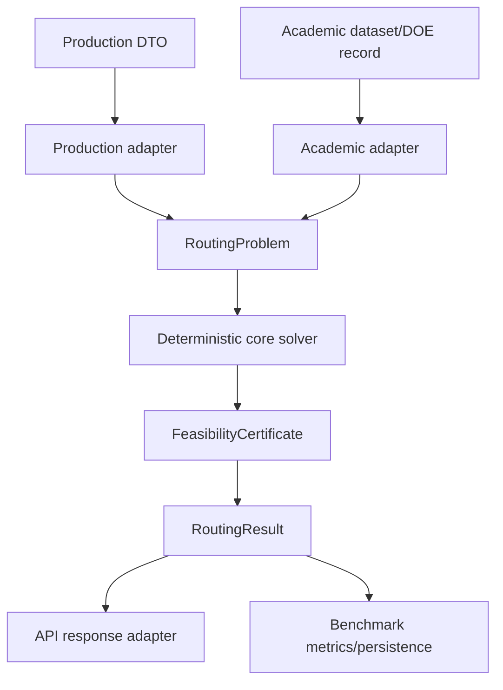

# UniRide Ultimate Audit

**Audit date:** 2026-07-16; live re-verification synchronized 2026-08-01
**Current baseline:** branch `WIP`, commit `0ebd63d337dc3fca1a1c9e7644910ecf2e620a79`
**Historical baseline:** `3534ae8c22057249c597bfbd38890e1e237c16ad`
**Scope:** Next.js frontend, Next.js API routes, FastAPI service, `uniride_core`, and academic benchmark framework
**Method:** live source/call-path analysis plus targeted and consolidated test/environment verification; historical reports are not treated as current evidence

## 1. Executive Reality Check

UniRide has substantial algorithmic and experimental breadth, but it is not production-safe and its current optimization results are not uniformly academically defensible.

The central defect is the absence of one trustworthy feasibility boundary. Multiple algorithms can return `success=True` for hard-constraint violations; repeated physical locations can overwrite customers or crash permutation crossover; the time-window split decoder can reject feasible solutions or misreport violations; and incomplete matrices can silently create free or synthetic edges.

The dual-engine dependency direction is mostly sound: production and academic adapters both reuse `uniride_core`. The boundary is nevertheless porous because legacy core models mix benchmark metadata with operational constraints, production schemas expose benchmark-oriented options, and executable strategy lifecycle is inconsistent.

### Verified claims that must be retired

- “CVRPTW support complete”: cluster-first solvers do not enforce time windows inside route construction.
- “DataLoader singleton is broken”: refuted. `DataLoader` uses the thread-safe `SingletonMeta`, and `get_instance()` delegates to the cached `cls()` instance. The 2026-08-07 2A work further extracted the cache into an injectable `TimeMatrixRepository`; provider timeout and last-known-good risks remain separate concerns.
- “No benchmark race conditions”: admission and creation are separate critical sections.
- “Stop benchmark”: the endpoint changes status but does not stop computation.
- “Production-grade core”: live feasibility and matrix defects contradict this status.
- “GIS map”: no active map renderer or route-geometry contract exists.
- “All frontend release gates are clean”: typecheck and unit tests pass, while lint still carries 159 temporarily waived warnings and the production build remains environment-waived at Supabase page-data collection.

### Positive findings

- Core dependency direction is largely inward and reusable.
- Directed costs are handled correctly in important split/local-search paths when a complete directed matrix is provided.
- TSPLIB download code uses a timeout and safe archive extraction.
- Frontend unit tests passed.
- The repository contains useful test infrastructure and several neutral model concepts suitable for the target architecture.

### 2026-08-01 re-verification corrections

The revised direct-source review corrected several claims from the original audit while preserving the defects that still reproduce on WIP:

- `optimizer_api/utils/patterns.py:10-31` implements a thread-safe singleton metaclass, and `optimizer_api/utils/data_loader.py:128-131` returns `cls()` through that metaclass. Repeated `get_instance()` construction is not the defect.
- `optimizer_api/strategies/pso_strategy.py:53` still falls back to `int(time.time() * 1000)` for every falsy seed, including an omitted seed, `None`, and explicit seed `0`. This breaks deterministic replay and discards seed-`0` semantics.
- Original finding: `optimizer_api/utils/data_loader.py:53-59` constructed the Supabase client without an explicit provider timeout; a stalled external request could block loading. (2A extracted the provider into `TimeMatrixRepository`/`SupabaseTimeMatrixProvider`.) — **Closed in 2B**: `matrix_repository.py` now provides an explicit, version-guarded provider timeout (`TIME_MATRIX_PROVIDER_TIMEOUT_SECONDS`), last-known-good retention on refresh failure, fail-closed `IncompleteTravelMatrixError` for missing/non-finite/zero/negative off-diagonal arcs, and retry backoff after failed loads. Generic `route_metrics` 15-minute fallback was retired from the production path (strict mode → `TravelTimeUnavailableError`) on 2026-08-08.
- `uniride_core/algorithms/cvrptw_decoder.py:95-111` skips a depot token without updating `prev`, so travel after a mid-route depot can be measured from a stale predecessor.
- `optimizer_api/strategies/promoted_config_loader.py:9-13` still imports academic promoted-config code into production strategy construction.
- `normalize_strategy_params` preserves unknown names rather than dropping them; the remaining risk is that downstream strategies silently ignore academic names they do not consume.
- Permissive time-warp/capacity penalty defaults in the optional CVRPTW decoder are a latent hardening concern. The re-verification did not find a production caller enabling that optional path, so it is not classified as an active production failure.
- The Package A/B/C1 branch work described by the July audit has since been consolidated and promoted into WIP. Historical branch-topology and “unmerged” statements are not current architecture evidence.

Verified consolidation gates at promotion:

| Gate | Current evidence |
| --- | --- |
| Academic benchmark suite | 790 passed, 42 warnings |
| `uniride_core` plus `optimizer_api` | 461 passed, 1 skipped, 3 warnings |
| Numba JIT parity | 9 passed, zero skips |
| Frontend unit tests | 21 passed across 7 files |
| TypeScript | Passed |
| ESLint | 0 errors, 159 warnings; temporary warning-cap waiver approved |

## 2. Critical Vulnerabilities

### P0: Duplicate physical locations corrupt customer identity

Shared adapters key demand and students by `location_code`. Two passengers at one stop overwrite each other. Split solvers then pass repeated location codes to permutation crossover, which assumes unique values and can exhaust its fill list.

Affected path:

```text
Split strategy
  -> build_student_demands / build_student_map
  -> giant-tour solver
  -> order_crossover
```

Required correction:

```python
# Wrong: physical location is treated as customer identity.
waypoints = [student.location_code for student in students]
student_map = {student.location_code: student for student in students}

# Required: customer occurrence and physical stop are separate.
waypoints = [student.id for student in students]
student_map = {student.id: student for student in students}
stop_location = {student.id: student.location_code for student in students}
demands = {
    student.id: student_capacity_demand(student)
    for student in students
}
```

Do not aggregate customers solely because coordinates match; disability class, service, and time windows may differ.

### P0: Infeasible routes are returned as successful

`VehicleCalculator` detects maximum-tour violations but returns the best violating assignment with `success=True`. Cluster-first GA, PSO, GWO, and HHO then construct successful responses.

Required correction:

```python
return {
    "success": False,
    "feasible": False,
    "assignments": best_assignments,  # diagnostics only
    "violations": {
        "max_route_duration_minutes": min_violation,
    },
    "message": "No assignment satisfies the hard constraints",
}
```

Every solver must pass an independent final certificate covering exact customer occurrence, capacity, duration, time windows, depot closure, matrix completeness, and route continuity.

### P0: Time-window split DP mishandles violations

Unreachable DP states initialize their violation count to zero. Positive-violation transitions therefore cannot update them correctly, and fallback output can report zero violations with infinite cost.

Required correction:

```python
cost = [float("inf")] * (n + 1)
cost[0] = 0.0

tw_violations = [float("inf")] * (n + 1)
tw_violations[0] = 0
```

Strict mode must exclude violated edges. Soft mode must expose violations explicitly and compare one documented objective.

### P0: Pickup split omits feasible shorter trips

Pickup construction grows one maximal capacity prefix, evaluates only that prefix, and discards it when duration is excessive. Shorter feasible prefixes are never added to the auxiliary graph.

The decoder must evaluate every capacity-feasible prefix and add every duration/TW-feasible edge.

### P0: Travel matrix corruption

Independent corruption paths exist:

- missing matrix pairs may remain zero and become free arcs;
- production latitude/longitude can be processed as abstract Euclidean coordinates;
- lower-level metrics may replace missing arcs with generic 15-minute edges.

Required rule:

```python
if source == target:
    value = 0.0
else:
    value = lookup_directed_arc(source, target)
    if not math.isfinite(value) or value <= 0:
        raise IncompleteTravelMatrixError(source, target)
```

Production geography and academic metrics require separate explicit adapters.

### P0/P1: Unauthenticated filesystem and compute exposure

FastAPI CLI preview/import accepted caller-supplied paths and returned source JSON records. FastAPI also mounts compute-heavy routers without authentication.

Required controls:

- remove public `filepath` parameters;
- restrict filename resolution to configured result roots;
- require administrator/service authentication;
- bound request sizes and work budgets;
- add rate limiting and audit logging.

### P1: Benchmark lifecycle is not durable

- stop changes only stored status;
- workers continue and may overwrite stopped with completed;
- concurrent admission is raceable;
- duplicate run IDs overwrite state;
- process-local daemon threads fail across restart or multiple workers;
- concurrent jobs reseed process-global RNG state.

Move execution to durable workers with atomic admission, idempotent IDs, cooperative cancellation, persistent state, and request-local RNGs.

### P1: Frontend authentication and direction defects

Vehicle Planning and Sandbox bypass available authenticated wrappers. Vehicle Planning omits direction from optimization while persisting the independently selected direction, so a dropoff plan can contain pickup results.

The backend result must be the authority for effective direction, feasibility, matrix provenance, and persisted route state.

## 3. Architecture and Performance Bottlenecks

### Algorithm layer

- GA-Split fitness and incumbent selection optimize different objectives.
- Linear split penalties reset within candidate-route construction and conflate different violations.
- Seed `0` is discarded by truthiness logic.
- K-means and benchmark orchestration use global randomness.
- ALNS insertion delta is wrong at cyclic boundary positions.
- Duplicate repair and Numba implementations can diverge.
- Historical penalty-management infrastructure is not a universal final validator.

### Backend/API

- Production uses shared `STRATEGY_REGISTRY` instances although fresh factories exist.
- `DataLoader` is a process-level singleton with timeout, last-known-good, cache-health, fail-closed arc validation, and strict-mode travel-time lookups in place (2A/2B/2026-08-08); academic-vs-production metric isolation and matrix provenance remain open.
- `/compare` creates a thread pool sized from input and does not truly cancel timed-out work.
- Optional `None` strategies can break health/default comparison enumeration.
- Benchmark state is process-local.
- Production and benchmark configurations are largely unbounded dictionaries/lists.
- Current error and authentication boundaries are inconsistent between Next.js and FastAPI.

### Frontend/GIS

- No active GIS renderer or reusable route-geometry abstraction exists; page-specific route lists and state must not be mistaken for GIS rendering.
- `D.Kampus` has multiple incompatible coordinate definitions.
- Async interval polling overlaps requests and permits stale responses to overwrite terminal state.
- Server state is duplicated despite React Query being installed.
- Some components mutate state-held arrays during render.
- Long requests lack cancellation and timeout.
- Production CSP permits `unsafe-eval`.
- Full user responses, including sensitive application data, are logged in one admin path.

### Quality gates

| Gate | Current result |
| --- | --- |
| Frontend unit tests | 21 passed across 7 files |
| Typecheck | Passed |
| Lint | 0 errors, 159 warnings; temporary cap waiver approved, debt remains |
| Production build | Compilation and typecheck passed; Supabase-configured page-data collection was environment-waived, not passed |
| Academic suite | 790 passed, 42 warnings |
| Core/API suite | 461 passed, 1 skipped, 3 warnings |
| Numba JIT parity | 9 passed, zero skips |
| Python dependency check | Passed in the combined validation environment |

These gates validate the consolidated branch and execution environments; they do not certify production feasibility, remove the warning debt, remediate npm advisories, or convert an environment waiver into a successful Supabase build.

## 4. Unification Strategy



### Core ownership

- customer occurrence identity;
- stop/location mapping;
- cost matrix and provenance;
- constraint profile;
- deterministic solvers/operators;
- neutral results and violations;
- final feasibility certificate.

### Production ownership

- Pydantic/API DTOs;
- user/service authentication;
- application authorization;
- authoritative location catalog;
- travel-time provider and route geometry;
- operational error taxonomy and persistence.

### Academic ownership

- TSPLIB/CVRPLIB paths and parsing;
- BKS/optimum values and gap calculations;
- DOE/Optuna parameter spaces;
- seeds, repetitions, environment manifests;
- result databases, statistics, and promotion decisions.

The production and academic registries should consume one immutable algorithm specification catalog while constructing separate request/job-scoped executors.

## 5. Historical Context and Design Decisions

The archived documents explain why the repository accumulated parallel engines, solvers, and experimental frameworks. Their status claims are not trusted; the durable rationale is preserved below.

### Dual-engine intent

The earliest detailed analysis framed UniRide as both an operational student-transport system and an academic routing laboratory. Production was expected to prioritize predictability, resource control, and usable plans; research was expected to prioritize quality, controlled experimentation, and reproducibility.

This distinction remains correct. The mistake was not creating two surfaces; it was allowing their DTOs, registries, lifecycle, and evidence standards to overlap without a sufficiently neutral core contract.

### Why two routing pipelines were retained

Cluster-first/route-second was considered practical for smaller operational instances and modular clustering experiments. Giant-tour plus Split was considered attractive for global route ordering and scalable vehicle partitioning.

Historical documents disagreed over which track owns Split. The current decision is more precise: both engines may use either solver family through adapters, but no family is production-certified until it passes the same feasibility contract.

### External solver roles

OR-Tools, PyVRP, and VROOM were selected as reference families:

- OR-Tools: industry and constraint-programming baseline;
- PyVRP/HGS: high-quality research baseline;
- VROOM: scalability/operational baseline.

They are comparison anchors, not original contributions. Optional availability must be represented safely.

### ALNS and structured-search rationale

The most coherent historical algorithm design combined:

1. multi-start construction;
2. problem-aware destroy operators;
3. greedy/regret repair;
4. simulated-annealing or related acceptance;
5. adaptive operator scoring;
6. layered local search;
7. explicit diversity and penalty control.

Random removal was intended for exploration, worst removal for intensification, and Shaw/related removal for spatial, demand, and time-window structure. Regret insertion was favored because it anticipates future insertion difficulty.

Alternative adaptation paths were also proposed:

- HHO vectors controlling operator probabilities;
- full operator-policy co-evolution;
- entropy-driven diversity control;
- resonance/structural similarity crossover.

These are distinct research algorithms, not interchangeable phases. No archival document recorded a definitive empirical selection.

### FCM rationale

The valuable FCM decision was to retain the membership matrix instead of immediately hard-assigning clusters. The difference between primary and secondary membership was proposed as an ambiguity signal for transferring border customers when capacity becomes tight.

This remains a plausible research path but requires deterministic initialization, versioned synthesized constraints, and feasibility certification.

### DOE and tuning rationale

Durable methodology extracted from the historical material:

- publish a versioned instance manifest;
- fix and publish a seed schedule;
- use paired seeds where possible;
- include exact/tightly bounded small instances;
- compare project baselines, ablations, classical methods, and external solvers;
- report feasibility before objective quality;
- record wall/CPU time, evaluations, termination reason, hardware/software, warm-up, dataset, and matrix semantics;
- use DOE for coarse factors and Optuna/TPE for refinement;
- tune on training instances and evaluate on held-out families;
- report dispersion, confidence intervals, appropriate paired/rank tests, effect sizes, and multiple-comparison correction.

Expected percentage improvements and “always feasible” claims in old documents were projections, not evidence.

### Candidate algorithms and discarded paths

Historical scoring favored lower-risk, structured adaptations before neural or metaphor-heavy methods. EBSO, structural/resonance crossover, operator evolution, SACO, chaotic GWO/WOA hybrids, and symbiotic methods were explored. QASI and HMFO were explicitly considered high-risk/avoid candidates.

The scoring matrices were expert estimates. Any revived candidate requires corrected mathematics, literature verification, ablation, held-out experiments, and reproducibility evidence.

### UI/backend structural decisions

- Next.js was intended as a BFF with authorization at server routes.
- Long-running benchmarks were moved outside the HTTP response lifecycle and exposed through polling.
- Benchmark state was initially implemented with daemon threads for simplicity.
- Pareto scenario presentation was proposed as a future UI concept.
- A real GIS layer was anticipated but never established through an authoritative geometry contract.

The rationale is preserved; the chosen daemon-thread/polling and direct-browser integration details must be replaced.

## 6. Master Roadmap

### Immediate containment

- protect compute and filesystem endpoints;
- repair dependency/lint/typecheck gates;
- remove arbitrary path access;
- apply bounded schemas.

### Mathematical correctness

- separate customer/stop identity;
- add the universal feasibility certificate;
- repair split DP/pickup graph;
- reject incomplete matrices;
- unify objectives and deterministic RNG propagation.

### Architecture

- request-scoped strategy factories;
- injected matrix repository (delivered in 2A: `TimeMatrixRepository`/`TravelTimeProvider` in `optimizer_api/utils/matrix_repository.py`, composed behind the `DataLoader` singleton);
- durable benchmark workers;
- authenticated BFF-to-FastAPI boundary;
- serialized cancellable frontend server state.

### Long term

- neutral core model migration;
- authoritative location and route-geometry contracts;
- reproducible DOE/promotion pipeline;
- consolidation of duplicate operators and acceleration modules.

Detailed tasks and acceptance criteria are maintained in [ACTIVE_ROADMAP.md](./ACTIVE_ROADMAP.md).

## 7. Documentation and Archive Policy

Active authority:

1. this audit;
2. `CURRENT_ARCHITECTURE.md`;
3. `ACTIVE_ROADMAP.md`;
4. `README.md`;
5. `WORKLOG.md`;
6. verified operational runbooks under `docs/`.

All files under `archive/` are non-authoritative historical evidence. They may contain unsafe archive recommendations, obsolete commands, contradictory designs, and unsupported performance claims.

## 8. Final Verdict

UniRide should be treated as an advanced experimental platform with a promising shared-core direction—not as a certified routing product. The highest-value next work is not another optimizer. It is establishing customer identity, matrix integrity, hard-feasibility certification, deterministic replay, and durable authenticated execution. Once those foundations exist, the repository's algorithmic breadth can become both operationally trustworthy and academically publishable.
