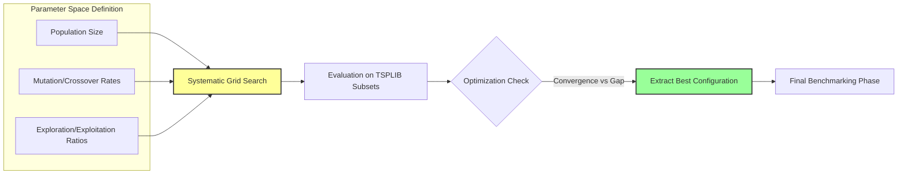
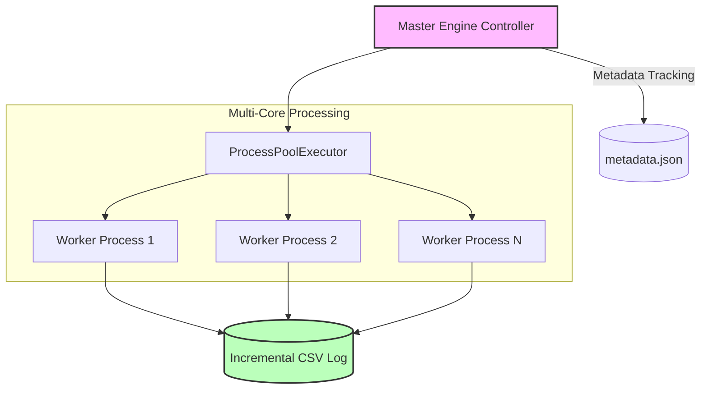

# 3. Experimental Framework and Computational Methodology

To rigorously evaluate the performance of classical meta-heuristic algorithms (e.g., Genetic Algorithm, Particle Swarm Optimization, Grey Wolf Optimizer, and Harris Hawks Optimization) on the Traveling Salesman Problem (TSP), a custom, high-performance computational infrastructure was developed. This custom-built "Numba-Accelerated Benchmark Engine" was designed to bridge the gap between high-level algorithmic flexibility and low-level computational efficiency, establishing a standardized environment for fair comparative analysis.

### 3.1. JIT-Optimized Meta-heuristic Implementation

A primary challenge in benchmarking complex meta-heuristics using high-level interpreted languages, such as Python, is the inherent execution overhead that can skew computational time analyses. To resolve this, the proposed framework integrates Just-In-Time (JIT) compilation technology via the Numba library. Core algorithmic routines, including fitness evaluations, population updates, and local search operations, were compiled directly into optimized machine code (`@njit(nogil=True)`). This approach effectively eliminated interpreter latency, achieving execution speeds comparable to native C++ implementations while preserving the dynamic adaptability required for algorithmic modifications.

```mermaid
graph TD
    A[High-Level Python Code] -->|@njit Decorator| B(Numba JIT Compiler)
    B --> C{First Execution?}
    C -->|Yes| D[Warm-up Phase: Compile to LLVM IR / Machine Code]
    D --> E[Optimized Machine Code]
    C -->|No| E
    E --> F[High-Speed Benchmark Execution]
    
    style D fill:#f9f,stroke:#333,stroke-width:2px
    style F fill:#bbf,stroke:#333,stroke-width:2px
```
*Figure 1: The JIT compilation pipeline. The mandatory "Warm-up" protocol explicitly isolates compilation time (D) from the actual benchmark measurements (F).*

To maintain strict computational rigor, a mandatory "Warm-up" protocol was instituted. Since JIT compilation requires an initial overhead during the first execution of any compiled function, this compilation time was explicitly isolated and excluded from all benchmark measurements. Consequently, the reported execution times strictly reflect the mathematical efficiency and convergence speed of the algorithms, rather than the underlying language mechanics.

### 3.2. Parameter Standardization via Design of Experiments

In heuristic-based optimization, algorithm performance is highly sensitive to hyperparameter configurations. To eliminate human bias and prevent overfitting to specific problem topologies, hyperparameters were neither manually selected nor randomly assigned. Instead, a rigorous "Design of Experiments" (DoE) methodology was implemented.


*Figure 2: The Design of Experiments (DoE) methodology employed to standardize algorithm parameters before formal benchmarking.*

Prior to the formal benchmarking phase, a dedicated DoE module performed a systematic grid search across the multidimensional parameter space of each algorithm. This procedure evaluated various combinations of parameters across a representative subset of TSPLIB instances. The configurations yielding the optimal balance between solution quality (gap percentage) and convergence stability were extracted and uniformly applied during the final evaluation phase. This systematic standardization guarantees that the comparative advantages observed are inherent to the algorithms' search mechanisms rather than arbitrary parameter tuning.

### 3.3. Parallel Execution and Computational Stability

Given the combinatorial explosion inherent to the TSP and the necessity for statistically significant trial repetitions, the framework was engineered for massive scalability. A robust, Windows-safe parallel processing architecture was deployed utilizing a `ProcessPoolExecutor`. 


*Figure 3: System architecture illustrating the isolated, multi-core worker distribution and incremental result persistence.*

Unlike traditional multi-processing models that are prone to memory leaks and synchronization deadlocks on certain operating systems, this isolated memory-space approach ensured high throughput and process stability across multi-core architectures. The engine seamlessly distributed independent algorithmic trials across available CPU cores, enabling the evaluation of diverse TSPLIB instances—from small graphs (e.g., *berlin52*) to massive networks—without computational degradation.

Furthermore, strict protocols for data integrity and reproducibility were established. An incremental result persistence mechanism was designed to log experimental outputs (e.g., route lengths, convergence gaps, and execution times) into distinct Comma-Separated Values (CSV) files in real time. This was coupled with a metadata-driven state management system (`metadata.json`) that continuously tracked the execution status of the benchmark matrix. This architectural safeguard not only prevented data loss in the event of hardware interruption but also ensured that every experiment conducted within the study is fully verifiable and 100% reproducible by independent researchers.


### 3.4. Algorithmic Enhancements and Metric Agnosticism

While the fundamental heuristics of algorithms like GA, PSO, GWO, and HHO remain faithful to their classical definitions, several robust software engineering practices were applied to elevate their utility for modern, large-scale applications:

1. **Distance Metric Agnosticism:** Traditional implementations of these meta-heuristics often rely on hardcoded Euclidean distance formulas. In this framework, the fitness evaluation functions were completely abstracted. This allows the JIT-compiled solvers to natively support not only standard TSPLIB spatial instances but also highly asymmetric, real-world routing topologies (e.g., Custom JSON Time Matrices), broadening the applicability of classical algorithms to complex logistical constraints.

2. **Dynamic Parameter Decoupling:** To support the systematic Design of Experiments (DoE) tuning, all algorithmic hyperparameters were stripped from their native procedural scopes and centralized into dynamic payloads. This architectural shift prevents "magic numbers" in the code and enables automated grid sweeps, ensuring that optimization is driven strictly by data rather than manual, hardcoded interventions.

3. **Fault-Tolerant Execution:** Classical algorithms, when subjected to immense computational stress or corrupted matrix inputs, often trigger memory overflows or mathematical singularities. The framework encapsulates these Numba-compiled solvers within isolated process spaces equipped with strict exception handling. Anomalies during fitness evaluations are safely caught, returning infinite penalty values instead of propagating systemic crashes, thereby guaranteeing the stability of long-running, multi-instance benchmarks.
