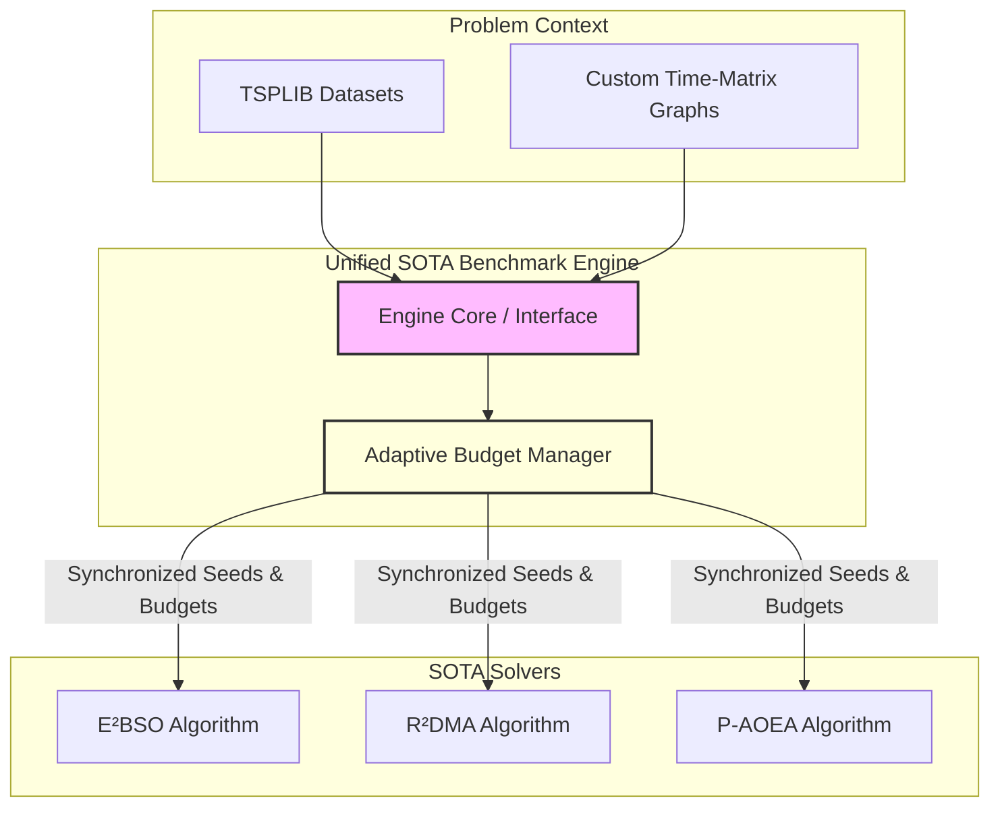
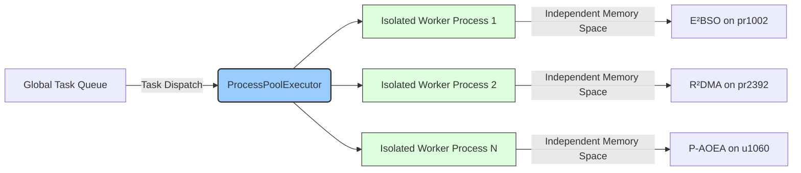
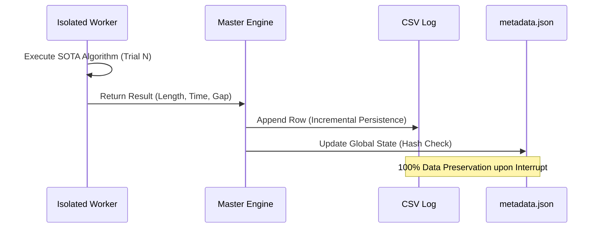

# 3. Experimental Framework and SOTA Evaluation Methodology

To ensure a high-fidelity evaluation of complex, modern solvers for the Traveling Salesman Problem (TSP)—specifically State-of-the-Art (SOTA) algorithms such as E²BSO, R²DMA, and P-AOEA—a custom "Unified SOTA Benchmark Engine" was conceptualized and developed. The primary objective of this architecture was to establish a rigorous, highly scalable, and equitable computational environment capable of managing the intense processing requirements of modern meta-heuristics on massive problem instances.

### 3.1. Unified Evaluation Framework for SOTA Solvers

Evaluating SOTA algorithms necessitates an architecture that accommodates significant variations in algorithmic complexity, structural memory footprints, and search paradigms. The developed framework employs a consolidated architectural pattern, standardizing the input-output interfaces across entirely different solver topologies. 

*Figure 1: The Unified SOTA Benchmark Engine. The adaptive budget manager dynamically allocates local search constraints based on problem topology, ensuring standardized evaluations across structurally distinct algorithms.*

To bridge the operational differences between these algorithms, an adaptive evaluation methodology was introduced. This methodology incorporates dynamically assigned local search budgets and time-matrix integrations, ensuring that algorithms are not only tested under idealized distance models but also under realistic, varied constraint scenarios. This adaptive scaling guarantees that solvers are pushed to their algorithmic limits proportionately relative to the problem dimension.

### 3.2. Scalability Management and Multi-Core Distribution

As problem dimensions scale toward massive instances (e.g., *pr2392*), the memory matrices and generational state-tracking mechanisms inherent to SOTA solvers exert severe strain on computational resources. To mitigate this, the framework was engineered with a highly optimized scalability management system tailored for multi-core Windows-based workstations.

*Figure 2: Multi-core distribution architecture utilizing isolated worker processes to prevent memory contamination and synchronization deadlocks during massive TSP instance evaluations.*

Computational resource allocation was centralized through a `ProcessPoolExecutor`. Unlike standard multi-threading models, which are constrained by the Global Interpreter Lock (GIL), or conventional multi-processing modules prone to memory leaks, this implementation isolates each benchmark trial within its own dedicated memory space. This isolation guarantees robustness and stability; the framework effortlessly handles high-complexity solvers and extended benchmarking cycles without succumbing to synchronization deadlocks or RAM overflows.

### 3.3. Algorithmic Comparison Protocols and Data Integrity

The cornerstone of the proposed methodology is its unwavering commitment to comparative benchmarking rigor. To ensure absolute fairness, a standardized environment was enforced wherein SOTA algorithms were evaluated using synchronized pseudo-random seed management and identical computational execution budgets. This protocol isolates the algorithmic search efficiency, ensuring that performance variances are strictly a product of the algorithms' heuristic capabilities rather than stochastic variance.

*Figure 3: Incremental data persistence and caching protocol ensuring 100% reproducibility and preventing data loss.*

Furthermore, an incremental data persistence system was embedded into the core loop. Traditional benchmarking scripts hold results in volatile memory until all trials conclude, risking catastrophic data loss during long-running evaluations. In contrast, this framework features a real-time logging mechanism. Each trial's results (e.g., convergence profiles, execution times, gap percentages) are instantly cached to non-volatile storage as Comma-Separated Values (CSV) and simultaneously verified against historical metadata (`metadata.json`). This fail-safe architecture allows for multi-stage experimental verification, enabling researchers to pause, resume, and independently reproduce the findings without any risk of data corruption or loss.

### 3.4. Algorithmic Adaptations for Large-Scale Stability

While the core generative mechanisms and mathematical operators of E²BSO, R²DMA, and P-AOEA were strictly preserved to ensure theoretical fidelity, several critical architectural adaptations were engineered to facilitate large-scale, production-grade execution. The canonical implementations provided by original authors are typically designed for idealized conditions; thus, the following enhancements were introduced to bridge the gap between theoretical algorithms and scalable benchmarking:

1. **Adaptive Local Search Budgets:** Canonical implementations frequently rely on unbounded local search neighborhoods (e.g., executing 2-opt or 3-opt until a strict local optimum is reached). On massive instances (exceeding 1,000 nodes), this induces a combinatorial explosion (O(N²) to O(N³)), leading to severe computational deadlocks. To resolve this, a dimension-adaptive budget manager was integrated, dynamically bounding search depths based on the problem size (N). This critical safety mechanism prevents algorithms from stagnating in micro-optimization loops while preserving macroscopic exploration efficiency.

2. **Distance Metric Agnosticism (Asymmetric Capability):** Original SOTA solvers are predominantly hardcoded to process symmetric 2D Euclidean spatial graphs. Our framework abstracts the evaluation objective function entirely, rendering the solvers "metric agnostic." This adaptation allows the algorithms to seamlessly transition from standard TSPLIB Euclidean calculations to processing custom, non-Euclidean, and asymmetric real-world transit networks (e.g., Time Matrices). 

3. **Dynamic Parameter Abstraction:** In conventional academic codebases, hyperparameters are typically hardcoded or statically assigned. Our implementation entirely decoupled the hyperparameter definitions from the core solver logic. By abstracting variables into a dynamic `StrategySpec` payload, the algorithms were rendered fully compatible with our external Design of Experiments (DoE) module, enabling automated and mathematically unbiased parameter tuning.
