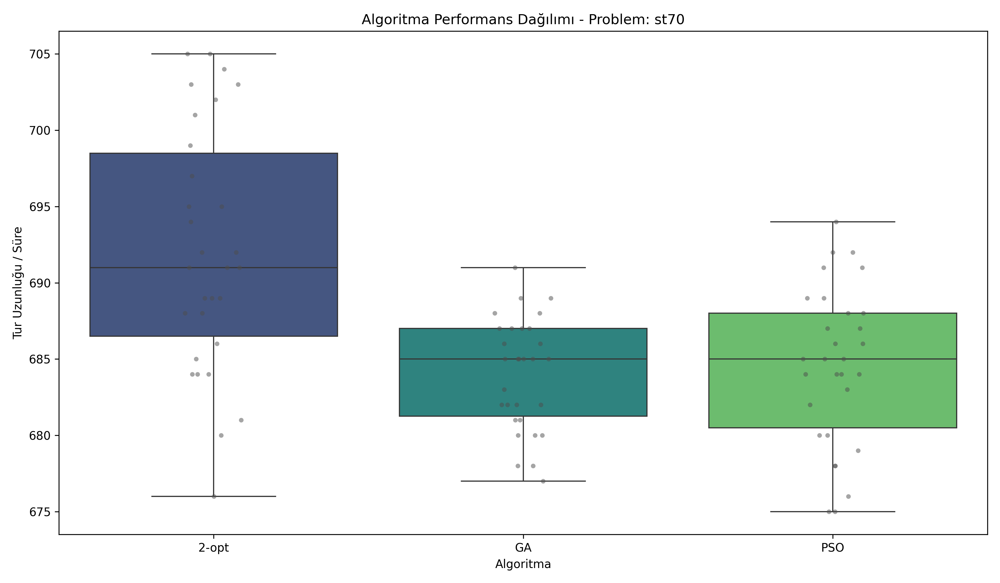

# Özel Gereksinimli Bireyler İçin Okul Servisi Rotalama: Zaman Matrisi Tabanlı Asimetrik TSP Çözümü, Deney Tasarımı ve Çoklu Problem Doğrulaması

## 1. Giriş

Bu çalışma, özel gereksinimli bireyler için okul servisi rotalama problemini zaman matrisi tabanlı asimetrik TSP çerçevesinde ele almaktadır. Temel araştırma sorusu, standart TSP problemlerinde optimize edilen meta-sezgisel parametrelerin gerçek saha koşullarına ne düzeyde aktarılabildiğidir.

Literatürde 2-opt, GA ve PSO gibi yöntemlerin tekil problem setlerinde güçlü sonuçlar verdiği bilinmekle birlikte, parametre transfer edilebilirliğini aynı deney hattında sistematik biçimde doğrulayan çalışmalar sınırlıdır. Bu boşluk doğrultusunda çalışma; deney tasarımı, parametre optimizasyonu, benchmark ve operasyonel karar katmanlarını tek bir bütünleşik metodoloji altında birleştirmektedir.

*Şekil 1. Dört fazlı araştırma akışı: hazırlık, tuning, benchmark, operasyonel karar.*

## 2. Problem Tanımı ve Yöntemsel Çerçeve

### 2.1 Problem Tanımı

Amaç, tüm düğümlerin bir kez ziyaret edilip başlangıç noktasına dönülen minimum maliyetli turu bulmaktır. Klasik simetrik TSP'den farklı olarak öğrenci probleminde maliyet matrisi asimetriktir; yani $c_{ij} \neq c_{ji}$ olabilir. Bu yapı, gerçek trafik ve yön kısıtlarını doğrudan modele taşır.

### 2.2 Algoritmalar

Bu bildiride deney tasarımı ve tuning aşamasında beş algoritma değerlendirilmiştir:

1. 2-opt: hızlı yerel iyileştirme, düşük hesap yükü.
2. 3-opt: daha geniş komşuluk araması ile kaliteyi artırabilen, ancak hesaplama maliyeti daha yüksek yaklaşım.
3. Or-opt: segment taşıma tabanlı yerel arama; belirli topolojilerde etkili, ancak problem bağımlılığı yüksek.
4. Genetik Algoritma (GA): kalite ve kararlılık odaklı popülasyon-temelli arama.
5. Parçacık Sürü Optimizasyonu (PSO): kalite-hız dengesi sunan sürü davranışı tabanlı optimizasyon.

### 2.3 Deney Tasarımı

Deney hattı iki ana aşamada yürütülmüştür:

1. Tuning aşaması: TSPLIB problemleri üzerinde 2-opt, 3-opt, Or-opt, GA ve PSO için Taguchi/fraksiyonel deney tasarımı ile parametre analizi.
2. Benchmark aşaması: eleme sonrası seçilen algoritmalar için 30 bağımsız koşu ve istatistiksel anlamlılık testleri.

## 3. Deney Ortamı ve Veri Setleri

### 3.1 TSPLIB Eğitim/Tuning Seti

Parametre optimizasyonu için farklı topolojilere sahip aşağıdaki problemler kullanılmıştır:

1. berlin52
2. eil51
3. st70
4. kroA100
5. rd100

### 3.2 Operasyonel Doğrulama Seti

Gerçek saha doğrulaması `student_matrix` veri seti ile yapılmıştır. Bu veri seti koordinat yerine zaman matrisi içerdiği için operasyonel gerçekliğe daha yakındır.

### 3.3 Değerlendirme Ölçütleri

Temel ölçütler:

1. Çözüm kalitesi (Mean)
2. Çalışma süresi (MeanTimeMS)
3. İstatistiksel etki büyüklüğü (ANOVA, eta kare)
4. İkili karşılaştırma anlamlılığı (Wilcoxon + Holm)

## 4. Parametre Optimizasyonu ve Taguchi Bulguları

### 4.1 Taguchi Tabanlı Arama Stratejisi

Parametre uzayı tam tarama yerine Taguchi yaklaşımıyla azaltılmış kombinasyonlar üzerinden analiz edilmiştir. Her kombinasyon çoklu tekrarlarla test edilmiş, ortalama ve S/N davranışı birlikte değerlendirilmiştir.

### 4.2 Parametre Duyarlılığı ve Etki Analizi

Tuning raporlarına göre özellikle GA'da popülasyon büyüklüğü ve iterasyon sayısı kalite üzerinde belirgin etki üretmektedir. PSO'da sürü boyutu, 2-opt'ta ise çoklu başlangıç sayısı kararlılığı belirleyen ana faktörlerdir.

### 4.3 Evrensel Parametre Seti

Kümülatif tuning çıktıları aşağıdaki çalışma setini desteklemiştir:

1. GA: Popülasyon 100, Nesil 200, Crossover 0.8, Mutation 0.1
2. PSO: Sürü 50, İterasyon 200, w=0.729, c1=c2=1.494
3. 2-opt: Çoklu başlangıç 5, first-improvement yaklaşımı
4. 3-opt: Çoklu başlangıç 5, iterasyon 500, first-improvement yaklaşımı
5. Or-opt: Çoklu başlangıç 5, iterasyon 500, maksimum segment uzunluğu 2

Bu parametre setleri önce tuning ve karşılaştırma aşamalarında birlikte test edilmiştir. Eleme kararından sonra nihai benchmark ve operasyonel doğrulama yalnızca 2-opt, GA ve PSO ile, yeniden ayar yapılmadan yürütülmüştür.

*Şekil 2. Taguchi analizi ile GA parametre seviyelerinin kalite üzerindeki etkisi.*

## 5. Benchmark Tasarımı, Sonuçlar ve İstatistiksel Testler

### 5.1 Eleme Gerekçesi

Tuning ve ön benchmark sonuçları birlikte değerlendirildiğinde:

1. 3-opt ve Or-opt, özellikle karmaşık topolojilerde kalite ve/veya süre bakımından karar setinde geride kalmıştır.
2. 2-opt hız açısından güçlü adaydır.
3. GA kalite ve kararlılık açısından güçlü adaydır.
4. PSO kalite-hız dengesi açısından güçlü adaydır.

Bu nedenle 3-opt ve Or-opt elenmiş; nihai benchmark analizi yalnızca 2-opt, GA ve PSO üzerinde derinleştirilmiştir.

### 5.2 Benchmark Veri Seti

İstatistiksel analizde kullanılan problem seti:

1. berlin52
2. eil51
3. kroA100
4. rd100
5. st70
6. student_matrix

Her problem için algoritma başına 30 bağımsız koşu değerlendirilmiştir.

### 5.3 Kalite Sonuçları (Mean)

| Problem | 2-opt | GA | PSO | Kalite Lideri |
|---|---:|---:|---:|---|
| berlin52 | 7932.933 | 7678.467 | 7719.600 | GA |
| eil51 | 439.433 | 433.100 | 433.500 | GA |
| kroA100 | 21667.433 | 21629.100 | 21699.600 | GA |
| rd100 | 8265.900 | 8139.933 | 8200.567 | GA |
| st70 | 692.100 | 684.033 | 684.567 | GA |
| student_matrix | 316.167 | 314.167 | 314.567 | GA |

GA, altı problemin tamamında en düşük ortalama maliyeti üretmiştir.

### 5.4 Süre Sonuçları (MeanTimeMS)

| Problem | 2-opt | GA | PSO | Süre Lideri |
|---|---:|---:|---:|---|
| berlin52 | 1556.7 | 1698.8 | 1756.5 | 2-opt |
| eil51 | 1398.8 | 1881.0 | 1826.3 | 2-opt |
| kroA100 | 2170.3 | 2535.1 | 2548.2 | 2-opt |
| rd100 | 2033.6 | 2619.7 | 1748.0 | PSO |
| st70 | 1550.1 | 2262.9 | 1963.4 | 2-opt |
| student_matrix | 3129.3 | 2199.2 | 2117.0 | PSO |

Süre tarafında TSPLIB ağırlıklı setlerde 2-opt, asimetri etkisinin daha belirgin olduğu setlerde PSO öne çıkmaktadır.

### 5.5 ANOVA Sonuçları

| Problem | F | Eta Kare | Etki Yorum |
|---|---:|---:|---|
| berlin52 | 40.0550 | 0.4794 | Yüksek etki |
| eil51 | 31.8272 | 0.4225 | Yüksek etki |
| kroA100 | 1.4241 | 0.0317 | Düşük etki |
| rd100 | 11.4614 | 0.2085 | Orta etki |
| st70 | 17.5126 | 0.2870 | Orta-yüksek etki |
| student_matrix | 20.3424 | 0.3186 | Orta-yüksek etki |

ANOVA özetleri, çoğu problemde algoritma seçiminin anlamlı performans farkı ürettiğini göstermektedir. kroA100 setinde etki büyüklüğü düşüktür.

### 5.6 Wilcoxon Signed-Rank ve Holm Düzeltmesi

Problem bazlı ikili karşılaştırma kararları:

- berlin52: (2-opt, GA) anlamlı, (2-opt, PSO) anlamlı, (GA, PSO) anlamsız
- eil51: (2-opt, GA) anlamlı, (2-opt, PSO) anlamlı, (GA, PSO) anlamsız
- kroA100: tüm ikili karşılaştırmalar anlamsız
- rd100: yalnızca (2-opt, GA) anlamlı
- st70: (2-opt, GA) anlamlı, (2-opt, PSO) anlamlı, (GA, PSO) anlamsız
- student_matrix: (2-opt, GA) anlamlı, (2-opt, PSO) anlamlı, (GA, PSO) anlamsız

Toplam desen:

1. 2-opt ile GA farkı çoğu sette anlamlıdır.
2. GA ile PSO farkı çoğu sette anlamlı değildir.
3. Kalite açısından GA ve PSO birbirine yakın; 2-opt çoğunlukla daha düşük kalite ama daha kısa sürede çözüm üretmektedir.

### 5.7 Dağılım ve Yakınsama Yorumları

Dağılım grafikleri ve yakınsama eğrileri, ortalama değerlere ek olarak kararlılık analizi sağlar:

*Şekil 3. st70 probleminde algoritmaların dağılım profili.*

*Şekil 4. Algoritmaların iteratif yakınsama davranışı.*

## 6. Öğrenci Zaman Matrisi İçin Operasyonel Karar

Asimetrik student_matrix probleminde özet performans:

- Kalite lideri: GA (Mean 314.167)
- Süre lideri: PSO (MeanTimeMS 2117.0)
- 2-opt: bu sette hem kalite hem süre tarafında geride

Bu problem özelinde radar grafik destekli yorum akışı aşağıdaki kararı güçlendirmektedir:

1. Kalite ve kararlılık ekseninde GA birinci tercih olarak öne çıkar.
2. Süre ekseninde PSO daha avantajlı ve dengeli görünüm verir.
3. 2-opt, bu asimetrik zaman matrisi için operasyonel performans açısından ikinci planda kalır.

*Şekil 5. Student matrix özelinde kalite-hız-kararlılık dengesinin radar temelli yorumu.*

Bu nedenle saha uygulamasında iki modlu karar önerilmektedir:

1. Kalite kritik görevlerde GA
2. Hız kritik görevlerde PSO

## 7. Tartışma

Bu çalışma üç temel katkı sunmaktadır:

1. Simetrik mesafe yaklaşımından asimetrik zaman matrisi yaklaşımına geçişin operasyonel faydası sayısal olarak gösterilmiştir.
2. Parametre optimizasyonu tüm algoritmalar için sistematik biçimde yürütülmüş ve deney tasarımı bulguları raporlanmıştır.
3. İstatistiksel testler (ANOVA, Wilcoxon, Holm) karar sürecine doğrudan entegre edilmiştir.

Ayrıca radar grafik tabanlı yorum akışı, tek metrikli başarı değerlendirmesi yerine çok kriterli karar çerçevesini güçlendirmiştir.

## 8. Sınırlılıklar ve Gelecek Çalışmalar

1. Bazı tuning alt dosyalarında kombinasyon sayısı düşük olduğundan istatistiksel güç farklılaşabilir.
2. Sonuçlar mevcut problem setiyle sınırlıdır; farklı şehir ve dönemlerde yeniden doğrulama önerilir.
3. Gelecekte CVRP, TSPTW ve hibrit memetik algoritmalarla genişletme planlanmalıdır.

## 9. Sonuç

Zaman matrisi tabanlı asimetrik modelleme, özel gereksinimli bireyler için servis rotalama probleminde gerçekçi ve uygulanabilir bir çerçeve sunmaktadır. Tuning aşamasında tüm algoritmaların parametre etkileri detaylı incelenmiş; benchmark aşamasında 2-opt, GA ve PSO arasında kalite-hız dengesi istatistiksel olarak karşılaştırılmıştır. Sonuçlar, GA’nın kalite tarafında, 2-opt ve PSO’nun ise problem yapısına bağlı biçimde hız tarafında güçlü olduğunu göstermektedir. Bu nedenle gerçek uygulamada adaptif algoritma seçimi en uygun stratejidir.

## 10. Kullanılan Kaynak Raporlar

1. results/reports/MASTER_DENEY_TASARIM_RAPORU.md
2. results/reports/DENEY_TASARIMI_20260425_093006.md
3. results/reports/DENEY_TASARIMI_20260425_093120.md
4. results/reports/DENEY_TASARIMI_20260425_093148.md
5. results/reports/DENEY_TASARIMI_20260425_093955.md
6. results/reports/FINAL_BENCHMARK_ANALYSIS_berlin52_20260425_215157.md
7. results/reports/FINAL_BENCHMARK_ANALYSIS_eil51_20260425_215158.md
8. results/reports/FINAL_BENCHMARK_ANALYSIS_kroA100_20260425_215159.md
9. results/reports/FINAL_BENCHMARK_ANALYSIS_rd100_20260425_215200.md
10. results/reports/FINAL_BENCHMARK_ANALYSIS_st70_20260425_215200.md
11. results/reports/FINAL_BENCHMARK_ANALYSIS_student_matrix_20260425_215202.md
