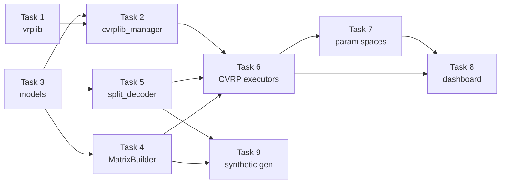

# CVRPLIB Integration Plan — Execution Specification

**Date:** May 26, 2026, 00:20 (UTC+3)  
**Architect:** Antigravity (Google DeepMind — Gemini 2.5 Pro, Advanced Agentic Coding)  
**Purpose:** Step-by-step execution guide for AI agents to implement CVRPLIB + Solomon benchmark support.  
**Verifier:** Antigravity will verify completed implementation against this specification.

---

## Prompt Used to Generate This Document

```
CVRPLIB Integration Scope Adding CVRPLIB support Should be planned as a separate dedicated effort.
create a very detailed plan i will use other ai agents for execution and i will require u to
check if implementation is done as intended.
```

**Context:** This plan is part of the UniRide Dual-Engine Master Architecture. The user wants to benchmark metaheuristic algorithms on CVRP/CVRPTW instances (in addition to existing TSPLIB TSP/ATSP support) for academic papers. All algorithms already exist in `uniride_core/algorithms/` as TSP solvers; this plan adds the problem instances, parsers, adapters, and benchmark executors needed to run them on CVRP/CVRPTW.

---

## Table of Contents

1. [Prerequisites & Dependencies](#1-prerequisites--dependencies)
2. [Task 1: Install `vrplib` Package](#task-1-install-vrplib-package)
3. [Task 2: Create CVRPLIB Manager](#task-2-create-cvrplib-manager)
4. [Task 3: Extend `ProblemInstance` Model](#task-3-extend-probleminstance-model)
5. [Task 4: Create `MatrixBuilder` Adapter](#task-4-create-matrixbuilder-adapter)
6. [Task 5: Create CVRP Solution Decoder](#task-5-create-cvrp-solution-decoder)
7. [Task 6: Register CVRP Executors in Academic Benchmark](#task-6-register-cvrp-executors-in-academic-benchmark)
8. [Task 7: Add CVRP Parameter Spaces](#task-7-add-cvrp-parameter-spaces)
9. [Task 8: Extend Dashboard for CVRP Metrics](#task-8-extend-dashboard-for-cvrp-metrics)
10. [Task 9: Create Synthetic CVRP/CVRPTW Generator](#task-9-create-synthetic-cvrpcvrptw-generator)
11. [Verification Checklist](#verification-checklist)

---

## Architecture Overview

```
academic_benchmark/
├── cvrplib_manager.py          ← NEW (Task 2)
├── cvrplib_data/               ← NEW (downloaded instances + DB)
│   ├── cvrplib.db              ← SQLite DB (mirrors tsplib_manager.py pattern)
│   ├── instances/              ← Downloaded .vrp / .sol files
│   └── solomon/                ← Downloaded Solomon VRPTW instances
├── core/
│   └── cvrp_registry_setup.py  ← NEW (Task 6)
├── dashboard.py                ← MODIFIED (Task 8)
├── param_spaces.py             ← MODIFIED (Task 7)
└── ...

uniride_core/
├── models.py                   ← MODIFIED (Task 3)
├── adapters/                   ← NEW directory
│   └── matrix_builder.py       ← NEW (Task 4)
├── algorithms/
│   └── split_decoder.py        ← NEW (Task 5)
└── ...
```

---

## 1. Prerequisites & Dependencies

### Existing Patterns to Follow

The implementing agent MUST study these files first — they define the coding patterns, naming conventions, and database schemas that this integration must mirror:

| File | Purpose | Why Study It |
|:-----|:--------|:-------------|
| `academic_benchmark/tsplib_manager.py` | SQLite DB management for TSPLIB | **Primary pattern reference** — `cvrplib_manager.py` must mirror this structure exactly |
| `academic_benchmark/engine_core.py` | `AlgorithmRegistry`, `RunResult`, `BenchmarkTask` | Executor signature: `(problem, params, seed, run_idx) → RunResult` |
| `academic_benchmark/core/registry_setup.py` | How algorithms are registered | Pattern for CVRP executor registration |
| `uniride_core/models.py` | `ProblemInstance`, `TSPResult` | New CVRP fields must extend `ProblemInstance` |
| `uniride_core/algorithms/sota_tsp/base_solver.py` | `BaseTSPSolver` interface | Solvers accept `distance_matrix` → return `TSPResult` |
| `academic_benchmark/param_spaces.py` | `SOTA_PARAM_SPACES` dict | Pattern for new CVRP param spaces |

### Dependency

```
vrplib >= 2.2.0
```

---

## Task 1: Install `vrplib` Package

### File: `requirements.txt` (or equivalent)

Add `vrplib>=2.2.0` to the project's Python dependencies.

### Verification

```bash
python -c "import vrplib; print(vrplib.__version__)"
# Expected: 2.2.0 or higher
```

---

## Task 2: Create CVRPLIB Manager

### File: `academic_benchmark/cvrplib_manager.py` (NEW — ~400 lines)

This file mirrors `tsplib_manager.py` but for CVRP/CVRPTW instances. It MUST follow the same patterns.

### Constants

```python
_HERE = os.path.dirname(os.path.abspath(__file__))
CVRPLIB_DATA_DIR = os.path.join(_HERE, "cvrplib_data")
CVRPLIB_INSTANCES_DIR = os.path.join(CVRPLIB_DATA_DIR, "instances")
SOLOMON_INSTANCES_DIR = os.path.join(CVRPLIB_DATA_DIR, "solomon")
DB_PATH = os.path.join(CVRPLIB_DATA_DIR, "cvrplib.db")
```

### SQLite Schema

```sql
-- Mirror tsplib_manager.py patterns: WAL journal, foreign keys ON

CREATE TABLE IF NOT EXISTS cvrp_problems (
    name TEXT PRIMARY KEY,
    dimension INTEGER NOT NULL,          -- number of nodes (including depot)
    num_customers INTEGER NOT NULL,      -- dimension - 1 (excluding depot)
    capacity INTEGER NOT NULL,           -- vehicle capacity
    best_known REAL,                     -- best-known solution (BKS) cost
    num_vehicles_bks INTEGER,            -- number of vehicles in BKS
    problem_type TEXT NOT NULL DEFAULT 'CVRP',  -- 'CVRP', 'CVRPTW', 'VRPTW'
    dataset TEXT NOT NULL,               -- 'augerat_A', 'augerat_B', 'augerat_P', 'cmt', 'golden', 'solomon_R1', etc.
    category TEXT NOT NULL,              -- 'small' (≤50), 'medium' (≤200), 'large' (>200)
    edge_weight_type TEXT NOT NULL DEFAULT 'EUC_2D',
    source TEXT DEFAULT 'cvrplib',
    extracted_at TEXT,
    comment TEXT
);

CREATE TABLE IF NOT EXISTS cvrp_coordinates (
    problem_name TEXT NOT NULL,
    node_idx INTEGER NOT NULL,           -- 0 = depot, 1..N = customers
    x REAL NOT NULL,
    y REAL NOT NULL,
    PRIMARY KEY (problem_name, node_idx),
    FOREIGN KEY (problem_name) REFERENCES cvrp_problems(name) ON DELETE CASCADE
);

CREATE TABLE IF NOT EXISTS cvrp_demands (
    problem_name TEXT NOT NULL,
    node_idx INTEGER NOT NULL,           -- 0 = depot (demand=0), 1..N = customers
    demand INTEGER NOT NULL,
    PRIMARY KEY (problem_name, node_idx),
    FOREIGN KEY (problem_name) REFERENCES cvrp_problems(name) ON DELETE CASCADE
);

CREATE TABLE IF NOT EXISTS cvrp_time_windows (
    problem_name TEXT NOT NULL,
    node_idx INTEGER NOT NULL,
    ready_time INTEGER NOT NULL,         -- earliest service start
    due_date INTEGER NOT NULL,           -- latest service start
    service_time INTEGER NOT NULL DEFAULT 0,
    PRIMARY KEY (problem_name, node_idx),
    FOREIGN KEY (problem_name) REFERENCES cvrp_problems(name) ON DELETE CASCADE
);

CREATE TABLE IF NOT EXISTS cvrp_distance_matrices (
    problem_name TEXT PRIMARY KEY,
    matrix_blob BLOB NOT NULL,           -- zlib-compressed int32 flat array
    dtype TEXT NOT NULL DEFAULT 'int32',
    shape_n INTEGER NOT NULL,
    edge_weight_type TEXT NOT NULL,
    computed_at TEXT NOT NULL,
    FOREIGN KEY (problem_name) REFERENCES cvrp_problems(name) ON DELETE CASCADE
);

CREATE TABLE IF NOT EXISTS cvrp_best_solutions (
    id INTEGER PRIMARY KEY AUTOINCREMENT,
    problem_name TEXT NOT NULL,
    algorithm TEXT NOT NULL,
    params_json TEXT NOT NULL,
    routes_json TEXT NOT NULL,            -- List[List[int]] — node indices per route
    total_cost REAL,
    num_vehicles INTEGER,
    gap REAL,                            -- gap from BKS (%)
    timestamp TEXT NOT NULL,
    FOREIGN KEY (problem_name) REFERENCES cvrp_problems(name) ON DELETE CASCADE
);

CREATE INDEX IF NOT EXISTS idx_cvrp_best_algo
    ON cvrp_best_solutions(problem_name, algorithm);
```

### Required Functions

#### Download Functions

```python
def download_cvrplib_instances(
    datasets: List[str] = None,  # e.g., ["A", "B", "P", "CMT", "Golden"]
    max_dimension: int = 0,
    force: bool = False,
) -> int:
    """Download CVRP instances from CVRPLIB using vrplib.
    
    Uses vrplib.download() to fetch .vrp and .sol files.
    Stores downloaded files in CVRPLIB_INSTANCES_DIR.
    
    Returns number of instances downloaded.
    
    Implementation notes:
    - Use vrplib.list_names(low=1, high=max_dimension) to get instance names
    - For each instance: vrplib.download(name, CVRPLIB_INSTANCES_DIR)
    - Also download solution: vrplib.download(name, CVRPLIB_INSTANCES_DIR, solution=True)
    - Filter by dataset prefix: A-n32-k5 → dataset "A"
    """
```

```python
def download_solomon_instances(
    types: List[str] = None,  # e.g., ["R1", "R2", "C1", "C2", "RC1", "RC2"]
    force: bool = False,
) -> int:
    """Download Solomon VRPTW instances.
    
    Solomon instances use a different format (solomon format, not VRPLIB).
    Uses vrplib.download(name, path, instance_format="solomon").
    
    Returns number of instances downloaded.
    """
```

#### Extract Functions (Download → SQLite DB)

```python
def cmd_extract(args) -> None:
    """Parse downloaded instances and insert into SQLite DB.
    
    For VRPLIB format (.vrp files):
        instance = vrplib.read_instance(filepath)
        # Returns dict with keys: 'name', 'dimension', 'capacity', 
        # 'node_coord', 'demand', 'depot', 'edge_weight_type'
        
    For Solomon format:
        instance = vrplib.read_instance(filepath, instance_format="solomon")
        # Returns dict with additional keys: 'time_window', 'service_time'
    
    For solutions (.sol files):
        solution = vrplib.read_solution(filepath)
        # Returns dict with keys: 'routes', 'cost'
    
    Category logic:
        n <= 50: 'small'
        n <= 200: 'medium'
        n > 200: 'large'
    
    Dataset detection from name:
        'A-n32-k5' → 'augerat_A'
        'B-n31-k5' → 'augerat_B'
        'P-n16-k8' → 'augerat_P'
        'CMT01' → 'cmt'
        'Golden_01' → 'golden'
        'R101' → 'solomon_R1'
        'C101' → 'solomon_C1'
        'RC101' → 'solomon_RC1'
    """
```

```python
def cmd_compute_dm(args) -> None:
    """Compute and cache distance matrices for all CVRP problems.
    
    Mirror tsplib_manager.py:cmd_compute_dm() exactly.
    Use EUC_2D rounding: d(i,j) = NINT(sqrt((xi-xj)² + (yi-yj)²))
    Store as zlib-compressed int32 blob.
    """
```

#### Public API (for engines to import)

```python
def get_cvrp_problems(
    db_path: str = DB_PATH,
    max_dim: int = 0,
    dataset: str = None,          # filter by dataset name
    problem_type: str = None,     # 'CVRP' or 'CVRPTW'
) -> List[dict]:
    """Return list of CVRP problem dicts for benchmark use.
    
    Each dict has keys:
        name, dimension, num_customers, capacity, best_known, 
        num_vehicles_bks, problem_type, dataset, category,
        coordinates, demands, time_windows (if CVRPTW),
        service_times (if CVRPTW)
    
    coordinates: List[Tuple[float, float]] — index 0 is depot
    demands: List[int] — index 0 is depot (demand=0)
    time_windows: List[Tuple[int, int]] or None
    service_times: List[int] or None
    """
```

```python
def get_cvrp_distance_matrix(problem_name: str, db_path: str = DB_PATH) -> Optional[np.ndarray]:
    """Load cached n×n int32 distance matrix. Returns None on miss.
    
    Mirror tsplib_manager.get_distance_matrix() exactly.
    """
```

```python
def get_cvrp_problem_as_instance(problem_name: str, db_path: str = DB_PATH) -> Optional[ProblemInstance]:
    """Load a CVRP problem and return as ProblemInstance.
    
    This is the bridge between cvrplib_manager and the existing engine system.
    Creates a ProblemInstance with:
        - name, dimension, coordinates from cvrp_problems + cvrp_coordinates
        - capacity from cvrp_problems
        - demands stored as a new field
        - time_windows from cvrp_time_windows (if CVRPTW)
        - optimal = best_known
        - problem_type = 'cvrp' or 'cvrptw'
        - source = 'cvrplib'
    """
```

#### CLI Entry Point

```python
def main():
    """CLI: python academic_benchmark/cvrplib_manager.py <command>
    
    Commands:
        download    — Download instances from CVRPLIB
        extract     — Parse downloaded files into SQLite DB
        compute-dm  — Compute and cache distance matrices
        status      — Show DB statistics
        download-solomon — Download Solomon VRPTW instances
    
    Arguments:
        --datasets    Comma-separated: A,B,P,CMT,Golden
        --max-dim     Maximum problem dimension
        --force       Re-insert even if cached
    """
```

### BKS (Best-Known Solutions) Dictionary

Create a `CVRP_BKS` dictionary similar to `TSPLIB_OPTIMALS`. This should contain at minimum:

```python
CVRP_BKS: Dict[str, float] = {
    # Augerat Set A (27 instances) — BKS from CVRPLIB
    "A-n32-k5": 784, "A-n33-k5": 661, "A-n33-k6": 742, "A-n34-k5": 778,
    "A-n36-k5": 799, "A-n37-k5": 669, "A-n37-k6": 949, "A-n38-k5": 730,
    "A-n39-k5": 822, "A-n39-k6": 831, "A-n44-k6": 937, "A-n45-k6": 944,
    "A-n45-k7": 1146, "A-n46-k7": 914, "A-n48-k7": 1073, "A-n53-k7": 1010,
    "A-n54-k7": 1167, "A-n55-k9": 1073, "A-n60-k9": 1354, "A-n61-k9": 1034,
    "A-n62-k8": 1288, "A-n63-k9": 1616, "A-n63-k10": 1314, "A-n64-k9": 1401,
    "A-n65-k9": 1174, "A-n69-k9": 1159, "A-n80-k10": 1763,
    # Augerat Set B (23 instances)
    "B-n31-k5": 672, "B-n34-k5": 788, "B-n35-k5": 955, "B-n38-k6": 805,
    "B-n39-k5": 549, "B-n41-k6": 829, "B-n43-k6": 742, "B-n44-k7": 909,
    "B-n45-k5": 751, "B-n45-k6": 678, "B-n50-k7": 741, "B-n50-k8": 1312,
    "B-n51-k7": 1032, "B-n52-k7": 747, "B-n56-k7": 707, "B-n57-k7": 1153,
    "B-n57-k9": 1598, "B-n63-k10": 1496, "B-n64-k9": 861, "B-n66-k9": 1316,
    "B-n67-k10": 1032, "B-n68-k9": 1272, "B-n78-k10": 1221,
    # CMT (5 classic instances)
    "CMT01": 524.61, "CMT02": 835.26, "CMT03": 826.14, "CMT04": 1028.42, "CMT05": 1291.29,
    # Solomon R1 VRPTW (representative)
    "R101": 1645.79, "R102": 1486.12, "R103": 1292.68, "R104": 1007.31,
    "R105": 1377.11, "R106": 1252.03, "R107": 1104.66, "R108": 960.88,
    "R109": 1194.73, "R110": 1118.84, "R111": 1096.72, "R112": 982.14,
}
# NOTE: The implementing agent should fetch the complete BKS from 
# https://galgos.inf.puc-rio.br/cvrplib/ for all datasets.
# The vrplib.read_solution() function reads .sol files which contain the BKS cost.
```

---

## Task 3: Extend `ProblemInstance` Model

### File: `uniride_core/models.py` (MODIFY)

Add fields to support CVRP/CVRPTW problems. **Keep all existing fields unchanged.**

#### New Fields to Add to `ProblemInstance`

```python
@dataclass
class ProblemInstance:
    """Unified representation of a TSP/ATSP/CVRP/CVRPTW problem."""
    # ... existing fields stay EXACTLY as they are ...
    
    # CVRP specific fields (ADD these)
    demands: Optional[List[int]] = None              # demand per node, index 0 = depot (0)
    service_times: Optional[List[int]] = None        # service time per node (CVRPTW)
    num_vehicles_bks: Optional[int] = None           # BKS vehicle count
    
    # Note: These fields ALREADY exist and are reused:
    # capacity: Optional[int] = None
    # time_windows: Optional[List[Tuple[int, int]]] = None
    # depot_index: int = 0
    # problem_type: str = "tsp"  ← will be "cvrp" or "cvrptw"
    # optimal: Optional[float] = None  ← stores BKS cost
```

#### New Result Dataclass

```python
@dataclass
class CVRPResult:
    """Output from a CVRP/CVRPTW optimization algorithm."""
    algorithm: str
    routes: List[List[int]]              # List of routes, each is list of node indices (0-indexed)
    total_cost: float                     # Total distance/time of all routes
    num_vehicles: int                     # Number of routes/vehicles used
    time_ms: float = 0.0
    optimal_gap: Optional[float] = None  # Gap from BKS (%)
    capacity_violations: int = 0          # Number of routes exceeding capacity
    tw_violations: int = 0               # Number of time window violations (CVRPTW)
    convergence_curve: Optional[List[float]] = None
    iterations: int = 0
    seed: Optional[int] = None
    params: Dict[str, Any] = field(default_factory=dict)
    route_costs: Optional[List[float]] = None     # Cost per individual route
    route_loads: Optional[List[int]] = None        # Total demand per route
```

---

## Task 4: Create `MatrixBuilder` Adapter

### File: `uniride_core/adapters/__init__.py` (NEW — empty)
### File: `uniride_core/adapters/matrix_builder.py` (NEW — ~120 lines)

```python
"""
MatrixBuilder — Unified distance/time matrix construction.

All algorithms receive their input through this adapter, ensuring consistent
matrix format regardless of problem source (TSPLIB, CVRPLIB, travel times).
"""

import math
import numpy as np
from typing import List, Tuple, Optional


class MatrixBuilder:
    """Build distance/time matrices from various sources."""

    @staticmethod
    def from_coordinates(
        coords: List[Tuple[float, float]],
        edge_weight_type: str = "EUC_2D",
    ) -> np.ndarray:
        """Build distance matrix from coordinates using TSPLIB distance functions.
        
        Supported edge_weight_types: EUC_2D, ATT, GEO, CEIL_2D
        
        For EUC_2D: d(i,j) = NINT(sqrt((xi-xj)² + (yi-yj)²))
        For ATT:    d(i,j) = CEIL(sqrt(((xi-xj)² + (yi-yj)²) / 10.0))
        For CEIL_2D: d(i,j) = CEIL(sqrt((xi-xj)² + (yi-yj)²))
        
        Returns: np.ndarray of shape (n, n) with dtype int32
        """
        # MUST use the canonical distance function from:
        # uniride_core.algorithms.tsplib_parser.tsplib_distance_by_type
        from uniride_core.algorithms.tsplib_parser import tsplib_distance_by_type
        
        n = len(coords)
        dm = np.zeros((n, n), dtype=np.int32)
        for i in range(n):
            for j in range(i + 1, n):
                d = tsplib_distance_by_type(edge_weight_type, coords[i], coords[j])
                dm[i, j] = d
                dm[j, i] = d
        return dm

    @staticmethod
    def from_explicit_matrix(matrix: List[List[float]]) -> np.ndarray:
        """Convert explicit distance/time matrix to numpy array.
        
        Used for ATSP problems and real travel time matrices.
        
        Returns: np.ndarray of shape (n, n) with dtype float64
        """
        return np.array(matrix, dtype=np.float64)

    @staticmethod
    def from_travel_times(time_matrix: List[List[float]]) -> np.ndarray:
        """Convert real travel time matrix to numpy array.
        
        Travel times are in minutes (float).
        Used for production UniRide data from Supabase/Google Maps.
        
        Returns: np.ndarray of shape (n, n) with dtype float64
        """
        return np.array(time_matrix, dtype=np.float64)

    @staticmethod
    def tsplib_to_travel_time(
        coords: List[Tuple[float, float]],
        speed_kmh: float = 40.0,
        noise_pct: float = 0.10,
        seed: int = 42,
    ) -> np.ndarray:
        """Convert TSPLIB coordinates to synthetic travel times.
        
        Formula: travel_time_minutes = (euclidean_distance / speed_kmh) * 60
        Then add uniform random noise: ±noise_pct of the travel_time
        
        This allows benchmarking CVRPTW algorithms on any TSPLIB/CVRPLIB 
        instance using travel times instead of distances.
        
        Args:
            coords: List of (x, y) tuples
            speed_kmh: Assumed average speed (default 40 km/h urban)
            noise_pct: Random noise as fraction (0.10 = ±10%)
            seed: Random seed for reproducibility
            
        Returns: np.ndarray of shape (n, n) with dtype float64 (minutes)
        """
        rng = np.random.RandomState(seed)
        n = len(coords)
        dm = np.zeros((n, n), dtype=np.float64)
        for i in range(n):
            for j in range(i + 1, n):
                dx = coords[i][0] - coords[j][0]
                dy = coords[i][1] - coords[j][1]
                dist = math.sqrt(dx * dx + dy * dy)
                base_time = (dist / speed_kmh) * 60.0  # minutes
                noise = base_time * noise_pct * rng.uniform(-1, 1)
                travel_time = max(0.1, base_time + noise)  # minimum 0.1 min
                dm[i, j] = travel_time
                dm[j, i] = travel_time  # can be asymmetric if desired
        return dm
```

---

## Task 5: Create CVRP Solution Decoder

### File: `uniride_core/algorithms/split_decoder.py` (NEW — ~200 lines)

This is a **pure math module** — no web dependencies, no API imports.

```python
"""
Split Decoder — Convert giant tour permutation into feasible CVRP routes.

Implements the Optimal Split algorithm (Prins 2004) that converts a 
TSP-style giant tour into a minimum-cost set of CVRP routes.

This is the key algorithm that bridges TSP solvers and CVRP problems:
    TSP Solver → giant tour permutation → split_decoder → CVRP routes

References:
    Prins, C. (2004). A simple and effective evolutionary algorithm 
    for the vehicle routing problem. Computers & Operations Research.
"""

import numpy as np
from typing import List, Tuple, Optional


def optimal_split(
    permutation: List[int],
    distance_matrix: np.ndarray,
    demands: List[int],
    capacity: int,
    depot: int = 0,
) -> List[List[int]]:
    """Split a giant tour into feasible CVRP routes using Bellman-style DP.
    
    The giant tour visits customers in order permutation[0], permutation[1], ...
    The split finds the optimal partition into sub-routes such that:
    - Each sub-route starts and ends at depot
    - Total demand in each sub-route ≤ capacity
    - Total cost is minimized
    
    Args:
        permutation: List of customer node indices (NOT including depot).
                     Example: [3, 1, 4, 2, 5] for 5 customers
        distance_matrix: n×n matrix where n includes depot (index 0)
        demands: Demand per node (index 0 = depot, demand=0)
        capacity: Vehicle capacity
        depot: Depot index in distance_matrix (default 0)
    
    Returns:
        List of routes. Each route is List[int] of customer indices
        (NOT including depot — depot is implicit start/end).
        Example: [[3, 1], [4, 2, 5]] means:
            Route 1: depot → 3 → 1 → depot
            Route 2: depot → 4 → 2 → 5 → depot
    """
    # Implementation: Bellman split (O(n²) worst case)
    # V[j] = min cost to serve customers permutation[0..j-1]
    # V[0] = 0
    # V[j] = min over i<j of { V[i] + cost(route serving permutation[i..j-1]) }
    #         subject to sum(demands[permutation[i..j-1]]) <= capacity
    ...


def split_with_time_windows(
    permutation: List[int],
    distance_matrix: np.ndarray,
    demands: List[int],
    capacity: int,
    time_windows: List[Tuple[int, int]],
    service_times: List[int],
    depot: int = 0,
) -> List[List[int]]:
    """Split a giant tour into feasible CVRPTW routes.
    
    Extends optimal_split with time window feasibility checks.
    A route is feasible only if:
    - Total demand ≤ capacity
    - Each customer is served within [ready_time, due_date]
    - Arrival before ready_time → wait until ready_time
    - Arrival after due_date → route is INFEASIBLE
    
    Args:
        permutation: Customer indices (not depot)
        distance_matrix: n×n matrix
        demands: Demand per node
        capacity: Vehicle capacity
        time_windows: List of (ready_time, due_date) per node
        service_times: Service time at each node
        depot: Depot index
    
    Returns:
        List of feasible routes (same format as optimal_split)
    """
    ...


def calculate_route_cost(
    route: List[int],
    distance_matrix: np.ndarray,
    depot: int = 0,
) -> float:
    """Calculate total cost of a single route: depot → c1 → c2 → ... → depot.
    
    Args:
        route: Customer indices (not including depot)
        distance_matrix: n×n matrix
        depot: Depot index
    
    Returns:
        Total route cost (float)
    """
    if not route:
        return 0.0
    cost = distance_matrix[depot][route[0]]
    for i in range(len(route) - 1):
        cost += distance_matrix[route[i]][route[i + 1]]
    cost += distance_matrix[route[-1]][depot]
    return float(cost)


def calculate_total_cost(
    routes: List[List[int]],
    distance_matrix: np.ndarray,
    depot: int = 0,
) -> float:
    """Calculate total cost of all routes combined."""
    return sum(calculate_route_cost(r, distance_matrix, depot) for r in routes)


def validate_cvrp_solution(
    routes: List[List[int]],
    demands: List[int],
    capacity: int,
    num_customers: int,
) -> Tuple[bool, List[str]]:
    """Validate a CVRP solution for feasibility.
    
    Checks:
    - All customers visited exactly once
    - No route exceeds capacity
    
    Returns:
        (is_feasible, list_of_violation_messages)
    """
    ...


def validate_cvrptw_solution(
    routes: List[List[int]],
    distance_matrix: np.ndarray,
    demands: List[int],
    capacity: int,
    time_windows: List[Tuple[int, int]],
    service_times: List[int],
    depot: int = 0,
) -> Tuple[bool, List[str]]:
    """Validate a CVRPTW solution for feasibility.
    
    Checks all CVRP constraints PLUS time window adherence.
    
    Returns:
        (is_feasible, list_of_violation_messages)
    """
    ...
```

### IMPORTANT Implementation Note for Optimal Split

The `optimal_split()` function already exists conceptually in `optimizer_api/strategies/` — specifically in the Split-based strategies (GA-Split, PSO-Split, etc.). The implementing agent should extract the Split logic from those strategies into this pure module. Look at:

- `optimizer_api/strategies/ga_split_strategy.py` — contains `_optimal_split()` or similar
- `optimizer_api/strategies/hybrid_base_strategy.py` — may have shared split helpers

The goal is to move this **pure math** into `uniride_core/` so both `academic_benchmark` and `optimizer_api` can use it.

---

## Task 6: Register CVRP Executors in Academic Benchmark

### File: `academic_benchmark/core/cvrp_registry_setup.py` (NEW — ~200 lines)

This registers CVRP executors for all existing TSP algorithms. Each executor:
1. Receives a `ProblemInstance` (with CVRP fields populated)
2. Builds a distance matrix
3. Calls the existing TSP solver's `optimize_permutation` / `solve`
4. Runs `optimal_split()` to convert the giant tour into routes
5. Returns a `RunResult` with CVRP-specific metrics

```python
"""
CVRP Algorithm Registration for Academic Benchmark

Registers CVRP-mode executors for all existing TSP algorithms.
Each algorithm gets a 'CVRP-' prefix: CVRP-E2BSO, CVRP-GA, etc.

The executor pattern:
1. Load problem → distance_matrix + demands + capacity
2. Run TSP solver → giant tour (permutation)
3. Run optimal_split() → CVRP routes
4. Compute total cost → RunResult
"""

import logging
from academic_benchmark.engine_core import AlgorithmRegistry, RunResult

logger = logging.getLogger(__name__)


def _make_cvrp_executor(base_algo: str, solver_factory):
    """Create a CVRP executor that wraps a TSP solver with optimal_split.
    
    Args:
        base_algo: Base algorithm name (e.g., "E2BSO-TSP")
        solver_factory: Callable(config) → BaseTSPSolver instance
    """
    def executor(problem, params, seed, run_idx):
        import time
        import math
        import numpy as np
        from uniride_core.algorithms.split_decoder import (
            optimal_split, calculate_total_cost, validate_cvrp_solution
        )
        from uniride_core.adapters.matrix_builder import MatrixBuilder
        
        # 1. Build distance matrix
        if problem.dist_matrix is not None:
            dm = np.array(problem.dist_matrix, dtype=np.float64)
        elif problem.is_time_matrix and problem.time_matrix is not None:
            dm = MatrixBuilder.from_travel_times(problem.time_matrix)
        else:
            try:
                from academic_benchmark.cvrplib_manager import get_cvrp_distance_matrix
                dm = get_cvrp_distance_matrix(problem.name)
            except Exception:
                dm = None
            if dm is None:
                dm = MatrixBuilder.from_coordinates(
                    problem.coordinates, problem.edge_weight_type
                ).astype(np.float64)
        
        # 2. Create TSP solver and find giant tour
        #    Pass distance matrix WITHOUT depot row/col to the TSP solver
        #    The TSP solver operates on customers only (indices 1..N)
        customer_indices = list(range(1, problem.dimension))
        
        # Build customer-only submatrix for TSP
        customer_dm = dm[np.ix_(customer_indices, customer_indices)]
        
        solver = solver_factory(params, seed)
        
        start_time = time.perf_counter()
        tsp_result = solver.solve_with_matrix(customer_dm)
        
        # 3. Map TSP tour back to original node indices
        #    TSP solver returns 0-indexed tour over customer_dm
        #    We need to map back: tour_idx → customer_indices[tour_idx]
        giant_tour = [customer_indices[i] for i in tsp_result.tour]
        
        # 4. Split giant tour into CVRP routes
        demands = problem.demands if problem.demands else [0] + [1] * (problem.dimension - 1)
        capacity = problem.capacity or problem.dimension
        
        routes = optimal_split(giant_tour, dm, demands, capacity, depot=0)
        
        elapsed = time.perf_counter() - start_time
        
        # 5. Calculate total cost
        total_cost = calculate_total_cost(routes, dm, depot=0)
        
        # 6. Validate solution
        is_feasible, violations = validate_cvrp_solution(
            routes, demands, capacity, problem.dimension - 1
        )
        
        # 7. Compute gap from BKS
        gap_pct = None
        bks = problem.optimal
        if bks and bks > 0 and not math.isnan(total_cost):
            gap_pct = ((total_cost - bks) / bks) * 100
        
        return RunResult(
            problem=problem.name,
            algorithm=f"CVRP-{base_algo}",
            run=run_idx,
            seed=seed,
            dimension=problem.dimension,
            optimal=bks,
            tour_cost=total_cost,
            gap_pct=round(gap_pct, 4) if gap_pct is not None else None,
            elapsed_sec=round(elapsed, 3),
            iterations=tsp_result.iterations,
            tour=None,  # For CVRP, use routes instead
        )
    
    return executor


# Register CVRP executors for SOTA algorithms
def register_cvrp_sota():
    """Register CVRP-mode for all 6 SOTA TSP algorithms."""
    import importlib
    import dataclasses
    
    SOTA_MAP = {
        "E2BSO-TSP": ("e2bso_tsp", "E2BSO_TSP", "E2BSOTSPConfig"),
        "R2DMA-TSP": ("r2dma_tsp", "R2DMA_TSP", "R2DMATSPConfig"),
        "P-AOEA-TSP": ("paoea_tsp", "PAOEA_TSP", "PAOEAConfig"),
        "CGO-TSP": ("cgo_tsp", "CGO_TSP", "CGOConfig"),
        "RUN-TSP": ("run_tsp", "RUN_TSP", "RUNConfig"),
        "ALNS-TSP": ("alns_tsp", "ALNS_TSP", "ALNSConfig"),
    }
    
    for algo_name, (mod_name, cls_name, cfg_name) in SOTA_MAP.items():
        def make_factory(mn, cn, cfgn):
            def factory(params, seed):
                mod = importlib.import_module(f"uniride_core.algorithms.sota_tsp.{mn}")
                cls = getattr(mod, cn)
                cfg_cls = getattr(mod, cfgn)
                valid_fields = {f.name for f in dataclasses.fields(cfg_cls)}
                cfg_kwargs = {k: v for k, v in params.items() if k in valid_fields}
                cfg_kwargs["seed"] = seed
                return cls(config=cfg_cls(**cfg_kwargs))
            return factory
        
        factory = make_factory(mod_name, cls_name, cfg_name)
        AlgorithmRegistry.register(f"CVRP-{algo_name}")(_make_cvrp_executor(algo_name, factory))


# Register CVRP executors for Numba algorithms
def register_cvrp_numba():
    """Register CVRP-mode for all Numba-accelerated algorithms.
    
    Uses the same pattern as SOTA but wraps the Numba metaheuristic 
    execution path from registry_setup.py.
    """
    # Implementation: follow the _make_legacy_executor pattern from
    # academic_benchmark/core/registry_setup.py but add the split step
    ...


register_cvrp_sota()
register_cvrp_numba()

logger.info("Loaded CVRP algorithms: %s", 
    [a for a in AlgorithmRegistry.list_algorithms() if a.startswith("CVRP-")])
```

### Integration Point

In `academic_benchmark/core/__init__.py` or `academic_benchmark/__main__.py`, add:

```python
import academic_benchmark.core.cvrp_registry_setup  # registers CVRP executors
```

This must be imported AFTER `registry_setup.py` (which registers the TSP executors).

---

## Task 7: Add CVRP Parameter Spaces

### File: `academic_benchmark/param_spaces.py` (MODIFY)

Add CVRP-specific parameter spaces. These use the **same algorithm parameters** as TSP but add CVRP-specific parameters like `split_method`.

```python
# Add to SOTA_PARAM_SPACES:

CVRP_PARAM_SPACES: Dict[str, Dict[str, Any]] = {
    # CVRP versions inherit TSP params + add split params
    "CVRP-E2BSO-TSP": {
        **SOTA_PARAM_SPACES.get("E2BSO-TSP", {}),
        "split_method": {
            "type": "categorical",
            "doe": ["optimal_split"],
            "optuna": ["optimal_split"],
        },
    },
    "CVRP-R2DMA-TSP": {
        **SOTA_PARAM_SPACES.get("R2DMA-TSP", {}),
        "split_method": {
            "type": "categorical",
            "doe": ["optimal_split"],
            "optuna": ["optimal_split"],
        },
    },
    # ... repeat for all CVRP algorithms ...
}

# Merge into SOTA_PARAM_SPACES for unified access
SOTA_PARAM_SPACES.update(CVRP_PARAM_SPACES)
```

---

## Task 8: Extend Dashboard for CVRP Metrics

### File: `academic_benchmark/dashboard.py` (MODIFY)

Add a new tab (Tab 8) for CVRP-specific analysis.

#### New Tab: "CVRP Analysis"

The tab should display:

1. **CVRP Leaderboard Table**: Algorithm | Avg Gap(%) | Min Gap | Avg Vehicles | Avg Time | Problems Solved
2. **Gap by Dataset Chart**: Bar chart showing average gap per algorithm, grouped by dataset (Augerat A/B, CMT, Golden, Solomon)
3. **Vehicles vs BKS Chart**: Comparison of number of vehicles used vs BKS vehicle count
4. **Capacity Utilization**: Average load per route / capacity
5. **LaTeX Export**: Same format as TSP but with CVRP-specific columns

#### CVRP Results Detection

The dashboard should detect CVRP results by looking for algorithm names starting with `CVRP-` in the results CSVs. The existing CSV format from `cli_engine.py` works as-is — the `algorithm` column will contain `CVRP-E2BSO-TSP` etc.

---

## Task 9: Create Synthetic CVRP/CVRPTW Generator

### File: `academic_benchmark/synthetic_cvrp_generator.py` (NEW — ~150 lines)

```python
"""
Generate CVRP/CVRPTW instances from existing TSPLIB problems.

This allows benchmarking CVRP algorithms on ALL 130+ TSPLIB instances
by adding synthetic demands, capacity constraints, and time windows.
"""

def generate_cvrp_from_tsplib(
    problem_name: str,
    capacity: int = None,          # Auto-calculated if None
    demand_range: Tuple[int, int] = (1, 10),  # Uniform random demands
    seed: int = 42,
    db_path: str = None,           # TSPLIB DB path
) -> ProblemInstance:
    """Create a CVRP instance from a TSPLIB TSP problem.
    
    Takes an existing TSP problem (coordinates + distance matrix)
    and adds:
    - Random demands from uniform(demand_range)
    - Capacity calculated as: sum(demands) / target_vehicles
      where target_vehicles = ceil(dimension / 15) — ~15 customers per vehicle
    - Depot at index 0 (first coordinate)
    
    The resulting instance can be benchmarked with CVRP executors.
    """
    ...


def generate_cvrptw_from_tsplib(
    problem_name: str,
    capacity: int = None,
    demand_range: Tuple[int, int] = (1, 10),
    speed_kmh: float = 40.0,
    time_window_width: int = 60,       # minutes
    planning_horizon: int = 480,        # 8-hour day in minutes
    seed: int = 42,
    db_path: str = None,
) -> ProblemInstance:
    """Create a CVRPTW instance from a TSPLIB TSP problem.
    
    Extends generate_cvrp_from_tsplib with:
    - Travel time matrix via MatrixBuilder.tsplib_to_travel_time()
    - Random time windows: ready_time ~ uniform(0, planning_horizon - width)
                          due_date = ready_time + time_window_width
    - Service times: uniform(5, 15) minutes
    - Depot time window: [0, planning_horizon]
    """
    ...


def batch_generate_cvrp(
    problem_names: List[str] = None,  # None = all TSPLIB problems
    max_dim: int = 500,               # Skip huge instances
    seed: int = 42,
) -> List[ProblemInstance]:
    """Generate CVRP instances for all eligible TSPLIB problems.
    
    Returns list of ProblemInstance objects ready for benchmarking.
    """
    ...
```

---

## Verification Checklist

After implementation, I (Antigravity) will verify each item:

### Task 1: vrplib Installed
```bash
python -c "import vrplib; print(f'vrplib {vrplib.__version__} OK')"
```

### Task 2: CVRPLIB Manager
```bash
# Download and extract
python academic_benchmark/cvrplib_manager.py download --datasets A,B
python academic_benchmark/cvrplib_manager.py extract
python academic_benchmark/cvrplib_manager.py compute-dm
python academic_benchmark/cvrplib_manager.py status

# Verify DB has data
python -c "
from academic_benchmark.cvrplib_manager import get_cvrp_problems
problems = get_cvrp_problems()
assert len(problems) >= 40, f'Expected >=40 problems, got {len(problems)}'
print(f'OK: {len(problems)} CVRP problems loaded')
for p in problems[:3]:
    print(f'  {p[\"name\"]}: dim={p[\"dimension\"]} cap={p[\"capacity\"]} BKS={p[\"best_known\"]}')
    assert p['demands'] is not None, f'No demands for {p[\"name\"]}'
    assert p['coordinates'] is not None, f'No coordinates for {p[\"name\"]}'
"
```

### Task 3: Model Extensions
```bash
python -c "
from uniride_core.models import ProblemInstance, CVRPResult
p = ProblemInstance(name='test', dimension=5, demands=[0,1,2,3,4], capacity=7, problem_type='cvrp')
assert p.demands == [0,1,2,3,4]
assert p.capacity == 7
r = CVRPResult(algorithm='test', routes=[[1,2],[3,4]], total_cost=100.0, num_vehicles=2)
assert r.num_vehicles == 2
print('Models OK')
"
```

### Task 4: MatrixBuilder
```bash
python -c "
from uniride_core.adapters.matrix_builder import MatrixBuilder
import numpy as np
coords = [(0,0), (3,4), (6,8)]
dm = MatrixBuilder.from_coordinates(coords, 'EUC_2D')
assert dm.shape == (3, 3), f'Expected (3,3), got {dm.shape}'
assert dm[0, 1] == 5, f'Expected 5, got {dm[0,1]}'  # NINT(sqrt(9+16))
assert dm.dtype == np.int32
tt = MatrixBuilder.tsplib_to_travel_time(coords, speed_kmh=40.0, noise_pct=0.0, seed=42)
assert tt.shape == (3, 3)
assert tt[0, 0] == 0.0
assert tt[0, 1] > 0
print(f'MatrixBuilder OK: dm={dm[0,1]}, tt={tt[0,1]:.2f} min')
"
```

### Task 5: Split Decoder
```bash
python -c "
from uniride_core.algorithms.split_decoder import (
    optimal_split, calculate_total_cost, validate_cvrp_solution
)
import numpy as np

# Simple 5-customer problem
dm = np.array([
    [0, 10, 20, 30, 40, 50],  # depot
    [10, 0, 15, 25, 35, 45],  # c1
    [20, 15, 0, 10, 20, 30],  # c2
    [30, 25, 10, 0, 10, 20],  # c3
    [40, 35, 20, 10, 0, 10],  # c4
    [50, 45, 30, 20, 10, 0],  # c5
], dtype=np.float64)
demands = [0, 3, 4, 3, 4, 3]  # depot=0
capacity = 8

routes = optimal_split([1, 2, 3, 4, 5], dm, demands, capacity, depot=0)
assert len(routes) >= 2, f'Expected >=2 routes, got {len(routes)}'

# Validate
is_feasible, errors = validate_cvrp_solution(routes, demands, capacity, 5)
assert is_feasible, f'Solution infeasible: {errors}'

total = calculate_total_cost(routes, dm, depot=0)
print(f'Split Decoder OK: {len(routes)} routes, total_cost={total}')
"
```

### Task 6: CVRP Executors Registered
```bash
python -c "
from academic_benchmark.engine_core import AlgorithmRegistry
import academic_benchmark.core.registry_setup         # loads TSP
import academic_benchmark.core.cvrp_registry_setup    # loads CVRP

all_algos = AlgorithmRegistry.list_algorithms()
cvrp_algos = [a for a in all_algos if a.startswith('CVRP-')]
assert len(cvrp_algos) >= 6, f'Expected >=6 CVRP algorithms, got {len(cvrp_algos)}'
print(f'CVRP algorithms registered: {cvrp_algos}')
"
```

### Task 7: CVRP Param Spaces
```bash
python -c "
from academic_benchmark.param_spaces import SOTA_PARAM_SPACES
assert 'CVRP-E2BSO-TSP' in SOTA_PARAM_SPACES or any('CVRP' in k for k in SOTA_PARAM_SPACES)
print('CVRP param spaces OK')
"
```

### Task 9: Synthetic Generator
```bash
python -c "
from academic_benchmark.synthetic_cvrp_generator import generate_cvrp_from_tsplib
p = generate_cvrp_from_tsplib('berlin52', seed=42)
assert p.problem_type == 'cvrp'
assert p.demands is not None
assert len(p.demands) == p.dimension
assert p.demands[0] == 0  # depot demand
assert p.capacity > 0
print(f'Synthetic CVRP OK: {p.name} dim={p.dimension} cap={p.capacity}')
"
```

### End-to-End Integration Test
```bash
# Run a CVRP benchmark on a small Augerat problem
python -c "
from academic_benchmark.engine_core import AlgorithmRegistry
import academic_benchmark.core.registry_setup
import academic_benchmark.core.cvrp_registry_setup
from academic_benchmark.cvrplib_manager import get_cvrp_problem_as_instance

problem = get_cvrp_problem_as_instance('A-n32-k5')
assert problem is not None, 'Could not load A-n32-k5'

executor = AlgorithmRegistry.get_executor('CVRP-E2BSO-TSP')
result = executor(problem, {'population_size': 20, 'max_iterations': 50}, seed=42, run_idx=1)

print(f'End-to-End OK:')
print(f'  Problem: {result.problem}')
print(f'  Algorithm: {result.algorithm}')
print(f'  Cost: {result.tour_cost}')
print(f'  Gap: {result.gap_pct}%')
print(f'  Time: {result.elapsed_sec}s')
"
```

---

## File Summary

| # | File | Action | ~Lines | Description |
|:--|:-----|:-------|:-------|:------------|
| 1 | `requirements.txt` | MODIFY | +1 | Add `vrplib>=2.2.0` |
| 2 | `academic_benchmark/cvrplib_manager.py` | NEW | ~450 | CVRPLIB SQLite DB manager (mirrors tsplib_manager.py) |
| 3 | `uniride_core/models.py` | MODIFY | +30 | Add `demands`, `service_times`, `CVRPResult` |
| 4 | `uniride_core/adapters/__init__.py` | NEW | 1 | Empty init |
| 5 | `uniride_core/adapters/matrix_builder.py` | NEW | ~120 | Unified matrix construction |
| 6 | `uniride_core/algorithms/split_decoder.py` | NEW | ~200 | Optimal Split + validation |
| 7 | `academic_benchmark/core/cvrp_registry_setup.py` | NEW | ~200 | CVRP executor registration |
| 8 | `academic_benchmark/param_spaces.py` | MODIFY | +40 | CVRP parameter spaces |
| 9 | `academic_benchmark/dashboard.py` | MODIFY | +100 | New CVRP analysis tab |
| 10 | `academic_benchmark/synthetic_cvrp_generator.py` | NEW | ~150 | Synthetic CVRP/CVRPTW from TSPLIB |

**Total new code: ~1,150 lines across 6 new files + 4 modifications.**

---

## Execution Order

> [!IMPORTANT]
> Tasks must be executed in this order due to dependencies:
> 
> 1. **Task 1** (vrplib) → no deps
> 2. **Task 3** (models) → no deps  
> 3. **Task 4** (MatrixBuilder) → depends on Task 3
> 4. **Task 5** (split_decoder) → depends on Task 3
> 5. **Task 2** (cvrplib_manager) → depends on Tasks 1, 3
> 6. **Task 9** (synthetic generator) → depends on Tasks 3, 4, 5
> 7. **Task 6** (CVRP executors) → depends on Tasks 2, 4, 5
> 8. **Task 7** (param spaces) → depends on Task 6
> 9. **Task 8** (dashboard) → depends on Tasks 6, 7


