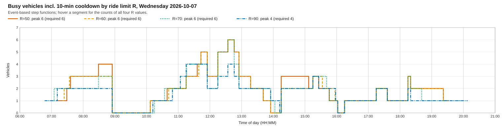
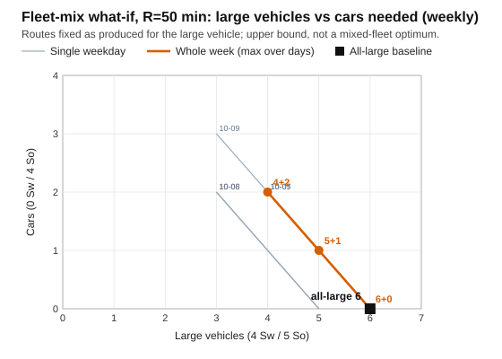

# Daily student transport planning with separate passenger capacities

Method note for co-authors — 7 October 2026. This document separates the implemented planning method from a proposed sensitivity experiment. The numerical illustration comes from an earlier planning session and was not reproduced through operational data access for this note.

## 1. Problem setting

A single campus provides transport for students with weekly class timetables. For a selected service date, the corresponding weekday determines each student's first class start and last class end. An eligible student generates a pickup leg before the first class and a drop-off leg after the last class. These are separate demand occurrences: one student can contribute two daily passenger trips. Students without an applicable class are excluded from that day's timetable demand.

Passengers use two separate capacity pools: wheelchair positions (Sw) and seated positions (So). An empty seated position cannot replace a wheelchair position. Each vehicle has capacities for both types. Each route starts and ends at the campus depot, serves its assigned demand occurrences once, and respects both capacities. Occurrence identifiers distinguish passengers even when they share a physical stop.

Admission is an input to planning. A hypothetical scenario can treat pending legs as admitted while retaining cancellations. This preview is explicitly non-publishable and does not create confirmations. Operational demand and a hypothetical timetable scenario must be reported separately: their passenger sets and inferred fleet requirements can differ.

## 2. Travel-time data

Let c(i,j) denote travel time in minutes from physical location i to location j. Planning uses a stored, directed matrix derived from road-network routing. In general c(i,j) differs from c(j,i). Straight-line distances and coordinate-based travel-time approximations are not used in this operational method. Missing or invalid required arcs prevent certification rather than being silently assigned zero travel time.

The matrix is not assumed to satisfy the triangle inequality. A direct campus-to-stop time is therefore not a certified lower bound on a route reaching that stop through other stops. A wave cannot be rejected solely because a direct arc exceeds its ride limit. Different passenger occurrences at one physical location may have a zero connecting hop; this does not justify zero travel between different locations.

A matrix snapshot is captured before solving. Wave requests are bound to its identity, and route verification uses the captured authoritative arc values. Experiments must record the snapshot identity and provenance. The matrix represents collection conditions, not necessarily current traffic, loading delays, or accessibility conditions.

## 3. Demand waves and constraints

Demands are grouped by direction and exact anchor time. A pickup anchor is the first class start minus a 15-minute arrival buffer: a 09:00 class produces an 08:45 campus arrival anchor. Drop-off departure is anchored at the last class end plus a 15-minute departure buffer. Groups within the same clock hour but at different anchors remain separate waves. The current method does not solve individual passenger time windows within a wave.

For a closed route D, v1, …, vk, D, tour duration is the sum of all directed arcs, including the empty outbound or return journey. This sum must not exceed the tour cap T. Passenger ride time has a separate definition:

- Pickup: a passenger boarding at vi experiences the arc sum from vi through the remaining stops to D. The empty initial journey from D is excluded.
- Drop-off: a passenger alighting at vi experiences the arc sum from D through preceding stops to vi. The final return to D is excluded.

Every passenger ride must be at most R. These definitions include travel only; boarding time and waiting are not added in the current anchored-wave calculation. Capacity is checked separately for Sw and So. Defaults are R = 90 minutes and T = 150 minutes, with selectable ranges of 15–240 and 30–300 minutes respectively. These are different service constraints.

For identical vehicles with capacities qSw and qSo, a wave containing nSw and nSo passengers has the necessary seat-capacity floor

**Lseat = max(⌈nSw / qSw⌉, ⌈nSo / qSo⌉).**

This floor ignores ride limits, tour limits, and inter-wave reuse. It is a minimum imposed by seats, not the number of feasible routes or a proof of the minimum daily fleet. Its maximum across the day's waves is also a necessary daily lower bound.

## 4. Solution method

### 4.1 Route-first, cluster-second search

Each wave uses a genetic algorithm (GA) over a permutation of passenger occurrences, called a giant tour. A split decoder partitions consecutive subsequences into depot-closed vehicle routes. This follows the route-first, cluster-second representation associated with [Prins (2004)](https://doi.org/10.1016/S0305-0548(03)00158-8). The present implementation has its own constraints and acceptance checks; no comparative performance claim is inferred from the reference.

Initialization combines randomized permutations and a nearest-neighbour tour. Tournament selection, order crossover, mutation, and elitism generate new candidates. Periodic local search modifies a selected giant tour, which is then decoded and evaluated again. The outer ranking prioritizes feasibility, then route count, then total travel time.

The decoder enumerates feasible contiguous segments under both passenger capacities and the tour and ride limits. Dynamic programming chooses a minimum-travel-time partition for a fixed permutation, preferring partitions without violations. This restricted calculation does not optimize all permutations, and its cost objective differs from the outer GA's route-count priority. Neither a decoded partition nor the final wave result proves globally minimum route count. With nonmetric travel, a duration violation also does not imply that every longer segment violates the limit; alternatives must still be examined.

The planning tool always selects the `ga_split` strategy and supplies no per-request algorithm configuration. The following are the strategy's declared defaults, rather than an observed deployment configuration:

| Parameter | Declared default | Interpretation |
|---|---:|---|
| Population size | 50 | Candidate giant tours |
| Maximum generations | 100 | Upper limit; early stopping can intervene |
| Crossover probability | 0.85 | Applied when generating offspring |
| Mutation probability | 0.20 | Applied to each offspring |
| Elite count | 3 | Retained candidates |
| Tournament size | 4 | Selection sample |
| Local search | Hybrid | Education of a selected giant tour |
| Local-search interval | 10 generations | Checked at zero-based indices 0, 10, … |
| No-improvement stop | 25 generations | Consecutive lack of improvement |
| Diversification threshold | 30 stagnant generations | Configured, but unreachable under the preceding default stop |
| Seed setting | None | Seed helper resolves this to effective seed 42 |

Two qualifications matter. The constructor can overlay promoted parameters on these defaults; an active deployment's effective configuration was not inspected for this note. Also, an absent or None seed resolves to 42, so the ordinary default path starts a seeded pseudorandom generator rather than a newly unseeded generator each run. A fixed seed alone does not establish reproducibility when demand ordering, matrix data, or configuration changes. Archive those inputs and use an explicit seed list for repeated experiments.

The defaults were not demonstrated to be tuned for this campus problem. Correctness and feasibility tests do not establish solution quality or comparative superiority. Current termination uses iterations and stagnation; it is not a fixed objective-evaluation-budget experiment.

### 4.2 Independent certification

An independent certificate reconstructs every route using the captured matrix. It checks required occurrence coverage, continuity, depot closure, passenger counts and capacities, tour duration, and direction-specific ride limits. A 0.005-minute tolerance per reported arc accommodates two-decimal formatting, with corresponding aggregate formatting checks; it is not extra operational ride allowance. Solver-reported durations alone do not establish feasibility. The preview also checks whether accepted output can form consistent daily route jobs.

Only accepted routes proceed to vehicle assignment. A failed certificate establishes that the returned candidate is unacceptable. Failure to generate a candidate or exhaustion of a search budget does not prove that no feasible routing exists. A feasibility certificate is not an optimality certificate.

### 4.3 Vehicle reuse across waves

A pickup route with duration t and arrival anchor a becomes the interval [a−t, a]; a drop-off route becomes [a, a+t]. Intervals outside the service day are rejected. A vehicle can serve multiple routes if both capacity pools suffice and each next route starts no earlier than the preceding route's end plus its cooldown.

Daily assignment searches for the fewest distinct vehicles for these fixed route jobs. It explores assignments in time order, uses concurrency lower bounds, and avoids equivalent branches for vehicles with matching capacities, cooldowns, and availability. The default budget is 50,000 visited nodes. A completed search, or a feasible witness meeting a valid lower bound, can prove the minimum for the given routes. If the budget is exhausted before proof, the result is indeterminate; an available witness gives only an upper bound. Completed failure establishes a shortage for the fixed routes and candidate fleet, not for every alternative routing.

For identical virtual vehicles this provides a conditional fleet minimum after heuristic routing. It is not a joint minimum over all possible routes. Comparing its count with a heterogeneous real fleet's vehicle count is insufficient: physical capacities, cooldowns, and assignment feasibility require separate evidence.

## 5. Planning workflow

The planner selects the service date, admission scenario, ride cap, tour cap, and fleet mode, then inspects the routes and fleet requirement. The fleet template is supplied as a parameter; this study uses the physical minibus layout, 4 Sw + 5 So, with a 10-minute cooldown. Template capacities are effective scenario inputs, although the current planning screen does not expose them as freely editable parameters.

Results include waves, routes, longest passenger ride, capacity floors, and assignment status. A proven minimum, an unproven witness, and a shortage have different meanings. Re-running with different limits supports exploring service-level trade-offs. Vehicles above the seat floor can be associated with routing constraints, overlap, or cooldown, but the observed gap does not measure each cause.

Mean passenger ride is a proposed study metric, not a currently displayed statistic. Calculate it from each admitted occurrence's cumulative arc time, weighted by passenger trips. Averaging route maxima would measure something different. Students, daily legs, routes, and vehicles must likewise remain distinct quantities.

## 6. Sensitivity experiment

Cross five weekdays with R ∈ {50, 60, 70, 90} minutes, giving 20 scenario cells. Hold T = 150 minutes and use identical vehicles with 4 Sw positions, 5 So positions (the fixed layout of the physical minibus), and a 10-minute cooldown. Ensure that this exact template is supplied in every scenario; automatic selection from changing live signatures would confound comparisons. Freeze timetable data, admission rules, passenger ordering, and the directed matrix snapshot across relevant paired scenarios.

This campaign uses one deterministic run per cell with the strategy's effective seed 42. Record effective parameters, termination reason, runtime, matrix identity, and assignment proof status. A rerun with the same seed and inputs checks reproducibility, not variation across seeds. Multi-seed robustness (a preregistered seed list and replicate count, with distributions summarized across seeds) is left to further study and is a validity limit of the results below.

Record daily vehicles V, total routes K, wave count W, daily seat floor Lseat, gap V−Lseat, maximum and mean passenger ride, total vehicle travel-minutes, and routes per wave. Keep indeterminate assignments visible, with bounds where available. Do not report witness counts as optima or heuristic failure as proved infeasibility. Vehicle-minutes are the sum of closed-route travel times, excluding cooldown. Retain per-run records and summarize distributions across seeds.

### Results: week of 2026-10-05 (4 Sw / 5 So template)

One snapshot, one run per cell (seed 42, native termination), under assumed confirmations, with the 4 Sw / 5 So template. Raw files and provenance are in [docs/paper/results/week-2026-10-05-4sw5so/](results/week-2026-10-05-4sw5so/). An earlier run of the same campaign used an incorrect capacity record (10 So instead of 5) and was superseded by this one. Every row has status preview_ready; V is the vehicle count proven for the solver's fixed routes, not a global optimum. Gap = V - Lseat.

| Weekday | R (min) | V / proof status | K (routes) | Lseat / gap | Max / mean ride (min) | Vehicle-minutes | Routes per wave (routes/waves) |
|---|---:|---|---|---|---|---|---|
| Monday | 50 | 6 (proven for fixed routes) | 26 | 3 / 3 | 50 / 28.3 | 1600 | 26/12 = 2.2 |
| Monday | 60 | 5 (proven for fixed routes) | 21 | 3 / 2 | 60 / 31.8 | 1475 | 21/12 = 1.8 |
| Monday | 70 | 4 (proven for fixed routes) | 17 | 3 / 1 | 70 / 36.2 | 1355 | 17/12 = 1.4 |
| Monday | 90 | 4 (proven for fixed routes) | 17 | 3 / 1 | 90 / 40.9 | 1338 | 17/12 = 1.4 |
| Tuesday | 50 | 5 (proven for fixed routes) | 22 | 2 / 3 | 50 / 26.6 | 1334 | 22/13 = 1.7 |
| Tuesday | 60 | 4 (proven for fixed routes) | 20 | 2 / 2 | 58 / 29.2 | 1307 | 20/13 = 1.5 |
| Tuesday | 70 | 4 (proven for fixed routes) | 18 | 2 / 2 | 67 / 31.8 | 1237 | 18/13 = 1.4 |
| Tuesday | 90 | 3 (proven for fixed routes) | 14 | 2 / 1 | 88 / 42.9 | 1164 | 14/13 = 1.1 |
| Wednesday | 50 | 6 (proven for fixed routes) | 20 | 2 / 4 | 50 / 28.9 | 1302 | 20/11 = 1.8 |
| Wednesday | 60 | 6 (proven for fixed routes) | 18 | 2 / 4 | 57 / 31.6 | 1252 | 18/11 = 1.6 |
| Wednesday | 70 | 6 (proven for fixed routes) | 18 | 2 / 4 | 69 / 34.7 | 1209 | 18/11 = 1.6 |
| Wednesday | 90 | 4 (proven for fixed routes) | 14 | 2 / 2 | 88 / 42.6 | 1141 | 14/11 = 1.3 |
| Thursday | 50 | 5 (proven for fixed routes) | 24 | 2 / 3 | 50 / 28.0 | 1494 | 24/13 = 1.8 |
| Thursday | 60 | 4 (proven for fixed routes) | 20 | 2 / 2 | 60 / 32.0 | 1387 | 20/13 = 1.5 |
| Thursday | 70 | 4 (proven for fixed routes) | 16 | 2 / 2 | 69 / 38.2 | 1294 | 16/13 = 1.2 |
| Thursday | 90 | 4 (proven for fixed routes) | 16 | 2 / 2 | 81 / 39.3 | 1286 | 16/13 = 1.2 |
| Friday | 50 | 6 (proven for fixed routes) | 17 | 2 / 4 | 50 / 29.1 | 1092 | 17/8 = 2.1 |
| Friday | 60 | 5 (proven for fixed routes) | 15 | 2 / 3 | 60 / 31.3 | 1029 | 15/8 = 1.9 |
| Friday | 70 | 5 (proven for fixed routes) | 13 | 2 / 3 | 65 / 31.2 | 958 | 13/8 = 1.6 |
| Friday | 90 | 4 (proven for fixed routes) | 12 | 2 / 2 | 89 / 40.7 | 933 | 12/8 = 1.5 |

Weekly fleet need is the maximum daily V over the five weekdays.

| R (min) | Weekly fleet need | Mon | Tue | Wed | Thu | Fri | Total vehicle-minutes |
|---:|---:|---:|---:|---:|---:|---:|---:|
| 50 | 6 | 6 | 5 | 6 | 5 | 6 | 6822 |
| 60 | 6 | 5 | 4 | 6 | 4 | 5 | 6450 |
| 70 | 6 | 4 | 4 | 6 | 4 | 5 | 6053 |
| 90 | 4 | 4 | 3 | 4 | 4 | 4 | 5862 |

In this snapshot the weekly fleet need was 6 vehicles for R = 50, 60 and 70 minutes and 4 vehicles for R = 90 minutes. Wednesday required 6 vehicles at every limit up to R = 70 and 4 at R = 90. Total vehicle-minutes decreased from 6822 at R = 50 to 5862 at R = 90, about 14% lower (6450 at R = 60 and 6053 at R = 70). The passenger-weighted mean ride rose from about 28 minutes at R = 50 to about 41 minutes at R = 90 (daily means 26.6-29.1 at R = 50, 29.2-32.0 at R = 60, 31.2-38.2 at R = 70 and 39.3-42.9 at R = 90). The daily seat floors were 2 or 3 while the proven vehicle counts were 3 to 6, so the required vehicles stayed above the floor on every day (gap 1 to 4). At R = 50 the longest ride equalled the limit on every day, and at R = 60 on three of five days (58 minutes on Tuesday, 57 on Wednesday); at R = 70 it equalled the limit on Monday only, and at R = 90 on Monday only (maximum 81 to 89 on the other days). The capacity record was corrected from 10 to 5 So positions; compared with the superseded run, the weekly fleet need did not change in any case, and the daily vehicle count changed only on Monday at R = 90 (3 to 4). The seat floors rose by one on every day, but the required vehicles stayed above them. These figures describe one set of heuristic routes for one week and do not identify causes of the differences. The vehicle minimum holds only for the fixed routes produced, not for all possible routings; the data are a single snapshot with one run per cell; and the results assume confirmed admissions for all legs, so they are not operational demand.

#### Resource requirement profile

The weekly fleet need above is a single number per run. The step charts in [results/week-2026-10-05-4sw5so/figures/](results/week-2026-10-05-4sw5so/figures/) show when in the day the vehicles are needed, counting both vehicles on a route and vehicles busy including the 10-minute cooldown; the checks are in the "Resource profile checks" section of `results/week-2026-10-05-4sw5so/schedule_verification.md`. The figure below compares the four ride limits on Wednesday.

On Wednesday 6 vehicles are needed at R = 50, 60 and 70, and in each case the value 6 is reached only in the window 12:34-12:46 (on a route only at 12:34-12:36); outside that window the busy count (including cooldown) is at most 5, and the number of vehicles on a route is at most 5. On some runs the peak including the cooldown is not the same event as the peak on a route. The clearest case is Tuesday at R = 50, where at most 4 vehicles are on a route at once but the busy peak is 5, which occurs at 08:48-08:55 and, through a 1-minute overlap, at 12:15-12:16; the other 19 runs have equal on-route and busy peaks, although the windows can differ (for example Tuesday at R = 60 and R = 70). In such cases the cooldown and the wave timing, not only the number of simultaneous routes, set the requirement. Peak times differ by day: on Monday the peak lies in the morning wave (busy window starting 08:11 at R = 50, 07:43 at R = 60, 07:31 at R = 70 and 07:33 at R = 90), whereas on Wednesday to Friday it lies around 12:30-13:55 for most limits (Wednesday 12:34-12:46; Thursday 12:39-12:55 at R = 50 and 13:35-13:53 at R = 70 and 13:35-13:52 at R = 90; Friday 13:15-13:35), with Thursday at R = 60 peaking at 16:15-16:42 as an exception. One chart per ride limit stacks the five weekdays, for example [resource_week_R50.svg](results/week-2026-10-05-4sw5so/figures/resource_week_R50.svg). These observations describe one set of routes and do not identify causes.

#### Heterogeneous fleet what-if

To see how much of the demand could be served by a smaller vehicle, the routes produced above were held fixed and each route was classified by its load. A route is car-eligible when it carries no Sw passenger and at most 4 So passengers, so that it fits a 4-seat passenger car with no wheelchair place. Over the five weekdays 53 of 109 routes (49%) are car-eligible at R = 50, 44 of 94 (47%) at R = 60, 36 of 82 (44%) at R = 70 and 28 of 73 (38%) at R = 90. For a fleet of L large vehicles (4 Sw / 5 So) and C cars (0 Sw / 4 So), both with the 10-minute cooldown, the minimum C that still covers a weekday was computed exactly for each L (all values were proven; method and tables in `results/week-2026-10-05-4sw5so/fleet_mix_analysis.md`, data in `fleet_mix.csv`). Covering all five weekdays with one fleet, the pairs (L, C) at R = 50, 60 and 70 are (6, 0), (5, 1) and (4, 2), and at R = 90 the only pair is (4, 0). Within this snapshot, one car therefore replaces one large vehicle at the weekly peak for R = 50, 60 and 70, and no pair uses fewer than 6 vehicles in total (4 at R = 90, where no car can replace a large vehicle).

These numbers have clear limits. The routes were built for the large vehicle, so the result is an upper bound on what a mixed fleet would need, not a mixed-fleet optimum; routes designed for both vehicle types might need fewer vehicles. There are no cost data, so no cost conclusion is drawn. Car drivers and accessibility policies are not modelled.

Analyze achieved service level against fleet size. Tighter limits contract the feasible set, but independent heuristic runs need not produce a monotone observed vehicle count. Distinguish that mathematical expectation from search outcomes. This sensitivity study is descriptive. Later algorithm comparisons require a separate fair protocol using primary fixed objective-evaluation budgets, with native-termination results reported separately.

## 7. Further study

Extensions can address passenger confirmation and cancellation with administrative approval, traffic-aware matrices, individual time windows, boarding times, heterogeneous physical fleets, driver assignment, and publication of approved daily plans. The peak resource requirement could be studied by shifting wave anchor times by a few minutes, by varying the cooldown, and by staggering class starts, each as a lever on the peak. Heterogeneous fleet vehicle routing (HFVRP) with Sw/So compartments would replace the fixed-route what-if above with routes designed for several vehicle types. Matrix-based clustering is another research question; spatial grouping and road-network route evaluation should remain distinct.

Exact routing for small waves could provide a quality reference. Small waves are expected in this timetable setting, but claiming that most contain fewer than approximately ten passengers requires a measured census. An existing exact single-route travelling-salesperson helper enumerates permutations with a default ten-stop ceiling. It is not used by the current planning method and does not solve capacitated multi-route waves or daily vehicle reuse. A suitable exact wave model must include both capacity pools and direction-specific ride and tour caps. Report gaps to matching exact optima or valid objective-specific lower bounds, together with time limits and unresolved cases. Exact methods have not been evaluated here; they remain open rather than rejected alternatives.

## 8. Validity and scope

The setting is a small, single-campus instance reported to have approximately 28 students and 29 physical locations. These are earlier snapshot counts, not a fresh census. Weekday demand and admission can produce smaller subsets. Larger networks, multiple campuses, wheelchair handling delays, and varying traffic require new evidence.

Validity boundaries include heuristic route generation, conditional assignment optimality for fixed routes, captured matrix data, and hypothetical versus operational admission. The proposed experiment has not been executed. No superiority, causal attribution, global fleet optimum, or validated service-time realism is claimed.

## References and implementation provenance

Prins, C. (2004). A simple and effective evolutionary algorithm for the vehicle routing problem. *Computers & Operations Research*, 31(12), 1985–2002. [doi:10.1016/S0305-0548(03)00158-8](https://doi.org/10.1016/S0305-0548(03)00158-8).

The method was checked against repository baseline `6f09e5a`, without operational data access. These repository-relative links support maintenance and can be omitted from a publication:

- [Timetable demand](../../src/services/daily-planning.ts) and [wave orchestration](../../src/app/api/admin/dudullu-preview/route.ts).
- [Route jobs and bounded assignment](../../src/services/dudullu-preview.ts) and [displayed metrics](../../src/services/daily-plan-view.ts).
- [GA defaults and overlays](../../optimizer_api/strategies/ga_split_strategy.py), [seed resolution](../../optimizer_api/strategies/seed_utils.py), [GA engine](../../uniride_core/algorithms/ga_split_engine.py), and [split decoder](../../uniride_core/algorithms/string_split_decoder.py).
- [Core feasibility](../../uniride_core/algorithms/feasibility_certificate.py), [independent certificate](../../optimizer_api/verification/response_certifier.py), and [matrix binding](../../optimizer_api/routers/optimization.py).
- [Exact single-route helper](../../uniride_core/algorithms/string_exact_tsp.py), [architecture](../../CURRENT_ARCHITECTURE.md), and [fair comparison protocol](../../ACADEMIC_FAIRNESS_PROTOCOL_DESIGN.md).
- [Prior planning notes](../DEMO_ROADMAP_2026-10-04.md) and [decision library](../DECISION_LOG.md).
